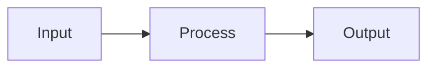

# CodeHound — Pull Request Template

Use this document as the base when authoring GitHub pull requests. Copy the sections below into the PR description and fill in each section. Delete guidance comments before submitting.

---

## How to use this template

1. **Pick a title** using the convention in [PR title](#pr-title).
2. **Write a 1–3 sentence summary** — what changed and why (not a file list).
3. **Fill in each section** — skip sections that do not apply, but keep `Summary`, `Changes`, and `Test plan`.
4. **Add code snippets** when they clarify non-obvious behavior or API changes.
5. **Link related issues** with `Fixes #123` or `Relates to #456`.
6. Save a copy under `plans/PR/pr-<short-slug>.md` for the record before opening the PR.

---

## PR title

### Convention

```
<type>: <short imperative description>
```

### Types

| Type | When to use | Example |
|------|-------------|---------|
| `feat` | New feature, rule, language, output format | `feat: add SLOP005 defer-in-loop detector` |
| `fix` | Bug fix | `fix: respect --skip when GoScan bundle runs` |
| `perf` | Performance improvement | `perf: parallel file scan with rayon` |
| `refactor` | Code change without behavior change | `refactor: extract shared emit helpers` |
| `test` | Tests only | `test: add mixed-repo integration case` |
| `docs` | Documentation only | `docs: update adding-a-language guide` |
| `chore` | Build, CI, deps, tooling | `chore: add GitHub Actions CI workflow` |
| `ci` | CI/CD pipeline changes | `ci: run clippy and cargo audit on PR` |

### Title rules

- Use **imperative mood** ("add", "fix", "remove") not past tense ("added", "fixed").
- Keep under **72 characters** when possible.
- Do not end with a period.
- Scope is optional: `feat(go): ...`, `perf(engine): ...`.

---

## PR description structure

Copy everything below this line into the GitHub PR body.

---

## Summary

<!-- 1–3 sentences: WHAT changed and WHY. A reviewer should understand the PR without reading the diff. -->

-

---

## Motivation / context

<!-- Optional but recommended for non-trivial PRs. Link design docs, review notes, or issues. -->

-

---

## Changes

<!-- Bullet list grouped by area. Be specific enough to review without opening every file. -->

### Area 1 (e.g. engine, rules, CLI)

-

### Area 2

-

---

## Code snippets (if applicable)

<!-- Include BEFORE/AFTER or usage examples for API changes, new config, or non-obvious logic. Use language-tagged fences. -->

### Before

```rust
// old approach
```

### After

```rust
// new approach
```

---

## Impact

<!-- What improves, what might regress, who is affected. -->

| Area | Impact |
|------|--------|
| **Performance** | |
| **Memory** | |
| **Behavior / correctness** | |
| **API / CLI** | |
| **Dependencies** | |
| **Binary size / build time** | |

---

## Breaking changes / migration

<!-- Write "None" if not applicable. -->

| Item | Migration |
|------|-----------|
| | |

---

## Architecture notes

<!-- Optional: pipeline diagram, module map, or design trade-offs. -->



---

## Files changed (high level)

<!-- Optional quick reference — not a substitute for Changes. -->

| Path | Change |
|------|--------|
| `src/...` | |

---

## Test plan

<!-- Checklist for reviewers AND author self-verification. Include commands. -->

- [ ] `cargo test`
- [ ] `cargo clippy -- -D warnings`
- [ ] `cargo fmt --check`
- [ ] Manual: `cargo run -- <path>` — expected output:
- [ ] Integration fixtures: `cargo test mixed_integration`

### Commands

```sh
cargo test
cargo run -- tests/fixtures
```

---

## Screenshots / sample output

<!-- Optional: terminal output, SARIF snippet, before/after timing. -->

```
(paste output)
```

---

## Related issues

<!-- Fixes #NNN | Relates to #NNN | Closes #NNN -->

-

---

## Follow-ups (out of scope)

<!-- Explicitly list what this PR does NOT do, to set reviewer expectations. -->

-

---

## Reviewer checklist

<!-- Optional — helps maintainers. -->

- [ ] Behavior matches summary and test plan
- [ ] No unrelated changes in diff
- [ ] Public API / CLI changes documented
- [ ] New rules have fixture coverage in `tests/fixtures/`
- [ ] `documents/architecture-performance.md` updated if pipeline changed
- [ ] No secrets or generated artifacts committed

---

## Release notes (if user-facing)

<!-- One line for changelog / GitHub release. Skip for internal refactors. -->

-

---

## Appendix: section guide

| Section | Required? | Purpose |
|---------|-----------|---------|
| Summary | **Yes** | Elevator pitch for the PR |
| Motivation | Recommended | Why now, what problem |
| Changes | **Yes** | Reviewable breakdown |
| Snippets | If API/non-obvious | Reduce back-and-forth |
| Impact | Recommended | Performance, risk, scope |
| Breaking / migration | If any | Upgrade path |
| Architecture | Optional | Design context |
| Files changed | Optional | Navigation aid |
| Test plan | **Yes** | How to verify |
| Related issues | If applicable | Traceability |
| Follow-ups | Recommended | Scope boundary |
| Reviewer checklist | Optional | Maintainer aid |
| Release notes | If user-facing | Changelog input |

---

## Example titles (CodeHound)

```
feat: add SLOP102 asyncio.gather in sync loop detector
fix: load codehound.toml languages field
perf: parallel file scan with rayon
refactor: single-pass Go AST visitor for loop rules
test: fixture manifest covers all default-language rules
docs: align README with SARIF and Python support
chore: remove unused dependencies from Cargo.toml
ci: add fmt, clippy, and test matrix workflow
```
