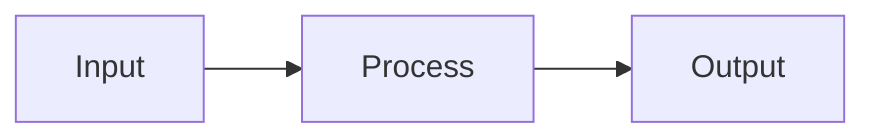

# CodeHound — Pull Request Template

Use this document as the base when authoring GitHub pull requests. Copy the sections below into the PR description and fill in each section. Delete guidance comments before submitting.

---

## How to use this template

1. **Pick a title** using the convention in [PR title](#pr-title).
2. **Write a 1–3 sentence summary** — what changed and why (not a file list).
3. **Fill in each section** — skip sections that do not apply, but keep `Summary`, `Changes`, `Test plan`, and `Related issues`.
4. **Add code snippets** when they clarify non-obvious behavior or API changes.
5. **Link related tickets** in the body **and** in `gh pr create` metadata (see [Ticket linking](#ticket-linking)).
6. **Choose labels** from the repo set (see [Labels](#labels)).
7. **Self-assign** the PR to the author (see [Self-assign](#self-assign)).
8. Save a filled copy under `plans/PR/pr-<short-slug>.md` (or `plans/v0.0.x/pr-<short-slug>.md` when the work is plan-scoped) **before** opening the PR, then commit it on the branch.
9. Open the PR with the CLI checklist below so assignee, labels, and body stay in sync.
10. Post issue/PR progress with `plans/PR/COMMENT_TEMPLATE.md` (no chatty “when you want” closers).

---

## Open the PR (`gh`) — required metadata

Always set **body file**, **assignee**, **labels**, and ensure the body contains issue keywords.

```sh
# From the feature branch (already pushed):
gh pr create \
  --base master \
  --head "$(git branch --show-current)" \
  --title "<type>(<scope>): <short imperative description>" \
  --body-file plans/PR/pr-<short-slug>.md \
  --assignee "@me" \
  --label documentation \
  --label enhancement
```

| Flag | Rule |
|------|------|
| `--assignee "@me"` | **Required.** Self-assign the opening author. Use a login only if opening for someone else with their OK. |
| `--label …` | **Required.** At least one label. Prefer the type-based defaults below; add more if needed. |
| `--body-file …` | **Required.** Full template body with **Related issues** filled (not empty `-`). |
| `--title` | Must match [PR title](#pr-title) convention. |

If the PR already exists without metadata:

```sh
gh pr edit <NUMBER> --add-assignee "@me"
gh pr edit <NUMBER> --add-label documentation --add-label enhancement
# Body ticket links: edit the PR description so Related issues uses Closes/Fixes/Relates to
```

List labels available on the repo:

```sh
gh label list
```

---

## Multi-workstream / epic integration (parallel agents)

When **multiple issue-sized branches** are developed in parallel (one PR per child issue under an epic), also ship a **single integration branch** so full-suite validation is not left to “merge order luck.”

### Why

- Per-branch `make test` only proves **that branch alone**.
- Merging several PRs into `master` can still fail on **combined** conflicts or interaction bugs.
- An integration branch merges all child heads, runs the full validation suite once, and is the preferred path to `master` for the epic.

### Workflow

```sh
git fetch origin master
git checkout -b chore/epic-N-integration origin/master

# Prefer docs-only branches first, then detectors, then engine/taint last
for b in origin/chore/child-a origin/chore/child-b origin/chore/child-c; do
  git merge "$b" -m "merge: integrate $b into epic-N integration"
done

make lint
make test
# plus focused tests for areas touched (CWE fixtures, taint, etc.)

git push -u origin HEAD
gh pr create \
  --base master \
  --title "chore: integrate epic #N workstreams" \
  --body-file plans/PR/pr-epic-N-integration.md \
  --assignee "@me" \
  --label documentation \
  --label enhancement
```

### Rules

| Rule | Detail |
|------|--------|
| **Child PRs** | May still target `master` for review visibility; note they are **superseded by** the integration PR when one exists. |
| **Integration PR** | `Closes` every child issue this stack completes (or `Closes` epic when all children land). |
| **Merge order** | Prefer **merging only the integration PR** into `master`, then close/supersede individual child PRs without merging them separately (avoids double-merge). |
| **Conflicts** | Resolve on the integration branch; re-run full tests after every conflict resolution. |
| **Validation gate** | Do not mark the epic ready until `make lint` + `make test` pass on the **integrated** tree. |

### Child PR body note (optional one-liner)

```markdown
## Integration

This branch is also merged into `chore/epic-N-integration` for combined validation.
Prefer reviewing/merging the integration PR when present.
```

---

## Self-assign

- Every PR the author opens **must** list them as assignee (`--assignee "@me"`).
- Do not leave assignees empty “for the reviewer to pick.”
- Reviewers may add themselves later; that does not replace the author assignee.

---

## Ticket linking

### In the PR body (`Related issues` section)

Use GitHub keywords so merges auto-close work when appropriate:

| Keyword | When to use |
|---------|-------------|
| `Closes #N` / `Fixes #N` / `Resolves #N` | This PR fully completes the issue |
| `Relates to #N` | Partial progress, dependency, or prior related work |
| `Refs #N` | Soft reference (design discussion, parent epic) |

Rules:

- Prefer **issue numbers**, not only plan file paths.
- Link **every** issue this PR is gated by (process gate) or implements.
- Link parent plan paths in **Motivation / context** as well (`plans/v0.0.5/...`).
- For stacked work: `Relates to #prior` and `Closes #current` when both apply.
- Never invent issue numbers; create the issue first if the process gate requires one.

### Examples

```markdown
## Related issues

- Closes #40
- Relates to #39
- Relates to #38
```

---

## Labels

Apply labels that match the **primary** change. Multiple labels are fine.

### Default mapping by title type

| Title type | Suggested labels |
|------------|------------------|
| `feat` | `enhancement` |
| `fix` | `bug` (if user-visible defect) or `enhancement` (hardening/trust) |
| `docs` | `documentation` |
| `perf` | `enhancement` |
| `refactor` / `test` / `chore` / `ci` | `documentation` if docs-only; else `enhancement` |

### Repo labels (current defaults)

| Label | Use when |
|-------|----------|
| `bug` | Something is broken / incorrect behavior |
| `documentation` | Plans, PR records, READMEs, decision docs |
| `enhancement` | Features, detector trust, CLI, non-bug product change |
| `duplicate` | Rarely on PRs — prefer closing as not planned |
| `good first issue` | Issues only, not PRs |
| `help wanted` | Issues only |
| `invalid` / `wontfix` / `question` | Issues triage |

**Agents / authors:** if the PR is mixed code + plans, use **both** `documentation` and `enhancement` (or `bug` when fixing defects).

---

## PR title

### Convention

```
<type>: <short imperative description>
```

### Types

| Type | When to use | Example |
|------|-------------|---------|
| `feat` | New feature, rule, language, output format | `feat: add SLOP005 defer-in-loop detector` |
| `fix` | Bug fix | `fix: respect --skip when GoScan bundle runs` |
| `perf` | Performance improvement | `perf: parallel file scan with rayon` |
| `refactor` | Code change without behavior change | `refactor: extract shared emit helpers` |
| `test` | Tests only | `test: add mixed-repo integration case` |
| `docs` | Documentation only | `docs: update adding-a-language guide` |
| `chore` | Build, CI, deps, tooling | `chore: add GitHub Actions CI workflow` |
| `ci` | CI/CD pipeline changes | `ci: run clippy and cargo audit on PR` |

### Title rules

- Use **imperative mood** ("add", "fix", "remove") not past tense ("added", "fixed").
- Keep under **72 characters** when possible.
- Do not end with a period.
- Scope is optional: `feat(go): ...`, `perf(engine): ...`.

---

## PR description structure

Copy everything below this line into the GitHub PR body (and into `plans/PR/pr-<short-slug>.md`).

---

## Summary

<!-- 1–3 sentences: WHAT changed and WHY. A reviewer should understand the PR without reading the diff. -->

-

---

## Motivation / context

<!-- Optional but recommended for non-trivial PRs. Link design docs, review notes, or issues. -->

- Plans: `plans/...`
- Issues: see **Related issues**

---

## Changes

<!-- Bullet list grouped by area. Be specific enough to review without opening every file. -->

### Area 1 (e.g. engine, rules, CLI)

-

### Area 2

-

---

## Code snippets (if applicable)

<!-- Include BEFORE/AFTER or usage examples for API changes, new config, or non-obvious logic. Use language-tagged fences. -->

### Before

```rust
// old approach
```

### After

```rust
// new approach
```

---

## Impact

<!-- What improves, what might regress, who is affected. -->

| Area | Impact |
|------|--------|
| **Performance** | |
| **Memory** | |
| **Behavior / correctness** | |
| **API / CLI** | |
| **Dependencies** | |
| **Binary size / build time** | |

---

## Breaking changes / migration

<!-- Write "None" if not applicable. -->

| Item | Migration |
|------|-----------|
| None | — |

---

## Architecture notes

<!-- Optional: pipeline diagram, module map, or design trade-offs. -->



---

## Files changed (high level)

<!-- Optional quick reference — not a substitute for Changes. -->

| Path | Change |
|------|--------|
| `src/...` | |

---

## Test plan

<!-- Checklist for reviewers AND author self-verification. Include commands. -->

- [ ] `make lint` (or `cargo clippy --all-targets --all-features -- -D warnings` + `cargo fmt --check`)
- [ ] `make test` (or `cargo test --locked`)
- [ ] Focused tests for the area touched (fixtures / integration)
- [ ] Manual scan if detector behavior changed

### Commands

```sh
make lint
make test
```

---

## Screenshots / sample output

<!-- Optional: terminal output, SARIF snippet, before/after timing. -->

```
(paste output)
```

---

## Related issues

<!-- REQUIRED. Use Closes/Fixes/Resolves and/or Relates to / Refs. At least one ticket when work was issue-gated. -->

- Closes #NNN
- Relates to #NNN

---

## PR metadata checklist (author)

<!-- Confirm before submit; mirrors gh flags. -->

- [ ] Self-assigned (`--assignee @me`)
- [ ] Labels applied (at least one; see [Labels](#labels))
- [ ] Related issues filled with real ticket IDs
- [ ] Filled body committed under `plans/PR/pr-<slug>.md` (or plan-scoped path)

---

## Follow-ups (out of scope)

<!-- Explicitly list what this PR does NOT do, to set reviewer expectations. -->

-

---

## Reviewer checklist

<!-- Optional — helps maintainers. -->

- [ ] Behavior matches summary and test plan
- [ ] No unrelated changes in diff
- [ ] Public API / CLI changes documented
- [ ] New rules have fixture coverage in `tests/fixtures/`
- [ ] PR has assignee and labels
- [ ] Related issues use correct Closes/Relates keywords
- [ ] `documents/architecture-performance.md` updated if pipeline changed
- [ ] No secrets or generated artifacts committed

---

## Release notes (if user-facing)

<!-- One line for changelog / GitHub release. Skip for internal refactors. -->

-

---

## Appendix: section guide

| Section | Required? | Purpose |
|---------|-----------|---------|
| Summary | **Yes** | Elevator pitch for the PR |
| Motivation | Recommended | Why now, what problem |
| Changes | **Yes** | Reviewable breakdown |
| Snippets | If API/non-obvious | Reduce back-and-forth |
| Impact | Recommended | Performance, risk, scope |
| Breaking / migration | If any | Upgrade path |
| Architecture | Optional | Design context |
| Files changed | Optional | Navigation aid |
| Test plan | **Yes** | How to verify |
| Related issues | **Yes** when issue-gated | Ticket traceability |
| PR metadata checklist | **Yes** for authors/agents | Assignee, labels, tickets |
| Follow-ups | Recommended | Scope boundary |
| Reviewer checklist | Optional | Maintainer aid |
| Release notes | If user-facing | Changelog input |

---

## Example titles (CodeHound)

```
feat: add SLOP102 asyncio.gather in sync loop detector
fix: load codehound.toml languages field
perf: parallel file scan with rayon
refactor: single-pass Go AST visitor for loop rules
test: fixture manifest covers all default-language rules
docs: align README with SARIF and Python support
chore: remove unused dependencies from Cargo.toml
ci: add fmt, clippy, and test matrix workflow
```

## Example `gh pr create` (full)

```sh
gh pr create \
  --base master \
  --title "fix(cwe): harden catalog trust and close Phase 4 decisions" \
  --body-file plans/PR/pr-cwe-trust-phase4.md \
  --assignee "@me" \
  --label documentation \
  --label enhancement
```
