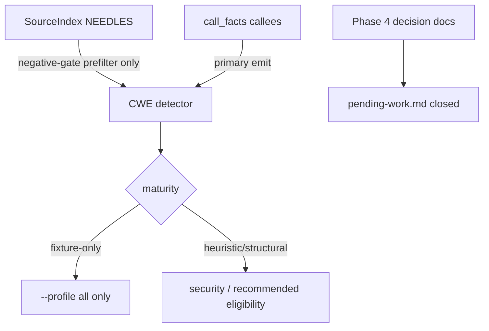

# fix(cwe): harden catalog trust and close Phase 4 decisions

## Summary

- Harden Go CWE catalog honesty: move several detectors to call-facts primary emit, quarantine fixture-shaped long-tail rules in maturity, and label NEEDLES as negative gates vs fixture literals.
- Close every open checkbox in `plans/v0.0.5/pending-work.md` with evidence-backed Phase 4 dispositions (BP candidates, perf, taint, roadmap) under issue #40 — without implementing BP-66..165, typed Go, or Python.
- Record dated canary hit rates for audited CWE families so promotion/quarantine decisions are reproducible.

---

## Motivation / context

After PR #38 closed the gorl noise-reduce-1 work, the remaining v0.0.5 ledger items were:

1. **CWE catalog trust** ([#39](https://github.com/chinmay-sawant/codehound/issues/39)) — long-tail NEEDLES, maturity, call-facts over `SourceIndex.has`.
2. **Phase 4 decision-gated backlog** ([#40](https://github.com/chinmay-sawant/codehound/issues/40)) — reassess BP candidates, evaluate engine perf options, decide taint/typed/Python scope.

This PR delivers both: detector trust improvements for CWE, plus decision records that clear Phase 4 checkboxes **without** expanding product scope into deferred investments.

Plans:

- `plans/v0.0.5/cwe-catalog-trust-audit.md`
- `plans/v0.0.5/pending-work.md`
- `plans/v0.0.5/bp-candidates-disposition.md`
- `plans/v0.0.5/perf-eval-decision.md`
- `plans/v0.0.5/taint-capability-decision.md`
- `plans/v0.0.5/roadmap-investments-decision.md`

---

## Changes

### CWE detectors (call-facts primary)

| Rule | Change |
|------|--------|
| **CWE-918** | Primary emit from `call_facts` (`http.Get`) + user-controlled URL query binding; SourceIndex prefilter/negatives only |
| **CWE-325** | Primary emit requires `cipher.NewCTR` + `.XORKeyStream` in `call_facts` |
| **CWE-328** | Primary emit requires `md5.Sum` in `call_facts` (real gopdfsuit hits support Heuristic keep) |
| **CWE-941** | Primary emit requires `smtp.SendMail` in `call_facts`; co-signals retained; maturity fixture-only |

### CWE maturity quarantine (fixture-only)

Added to `is_fixture_only` (available under `--profile all`, out of default security/recommended packs):

- Tranche 1 (prior): CWE-334/335/338/342/343/798
- Tranche 2: **CWE-1204**, **CWE-1240** (CWE-325 stays Heuristic)
- Tranche 3: **CWE-323**, **CWE-331**, **CWE-347** (CWE-328 stays Heuristic)
- Tranche 4: **CWE-940**, **CWE-941**

### NEEDLES hygiene

Labeled needles in `source_index.rs` for audited families as:

- `// negative-gate:` — cheap impossibility / prefilter only
- `// fixture-literal:` — corpus-specific identifiers/literals (not structural evidence)

### Phase 4 decision records (docs)

| Doc | Outcome |
|-----|---------|
| `bp-candidates-disposition.md` | 29 absent BP IDs: **9 retire-duplicate**, 1 canary-gated, 6 proof-boundary, 13 policy-defer |
| `perf-eval-decision.md` | Cold scan sub-second; **defer** flamegraph / shared facts / tree retention |
| `taint-capability-decision.md` | Prepare same-var **design-approved only**; Decode/external/channel **defer**; keep explicit FN model |
| `roadmap-investments-decision.md` | `--typed` / Python **defer** (ADR 0005 Go-first) |

### Ledger

- `pending-work.md`: **no open checkboxes**; Phase 4 closed with evidence under #40; CWE progress linked to #39.

---

## Code snippets (if applicable)

### CWE-918: call-facts primary (pattern used for 325/328/941)

```rust
// Before (shape): primary emit from SourceIndex substring
// facts.source_index.has("http.Get(target)") && query_url_needles...

// After: primary from call_facts + user-controlled binding
for call in &facts.call_facts {
    if call.callee.as_ref() != "http.Get" { continue; }
    // require arg bound from user-controlled url query read
    // SourceIndex only for cheap prefilter / allowlist negatives
}
```

### Maturity quarantine

```rust
// fixture-only → out of recommended/security default packs
"CWE-323" | "CWE-331" | "CWE-347" | "CWE-940" | "CWE-941"
  | "CWE-1204" | "CWE-1240" | /* + prior PRNG/798 set */
```

---

## Impact

| Area | Impact |
|------|--------|
| **Performance** | Neutral (same scan path; call_facts already built) |
| **Memory** | Negligible |
| **Behavior / correctness** | Fewer structural false claims: fixture-shaped CWE rules quarantined; call-facts primary reduces needle-only emit for 918/325/328/941 |
| **API / CLI** | No new flags; quarantine affects pack membership for fixture-only IDs under default profiles |
| **Dependencies** | None |
| **Binary size / build time** | Unchanged |

### Canary notes (release, focused `--only`)

| Family | Result |
|--------|--------|
| Cipher 325/1204/1240 | 0/126 files (3 repos) |
| Tranche 3 323/328/331/347 | 328 ×3 on gopdfsuit (real `md5.Sum`); others ×0 |
| OAuth 940/941 | 0/126 files |

---

## Breaking changes / migration

| Item | Migration |
|------|-----------|
| Fixture-only CWE IDs | Still available under `--profile all` / explicit `--only`; no longer treated as default-pack structural security rules |
| None for CLI surface | No flag renames |

---

## Architecture notes



---

## Files changed (high level)

| Path | Change |
|------|--------|
| `src/lang/go/detectors/cwe/domains/request_handling.rs` | CWE-918 call-facts |
| `src/lang/go/detectors/cwe/domains/cryptography/ciphers.rs` | CWE-325 call-facts |
| `src/lang/go/detectors/cwe/.../crypto_strength.rs` | CWE-328 call-facts |
| `src/lang/go/detectors/cwe/.../oauth.rs` | CWE-941 call-facts; 940 comments |
| `src/lang/go/detectors/cwe/source_index.rs` | NEEDLES labels |
| `src/rules/maturity.rs` | fixture-only expansions + tests |
| `plans/v0.0.5/*` | audit, ledger, 4 decision docs |

---

## Test plan

- [x] `make lint` (`cargo clippy --all-targets --all-features -- -D warnings` + `cargo fmt --check`)
- [x] `make test` — 401 passed
- [x] `cargo test --locked --test go_cwe_detector_fixtures`
- [x] `cargo test --locked --lib rules::maturity`

### Commands

```sh
make lint
make test
cargo test --locked --test go_cwe_detector_fixtures
cargo test --locked --lib rules::maturity
```

---

## Screenshots / sample output

```
# make test
Summary [  38.201s] 401 tests run: 401 passed, 0 skipped

# go_cwe_detector_fixtures
test result: ok. 4 passed; 0 failed
```

---

## Related issues

- Closes #40
- Relates to #39
- Relates to #38 (prior noise-reduce-1 merge; this branch builds on that baseline)

---

## Follow-ups (out of scope)

- Implementing any of the 29 BP-66..165 candidates (even retire-duplicate IDs are **not implemented** — disposition only)
- Further non-crypto CWE domain NEEDLES audits (optional under #39)
- Prepare same-var taint design implementation (design-approved only)
- `--typed` / `go/packages` or Python multi-rule support
- Engine shared-fact reuse / flamegraph implementation

---

## Reviewer checklist

- [ ] Behavior matches summary and test plan
- [ ] No unrelated changes in diff
- [ ] Public API / CLI changes documented (pack membership only)
- [ ] New detector boundaries preserve CWE fixture oracle
- [ ] Fixture-only maturity updates tested
- [ ] No secrets or generated artifacts committed

---

## Release notes (if user-facing)

- CWE catalog trust: call-facts primary for SSRF/CTR/md5/SMTP paths; quarantine additional fixture-only CWE rules; close v0.0.5 Phase 4 decision ledger without expanding BP/Python scope.
