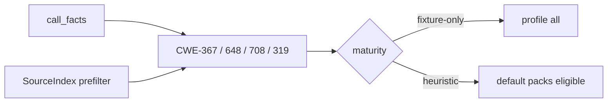

# fix(cwe): complete catalog trust tranche 5 domains

## Summary

- Finish the issue #42 checklist for CWE long-tail honesty: file/path, network bind, TOCTOU, permissions, and TLS/JWT neighbors.
- Quarantine fixture-shaped rules as fixture-only; rewrite CWE-367, 648/708, and 319 to call-facts primary emit where the fixture oracle allows.
- Record dated canaries and NEEDLES labels; add issue-creation and comment templates for process hygiene.

---

## Motivation / context

After [#39](https://github.com/chinmay-sawant/codehound/issues/39) closed and [#41](https://github.com/chinmay-sawant/codehound/pull/41) merged, remaining CWE families were tracked under [#42](https://github.com/chinmay-sawant/codehound/issues/42) with checklist `plans/v0.0.5/cwe-catalog-trust-next.md`.

This PR executes that checklist (phases 1–6) and ships the audit record in `cwe-catalog-trust-audit.md` §§2.6–2.10.

---

## Changes

### Domain dispositions

| Family | Rules | Disposition | Call-facts |
|--------|-------|-------------|------------|
| File/path | CWE-434 | fixture-only | no |
| Network bind | CWE-1327 | fixture-only | no |
| TOCTOU | CWE-367 | Heuristic keep | yes — same-path `os.Stat` + `os.ReadFile` |
| Permissions | CWE-648, CWE-708 | fixture-only | yes — `os.Chown` primary |
| TLS / JWT | CWE-319, CWE-358 | fixture-only | 319 yes (`*ListenAndServe`); 358 no |

### Process docs

- `plans/PR/ISSUE_TEMPLATE.md` — issue create with assignee + labels
- `plans/PR/COMMENT_TEMPLATE.md` — issue/PR comment tone and structure
- Checklist + parent audit updates for #42

### NEEDLES / maturity

- Family NEEDLES labeled `negative-gate` / `fixture-literal` for audited rules
- `maturity.rs`: fixture-only for 434, 1327, 648, 708, 319, 358 (367 remains Heuristic)

---

## Code snippets (if applicable)

### CWE-367 shape (call-facts)

```rust
// Primary: os.Stat + os.ReadFile in call_facts with same path argument text
// SourceIndex: prefilter only (os.Stat(, os.ReadFile)
```

---

## Impact

| Area | Impact |
|------|--------|
| **Performance** | Neutral |
| **Memory** | Negligible |
| **Behavior / correctness** | CWE-367 may report generalized Stat+ReadFile TOCTOU shapes (not only `(target)` corpus); fixture-only rules leave default packs |
| **API / CLI** | Pack membership for newly quarantined IDs |
| **Dependencies** | None |
| **Binary size / build time** | Unchanged |

### Canary (focused `--only`, 126 files across three repos)

| Rules | Hits (notable) |
|-------|----------------|
| CWE-434, 1327, 648, 708, 319, 358 | 0 |
| CWE-367 | 1 on gopdfsuit sampledata (example-tagged) |

---

## Breaking changes / migration

| Item | Migration |
|------|-----------|
| Fixture-only CWE IDs | Still under `--profile all` / `--only`; not default structural pack members |
| CWE-367 broader match | May surface new TOCTOU-shaped Stat+ReadFile pairs outside corpus names |

---

## Architecture notes



---

## Files changed (high level)

| Path | Change |
|------|--------|
| `src/lang/go/detectors/cwe/domains/concurrency/toctou.rs` | CWE-367 call-facts |
| `src/lang/go/detectors/cwe/.../chown.rs` | CWE-648/708 call-facts |
| `src/lang/go/detectors/cwe/.../transport.rs` | CWE-319 call-facts |
| `src/lang/go/detectors/cwe/source_index.rs` | NEEDLES labels |
| `src/rules/maturity.rs` | fixture-only expansions |
| `plans/v0.0.5/cwe-catalog-trust-*.md` | checklist + audit §§2.6–2.10 |
| `plans/PR/ISSUE_TEMPLATE.md` | issue create guide |
| `plans/PR/COMMENT_TEMPLATE.md` | comment guide |

---

## Test plan

- [x] `make lint`
- [x] `make test` — 401 passed
- [x] `cargo test --locked --test go_cwe_detector_fixtures`
- [x] `cargo test --locked --lib rules::maturity`

### Commands

```sh
make lint
make test
cargo test --locked --test go_cwe_detector_fixtures
```

---

## Related issues

- Closes #42
- Relates to #39
- Relates to #41

---

## PR metadata checklist (author)

- [x] Self-assigned (`--assignee @me`)
- [x] Labels applied (`documentation`, `enhancement`)
- [x] Related issues filled with real ticket IDs
- [x] Filled body under `plans/PR/pr-cwe-trust-tranche5.md`

---

## Follow-ups (out of scope)

Future CWE domain audits (new issue), not incomplete work for this PR:

- Broader upload/path taint beyond CWE-434 corpus
- Generalized public-bind policy (beyond CWE-1327 museum)
- Structural TOCTOU (ordering / symlink policy) beyond Stat+ReadFile co-use
- Ownership policy without form-key co-signals
- BP-66..165, typed Go, Python, engine micro-opts

---

## Reviewer checklist

- [ ] Behavior matches summary and test plan
- [ ] No unrelated changes in diff
- [ ] Fixture oracle preserved for rewritten rules
- [ ] Maturity quarantines intentional
- [ ] PR has assignee and labels
- [ ] Related issues use Closes/Relates correctly

---

## Release notes (if user-facing)

- CWE trust tranche 5: call-facts for TOCTOU/chown/cleartext listen sinks; quarantine additional fixture-only long-tail CWEs.
