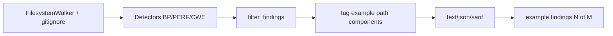

# feat(go): harden catalog trust and close noise-reduce-1 canary

## Summary

- Harden existing Go BP and PERF detectors with stronger structural evidence (function scope, request-path gates, interface conversion, comment-aware registration, server entrypoints) so full-catalog noise drops without losing true positives.
- Close the gorl noise-reduce-1 plan: disposition table, PERF-46/145 advisory tiering, example-path labeling with optional `--exclude-examples`, and named fixture variants that keep base safes locked.
- Record CWE/BP canary evidence and recommended-pack pilot notes so pending-work reconciliation has reproducible validation.

---

## Motivation / context

`plans/v0.0.5/pending-work.md` and `plans/v0.0.5/noise-reduce-1.md` track catalog trust work: the product gap is noisy full-catalog findings and incomplete canary evidence, not more rule IDs. This branch executes the pinned `real-repos/gorl` canary plan and related BP/PERF trust fixes, reducing full-catalog counts while keeping the recommended pack at zero findings.

Related plans:

- `plans/v0.0.5/noise-reduce-1.md` (closed for this checklist)
- `plans/v0.0.5/pending-work.md`
- `plans/v0.0.5/cwe-catalog-trust-audit.md`

---

## Changes

### Go bad-practice detectors

- Scope select/concurrency escape checks and nested edge cases with safer heuristics.
- BP-5: treat returned `Close()` as handled; keep explicit blank discard as positive.
- BP-37: require post-init write evidence for package-level maps.
- BP-35 retired; BP-28/BP-30 opt-in style only (out of default style pack).
- BP-41: accept sibling multi-line package docs.
- Server rules BP-47/50/54/55: require real non-example `package main` + server start; recognize Gin/Echo/Fiber/package `ListenAndServe`.
- Keep base project fixtures; add named variants (`BP-47-fiber`, `BP-50-gin`, `BP-54-echo`, `BP-55-listenandserve`).

### Go PERF detectors

- PERF-7: function-lifetime scope for deferred loop cleanup.
- PERF-102: `WriteHeader` per enclosing function; control-flow aware branches.
- PERF-214: drop source-only volatile-key fallback.
- PERF-114: skip interface-box conversion loops (`[]interface{}` / `[]any`).
- PERF-121: require real source→target field flow.
- PERF-143: ignore comment-only `http.Handle*`.
- PERF-38: suppress done `chan struct{}`; classify each `make(chan…)` independently.
- PERF-40: request-handler gate + group `time.Now` by function body range.
- PERF-44: repeated assertions only within the same function.
- PERF-46 / PERF-145: advisory Info (TIER_B); not in recommended/perf packs.

### Scan / reporting / CLI

- Tag findings under path components `examples` / `example` / `sampledata` / `samples` with `example` (visible, not suppressed).
- Summary line: `example findings: N (of M total)`.
- Optional `--exclude-examples` discovery globs.
- PERF fixture discovery supports named variants (BP-style case names).

### Plans / evidence

- noise-reduce-1 canary tables, disposition rollup (53 findings: 23 example / 30 non-example).
- CWE catalog trust audit notes and canary provenance docs.
- BP representative canary evidence docs.
- `.gitignore` updates for real-repos.

---

## Code snippets (if applicable)

### PERF-40: request-path only (not bare `for`)

```rust
// After: only multi-Now in request-handler bodies reports
if !is_request_path(&facts.source_index) {
    return;
}
// group by enclosing_function_body_range start key
```

### Example labeling (default still scans examples)

```text
low  BP-5  real-repos/gorl/examples/echo/main.go:24:8
  Close() return value is ignored; ...
  tags: example

...
example findings: 23 (of 53 total)
```

```sh
# Optional: drop demo trees at discovery
codehound real-repos/gorl --profile all --exclude-examples
```

---

## Impact

| Area | Impact |
|------|--------|
| **Performance** | Neutral; small post-filter tag pass and path helpers only |
| **Memory** | Negligible |
| **Behavior / correctness** | Fewer full-catalog FPs on gorl/gopdfsuit; recommended pack remains 0; true positives retained via fixtures |
| **API / CLI** | New optional `--exclude-examples`; findings may include `tags: example` |
| **Dependencies** | None material for runtime |
| **Binary size / build time** | Unchanged |

### Canary deltas (release binary, cold)

| Target | Before (branch start / plan) | After |
|--------|------------------------------|-------|
| gorl `--profile all` | 85 → intermediate batches | **53** (23 example-tagged) |
| gorl recommended | 0 | **0** |
| gopdfsuit full-catalog | ~978 early → intermediate | **914** (last measured after PERF-40) |

---

## Breaking changes / migration

| Item | Migration |
|------|-----------|
| None expected | Example findings still appear by default; use `--exclude-examples` if CI wants production trees only. PERF-46/145 severity becomes Info under tier policy (less CI-fail under MediumAsErrors for those two). |

---

## Architecture notes



---

## Files changed (high level)

| Path | Change |
|------|--------|
| `src/lang/go/detectors/bad_practices/**` | Scope/harden BP rules; server entrypoints |
| `src/lang/go/detectors/perf/**` | Noise boundaries + TIER_B for 46/145 |
| `src/engine/**`, `src/cli/**`, `src/app/**` | Example tags + `--exclude-examples` |
| `src/reporting/text/summary.rs` | Example count line |
| `tests/fixtures/go/**` | Base + named variants; manifest |
| `plans/v0.0.5/**` | noise-reduce-1 closed; CWE/BP canary docs |

---

## Test plan

- [x] `make test` (401 passed at close-out)
- [x] `make lint` / `cargo clippy -- -D warnings` + `cargo fmt --check`
- [x] `cargo test --locked --test go_perf_detector_integration`
- [x] `cargo test --locked --test go_bad_practice_integration`
- [x] `cargo test --locked --test go_bad_practice_project_integration`
- [x] Manual: gorl full-catalog cold scan — 53 findings, example tags, recommended 0
- [x] Manual: `--exclude-examples` — 30 findings

### Commands

```sh
make lint
make test
cargo build --release --locked
./target/release/codehound real-repos/gorl --profile all \
  --no-fail --no-cache --no-snippet --no-color true
./target/release/codehound real-repos/gorl --profile recommended \
  --no-fail --no-cache --no-snippet --no-color true
./target/release/codehound real-repos/gorl --profile all --exclude-examples \
  --no-fail --no-cache --no-snippet --no-color true
```

---

## Screenshots / sample output

```
scanned 28 files (2640 lines) in 68.4ms
53 findings
  severity: 25 info, 23 low, 5 medium
  top rules: BP-5 ×9, BP-49 ×8, PERF-35 ×7, BP-30 ×3, BP-39 ×3
  example findings: 23 (of 53 total)

# recommended
no slop detected
```

---

## Related issues

- Relates to `plans/v0.0.5/pending-work.md` catalog trust / noise-reduce work
- Closes checklist work in `plans/v0.0.5/noise-reduce-1.md`

---

## Follow-ups (out of scope)

- CWE long-tail NEEDLES maturity rewrite and canary delete decisions
- Call-facts-over-`SourceIndex.has` broader migration
- Opening a dedicated GitHub issue before the *next* detector implementation batch (process gate)
- Optional default exclude for committed `vendor/` when not gitignored
- Archival reconciliation of historical plan boxes with evidence

---

## Reviewer checklist

- [ ] Behavior matches summary and test plan
- [ ] No unrelated changes in diff
- [ ] Public API / CLI changes documented (`--exclude-examples`, example tags)
- [ ] New rules/boundaries have fixture coverage in `tests/fixtures/`
- [ ] Base fixtures kept; named variants for new boundaries
- [ ] No secrets or generated artifacts committed

---

## Release notes (if user-facing)

- Reduce Go full-catalog noise with stronger BP/PERF evidence; tag example/demo findings; optional `--exclude-examples`; demote PERF-46/145 to advisory Info.
