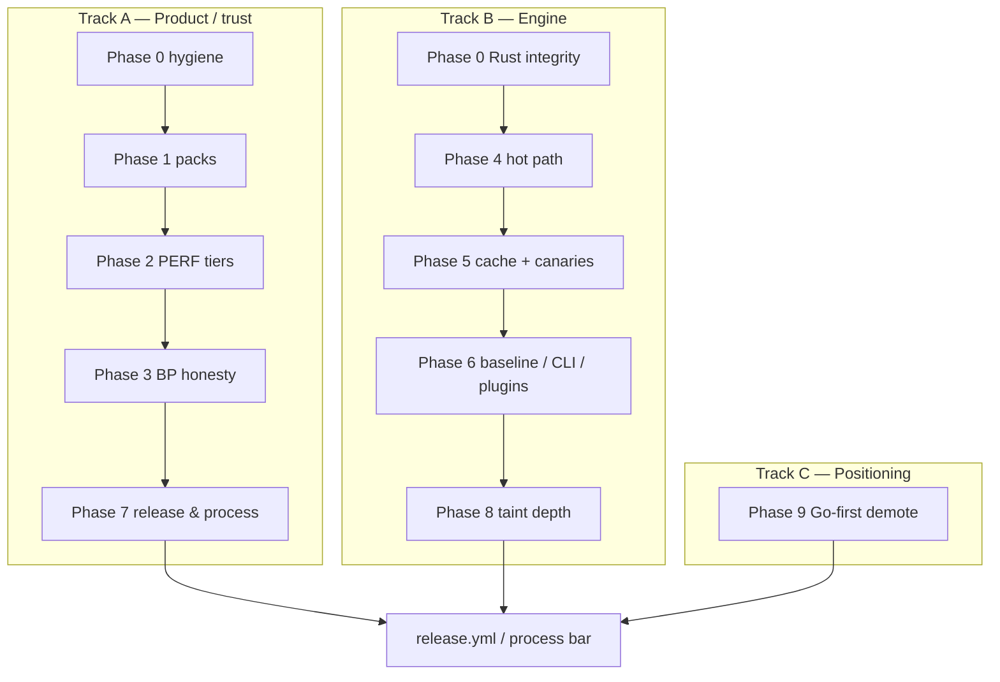

# feat: feedback-improvements — packs, trust, engine, CI

## Summary

Feedback-driven product and engine work from the 2026-07-10 review: CI-safe defaults, curated `--profile recommended`, honest PERF/BP/taint behavior, engine hot-path and cache correctness, brownfield baseline/ignore tooling, release/CI plumbing, and Go-first multi-lang honesty. Implements phases **0–9** from the feedback set so CodeHound is a complementary Go PERF + framework-footgun analyzer rather than a noisy full-catalog gate.

**Branch:** `feat/feedback-improvements` (`cb5cbcb`) vs `master` (`8e0af74`) — 26 commits · ~309 files · +12.7k / −2.5k  
**Plan of record:** [`plans/feedback/10072026/action-items.md`](./10072026/action-items.md)

---

## Motivation / context

The ultra-senior product review found strong engine bones but muddy defaults: workspace-dirtying export, SARIF/license/docs drift, fixture-museum CWEs in the default gate, over-broad BP vs staticcheck, and multi-lang marketing that exceeded capability. The actionable backlog lives under `plans/feedback/10072026/`. This PR executes that plan end-to-end (phases 0–9 ship criteria done; residual work triaged as post-phase backlog).

| Source | Role |
|--------|------|
| [`action-items.md`](./10072026/action-items.md) | Backlog of record (phases 0–9) |
| [`improvements.md`](./10072026/improvements.md) | Product / system priorities |
| [`go.md`](./10072026/go.md) | Detector / taint / PERF / BP |
| [`rust.md`](./10072026/rust.md) | Engine craft / cache / API |
| [`ultra-senior-go-rust-product-review.md`](./10072026/ultra-senior-go-rust-product-review.md) | Pre-work ratings |
| [`ultra-senior-go-rust-product-review-post-p0-9.md`](./10072026/ultra-senior-go-rust-product-review-post-p0-9.md) | Post-phase delta review |

---

## Changes

### Phase 0 — Trust & product hygiene

- Default **context/chunks export OFF** (`--export-context` / `--export-chunks` opt-in)
- **SARIF 2.1.0** camelCase locations, real `workingDirectory.uri`, richer rule metadata, structural validation tests
- Dual license files (`LICENSE`, `LICENSE-MIT`, `LICENSE-APACHE`) aligned with `Cargo.toml`
- Docs/schema/runtime lockstep: taint **off** by default, `severity_overrides`, strict `fail_on`, README rule-count CI guard
- CLI hygiene: real `--warnings-as-errors` fail policy, baseline flag conflicts, split `--no-snippet` / `--sarif-compact`
- **Sanitizer honesty:** `filepath.Clean` alone is not Path-safe; CWE-78 not Path-sanitized; bare `.Prepare` not SQL-safe
- Rust integrity: `PathIo` errors + exit codes, finding string interning, mutex poison recovery, max file size, fixture path + rebuild-cache safety

### Phase 1 — Profiles & catalog honesty

- `--profile recommended|perf|security|style|all` (CLI default **recommended**, ~14 rules)
- Rule **maturity** tags; fixture-only / reserved quarantined out of recommended/security/perf
- Severity/confidence discipline; BP off in recommended; PERF-first README positioning
- Sample CI workflow (`.github/workflows/codehound.yml`)

### Phase 2 — PERF is the product

- PERF **S/A/B/C tiers** wired into packs and severity
- Narrowed `is_hot_path` (no bare `func (`; cold `main`/`init`)
- Advice quality retunes (Body.Close, NewRequest/http.Get patterns)
- Framework sources (Chi/Fiber shapes); real-world timeout fixtures; framework gap list in docs

### Phase 3 — BP honesty vs staticcheck

- Overlap matrix published (`documents/bad-practices.md`)
- Fixed BP-1 / 6 / 8 / 9 precision; BP-21/28 demoted; BP-63 remains reserved snapshot
- Style pack advisory (`NoFail`); BP off in recommended

### Phase 4 — Engine hot path

- **O(1)** `SourceIndex::has` (process-lifetime HashMap lookup)
- Lazy/selective fact extraction when taint off
- `source_cache` only when export retains sources
- Off-lock taint project units; short Mutex critical section
- Honest Criterion benches + smoke/budget ceilings; ADR on hash maps

### Phase 5 — Cache & quality loop

- Same-scan reverse-dep cascade; tool-version mass-stale
- Project-relative path identity (ADR 0002)
- Stronger oracles (line + exclusive fire + evidence for core taint); Python `SLOP` safe-class fix
- In-repo canary budgets (clean_lib / http_service / `src` dogfood) + CI job

### Phase 6 — CI product surface

- Baseline: `list|prune|update|diff|save`, fingerprint v2 (message-stable), `--show-baselined`, optional reason/expires
- Ignores: block ranges, EOL, Python `#` comments
- CLI subcommands (`scan`, `rules`, `cache prune`, `baseline …`, `init`) without breaking bare scan
- `LanguagePlugin::extract_deps`; Go sinks moved under lang; finalize model documented

### Phase 7 — Release & process bar

- Multi-arch `release.yml` (tag `v*`); SBOM + cargo audit; Dependabot
- Composite action `.github/actions/codehound-scan`
- Live `ROADMAP.md`, `CONTRIBUTING.md`, `CONTEXT.md`, ADRs 0001–0004, rule RFC template
- Embedder docs / feature matrix on `lib.rs`

### Phase 8 — Taint depth

- Versioned last-write at use site; field keys (`user.Path`); map-base conservative taint
- Explicit **unsupported** channel/goroutine FNs (not silent pretends)
- `--taint-depth` (1–4) bounded multi-hop summaries
- Codegen validates registry `function` identifiers

### Phase 9 — Multi-lang honesty

- **Go-first demote** (ADR 0005): default features Go-only; Python opt-in (`--features python`)
- Remove empty `typescript` feature + `LanguageId::TypeScript`
- Marketing/README/schema/fixture languages match capability

### Pre-phase product cleanup

- Generic product rename (PDF-specific needles/refs removed)
- Folder restructure; PERF-232–241 generic rules + fixtures
- Detection pattern fix for brackets

### Docs & website (post-phase)

- `docs/` → `documents/` rename + path updates across plans
- Website/README/frontend: audience, animations, diagrams, GitHub stars, references
- Post-phase backlog triage + re-rate review doc

---

## Code snippets

### Before (default product)

```bash
# Effectively full-catalog noise; export dirtied workspace; taint/docs drift
codehound .
```

### After (new defaults)

```bash
# High-signal CI pack (PERF S-tier + curated allow-list; BP off; fail high+)
codehound --profile recommended .

# Security / taint opt-in
codehound --profile security --taint .

# Full catalog only when explicit
codehound --profile all .
```

### Brownfield baseline

```bash
codehound baseline save
codehound baseline list
codehound baseline prune
codehound --show-baselined .
```

---

## Impact

| Area | Impact |
|------|--------|
| **Performance** | O(1) needle lookup; skip taint fact/graph cost when taint off; no export RAM tax by default; cascade/path-identity fix correctness more than raw speed |
| **Memory** | `retain_sources` gated on export; finding-string interning bounds churn; no unbounded project accumulate when taint off |
| **Behavior / correctness** | Sanitizer/path confinement honest; BP detectors fixed; cache same-scan cascade + tool-version bust; stronger oracles |
| **API / CLI** | Profiles, subcommands, baseline cmds, `--taint-depth`, export opt-in, fingerprint v2 |
| **Dependencies** | Dual license files; Dependabot; `cargo audit` in CI; no forced parking_lot |
| **Binary size / build time** | TypeScript stub removed; Python off default features (smaller default build) |

---

## Breaking changes / migration

| Item | Migration |
|------|-----------|
| Default profile **recommended** (not full catalog) | Use `--profile all` or explicit packs for old behavior |
| Context/chunks **export off** by default | Pass `--export-context` / `--export-chunks` |
| Taint **off** by default | `--taint` or `--profile security` |
| Fingerprint **v2** (message-stable) | Regenerate baselines after upgrade (`documents/finding-identity.md`) |
| SARIF camelCase fields | Re-validate GH code scanning upload path |
| Python not in default features | Build with `--features python` if needed |
| Empty TypeScript feature removed | Drop any `typescript` feature flags from local builds |
| Docs path `docs/` → `documents/` | Update bookmarks / external links |

---

## Architecture notes



North star: **fast offline Go PERF + framework-footgun analyzer** with a **curated** CWE pack — complementary to golangci-lint and govulncheck.

---

## Files changed (high level)

| Path | Change |
|------|--------|
| `src/cli/`, `src/app/`, `src/core/profile.rs` | Profiles, subcommands, baseline cmds, export defaults |
| `src/reporting/sarif/` | camelCase SARIF + metadata |
| `src/lang/go/detectors/cwe/taint/` | Sanitizers, versioned writes, field keys, multi-hop |
| `src/lang/go/detectors/perf/` | Tiers, hot_path, advice, new PERF fixtures/rules |
| `src/lang/go/detectors/bad_practices/` | BP-1/6/8/9 fixes + policy severity |
| `src/lang/source_index.rs` | O(1) needle lookup |
| `src/engine/cache/`, walk/deps | Cascade, tool-version, path identity, lazy facts |
| `src/rules/maturity.rs`, `finding_wire.rs` | Maturity quarantine, interning |
| `src/lang/plugin.rs`, `src/lang/go/sinks.rs` | Plugin deps + sink placement |
| `.github/workflows/`, `.github/actions/` | CI, canary, release, composite SARIF action |
| `tests/canary/`, `tests/profile_packs.rs`, fixtures | Canaries, packs, oracles, PERF/CWE fixtures |
| `documents/**`, ADRs 0001–0005 | Product docs + decisions |
| `README.md`, `ROADMAP.md`, `CONTRIBUTING.md`, `CONTEXT.md`, `CHANGELOG.md` | Product surface |
| `plans/feedback/10072026/**` | Feedback plan + post review |
| `frontend/`, website assets | Go-first marketing polish |

### Commits (`master..HEAD`)

| SHA | Subject |
|-----|---------|
| `68df5a6` | Feedback improvements init |
| `6d263a7` | Refactored the folder structure |
| `1c4a9a8` | fixed the broken detection pattern for the brackets |
| `3a3d910` | Making the application truely generic (PDF needles/refs) |
| `a1f3ce9` | Added 232-241 generic rules |
| `76f026e` | Action items added |
| `2c5d417` | fix: implement Phase 0 trust and product hygiene |
| `f284839` | fix: complete remaining Phase 0 trust partials |
| `ee92398` | feat: Phase 1 profiles, maturity quarantine, and recommended pack |
| `9606aab` | feat: Phase 2 PERF tiers, hot-path tightening, and advice quality |
| `affc138` | feat: Phase 3 BP honesty — overlap matrix, fixed detectors, style policy |
| `1c416b2` | feat: Phase 4 engine hot path — O(1) SourceIndex, lazy facts, honest benches |
| `30ec37d` | feat: Phase 5 cache cascade, path identity, oracles, and canaries |
| `4de9cb7` | feat: Phase 6 CI surface — baseline cmds, ignore ranges, plugin deps |
| `90e258d` | chore: Phase 7 ship 0.1.0 — release pipeline, docs, and process bar |
| `47b92db` | feat: Phase 8 taint depth — versioned writes, field keys, honest FNs |
| `5fc7a2f` | feat: Phase 9 multi-lang honesty — Go-first demote, drop TS stub |
| `819773f` | fixed the make fmt and make lint |
| `be7b15f` | docs: triage post-0.1 backlog and re-rate after phases 0–9 |
| `ca1a077` | Updated audience |
| `7446ea8` | Updating the website and the readmes |
| `c4e3432` | website update |
| `d9ad49d` | Updating the animations on the website |
| `274c583` | Added more diagrams and github stars and updated references |
| `13375da` | Updating the docs to documents |
| `cb5cbcb` | Added the docs |

### Key markdown on this branch

| Doc | Why it matters |
|-----|----------------|
| `plans/feedback/10072026/action-items.md` | Phase 0–9 checklist (done vs residual) |
| `plans/feedback/10072026/ultra-senior-*-post-p0-9.md` | Post-phase ratings |
| `documents/adr/0001`–`0005` | Hash maps, path identity, taint, default profile, multi-lang |
| `documents/go-recommended-pack.md`, `perf-tiers.md`, `bad-practices.md`, `taint.md` | Product packs + honesty |
| `documents/go-vs-staticcheck.md`, `finding-identity.md`, `rule-rfc-template.md` | Positioning + process |
| `README.md`, `ROADMAP.md`, `CONTRIBUTING.md`, `CONTEXT.md`, `CHANGELOG.md` | User-facing notes |
| `benchmarks.md` | Honest bench gates |

---

## Test plan

- [ ] `cargo test`
- [ ] `cargo clippy -- -D warnings`
- [ ] `cargo fmt --check`
- [ ] `cargo test --test profile_packs`
- [ ] `cargo test --test reporting_sarif_core`
- [ ] `cargo test --test rule_counts_readme`
- [ ] `cargo test --test go_cwe_detector_evidence`
- [ ] Canaries: `scripts/canary/run_canaries.sh` (or CI job `canary`)
- [ ] Manual: `cargo run -- --profile recommended tests/canary/clean_lib` — expect **0** findings
- [ ] Manual: `cargo run -- --profile recommended .` — smoke dogfood
- [ ] Manual: SARIF camelCase sample (`--format sarif`) — nested `physicalLocation` / `startLine`
- [ ] Optional: `make lint` / `make fmt`

```sh
cargo test
cargo clippy -- -D warnings
cargo fmt --check
cargo run -- --profile recommended tests/canary/clean_lib
cargo run -- --profile security --taint tests/fixtures/go/taint
scripts/canary/run_canaries.sh
```

---

## Sample output

```
codehound --profile recommended .
# High-signal PERF (S-tier) findings only; no BP flood; no scripts/ export dirt

codehound --list-rules
# counts match README (guarded by rule_counts_readme)
```

---

## Related issues

- Relates to feedback set under `plans/feedback/10072026/`
- Relates to live roadmap: `ROADMAP.md`

---

## Follow-ups (out of scope)

Residual open items from `action-items.md` (not claimed here):

- **B01** Senior Go triage of ~20 recommended findings on real services
- **B02 / B05 / B07** Long-tail CWE needle audit; call-facts-first detectors; NEEDLES comment pass
- **B03** Rewrite bar for `structural` promotion (process)
- **B09–B11** mtime prefilter, parallel preflight, external SHA canary pins
- **B14 / B18** Public API façade / missing_docs ratchet
- **B19–B20** Typed `go/packages` / `--typed` (explicit defer)
- Homebrew/deb, streaming SARIF, crate split, public FP dashboard

---

## Reviewer checklist

- [ ] Behavior matches summary and test plan
- [ ] No unrelated changes in diff (website/docs renames are intentional post-phase polish)
- [ ] Public API / CLI changes documented (`CHANGELOG.md`, README, ADRs)
- [ ] New/changed rules have fixture coverage in `tests/fixtures/`
- [ ] `documents/architecture-performance.md` reflects pipeline/cache changes
- [ ] No secrets or generated artifacts committed
- [ ] Breaking migrations (profile default, export, fingerprint v2, features) are called out

---

## Phase completion

| Phase | Status on this branch |
|------:|------------------------|
| **0** Trust/hygiene | Done |
| **1** Profiles / quarantine | Done (real-repo senior triage open as B01) |
| **2** PERF tiers | Done |
| **3** BP honesty | Done |
| **4** Engine hot path | Done (mtime/preflight deferred) |
| **5** Cache + canaries | Done (external SHA pins deferred) |
| **6** CI surface | Done (full ScanContext split deferred) |
| **7** Release & process bar | Done (pipeline/docs; not a public release) |
| **8** Taint depth | Done (`--typed` deferred) |
| **9** Multi-lang honesty | Done |
