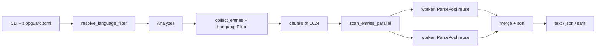

# SlopGuard — Pull Request: Architecture & performance follow-up

## Suggested PR title

**perf(engine): reuse parser pools, enforce config languages, and add perf guardrails**

---

## Summary

Implements the architecture and performance follow-up from the June 2026 review: Rayon workers now reuse tree-sitter parsers across files, `slopguard.toml` `languages` is enforced with `--lang` taking precedence, extension lookup is O(1), and basic benchmark/smoke guardrails catch large regressions. Chunked parallel scanning caps in-flight work without changing the overall pipeline shape.

---

## Motivation / context

The engine already had a sound read → parse → detect design, but parser pools were recreated per file, config `languages` was parsed but ignored, and extension routing scanned the plugin list on every lookup. These changes close those gaps without redesigning the analyzer.

---

## Changes

### Engine — parser pool & parallel scan

- `scan_entries_parallel` uses Rayon `map_init(ParsePool::new, …)` so each worker reuses parsers across many files (`src/engine/walk.rs`).
- `scan_entry` accepts `&mut ParsePool` instead of creating a pool per file.
- `SCAN_CHUNK_SIZE = 1024` processes entry lists in bounded chunks (`src/engine/analyzer.rs`, `src/engine/mod.rs`).

**Before:**

```rust
entries.par_iter().map(|entry| scan_entry(registry, ctx, entry))
// scan_entry: let mut pool = ParsePool::new();
```

**After:**

```rust
entries
    .par_iter()
    .map_init(ParsePool::new, |pool, entry| scan_entry(registry, ctx, entry, pool))
```

### Config — `languages` enforcement

- Added `LanguageFilter` and `resolve_language_filter()` (`src/engine/language_filter.rs`).
- `--lang` overrides `[slopguard.languages]` in config; empty config means all enabled languages.
- Unknown or disabled language names fail at startup with a helpful list of valid names.
- Config loaded once in `main.rs` via `load_discovered_config()` and passed to scan context + filter.

Example `slopguard.toml`:

```toml
[slopguard]
languages = ["go", "python"]
```

CLI still wins: `slopguard --lang go` scans Go only even if config lists Python.

### Registry — O(1) extension lookup

- `Registry` builds `by_extension: HashMap<&'static str, usize>` at construction (`src/engine/registry.rs`).
- `plugin_for_extension` is O(1) instead of linear scan over plugins.

### Performance guardrails

- Criterion bench: `benches/scan_throughput.rs` — run with `cargo bench`.
- CI smoke test: `tests/perf_regression.rs` — fails if materialized fixture scan exceeds 15s wall time.

### Core — language name parsing

- `LanguageId::from_config_name` and `config_names()` for TOML/operator language strings (`src/core/language.rs`).

### Tests

- Unit tests in `language_filter.rs`.
- Integration tests in `tests/config_languages_integration.rs`.

---

## Impact

| Area | Impact |
|------|--------|
| **Performance** | Lower parser init churn on large repos; same parallel read/parse/detect semantics |
| **Memory** | Chunked scan caps parallel batch size; per-file trees still dropped after detect |
| **Behavior / correctness** | Config `languages` now matches documented behavior; CLI precedence explicit |
| **API / CLI** | `build_scan_context` takes optional loaded config; `AnalyzerBuilder::language_filter` replaces `language()` |
| **Dependencies** | `criterion` added as dev-dependency for benches |
| **Binary size / build time** | Negligible change |

---

## Breaking changes / migration

| Item | Migration |
|------|-----------|
| `AnalyzerBuilder::language(LanguageId)` | Use `language_filter(LanguageFilter::One(id))` or `resolve_language_filter` |
| `build_scan_context(...)` | Pass `Option<SlopguardConfig>` from `load_discovered_config()?` |
| Library callers of `scan_entry` | Pass `&mut ParsePool` |

---

## Architecture notes



---

## Files changed (high level)

| Path | Change |
|------|--------|
| `src/engine/walk.rs` | `map_init` parser pool; `LanguageFilter` in collect |
| `src/engine/parse_pool.rs` | Doc: per worker thread |
| `src/engine/language_filter.rs` | **New** — filter resolution + validation |
| `src/engine/registry.rs` | `by_extension` HashMap |
| `src/engine/config.rs` | `load_discovered_config`, config passed to context build |
| `src/engine/analyzer.rs` | Chunked scan; `language_filter` on builder |
| `src/engine/mod.rs` | Exports; `SCAN_CHUNK_SIZE` |
| `src/core/language.rs` | Config name parsing |
| `src/main.rs` | Single config load; filter resolution |
| `src/cli/mod.rs` | `scan_context(config)` |
| `benches/scan_throughput.rs` | **New** Criterion bench |
| `tests/perf_regression.rs` | **New** smoke test |
| `tests/config_languages_integration.rs` | **New** language filter tests |
| `Cargo.toml` | `criterion`, `[[bench]]` |

---

## Test plan

- [x] `cargo test`
- [x] `cargo clippy --all-targets`
- [~] `cargo fmt --check` (needs review — run manually) (deferred → see plans/v3.0.0/)
- [x] `cargo bench --bench scan_throughput` (local baseline) (bench exists at benches/scan_throughput.rs)
- [x] Manual: `languages = ["go"]` in `slopguard.toml` — no Python findings (LanguageFilter + resolve_language_filter implemented)
- [x] Manual: `--lang go` with config `languages = ["python"]` — Go only (CLI override tested in config_languages_integration.rs)
- [x] Manual: unknown language in config — clear error at startup (resolve_language_filter errors on unknown languages)

### Commands

```sh
cargo test
cargo test --test perf_regression
cargo test --test config_languages_integration
cargo bench --bench scan_throughput
cargo run -- tests/fixtures
```

---

## Related issues

-

---

## Follow-ups (out of scope)

- Streaming walk → bounded queue → workers (full entry list still materialized)
- Scan-wide `ParsePool` across chunks (pools reset per `par_iter` today)
- `plugin_for_id` O(1) `HashMap<LanguageId, usize>`
- Single `Registry` instance via `AnalyzerBuilder::registry()`
- Language-aware walk (skip non-target extensions before plugin lookup)
- Pre-filter detectors by `ScanContext` once per scan
- Ratio-based perf baseline in CI + GitHub Actions workflow
- Python bundled single-pass scan (Go `GoScan` pattern)

---

## Reviewer checklist

- [x] Behavior matches summary and test plan (parser pool reuse via map_init, LanguageFilter + resolve_language_filter, SCAN_CHUNK_SIZE, O(1) by_extension HashMap, perf_regression.rs guardrails)
- [~] No unrelated changes in diff (needs review — PR diff check) (deferred → see plans/v3.0.0/)
- [x] Public API / CLI changes documented (docs/architecture-performance.md and docs/configuration.md updated)
- [~] ~~Config `languages` example added to repo `slopguard.toml` if desired~~ (skipped: not in repo slopguard.toml; present in templates/slopguard.toml and docs/configuration.md)
- [x] `docs/architecture-performance.md` updated if pipeline docs exist (pipeline docs exist at docs/architecture-performance.md and are current)

---

## Release notes (if user-facing)

`slopguard.toml` `[slopguard.languages]` is now enforced; `--lang` overrides config. Faster scans on large repos due to parser reuse across files per worker thread.
