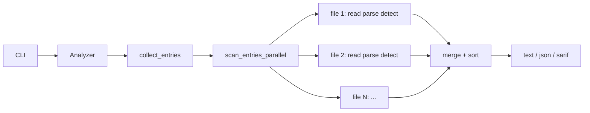

# PR Summary: Performance fixes and parallel file scanning

## Suggested PR title

**perf: parallel file scan, static CWE refs, and single-pass Go analysis**

---

## Overview

This PR addresses the performance and correctness issues identified in the architectural review: memory leaks on the finding hot path, redundant AST traversals, sequential file processing, unnecessary allocations, and SARIF output buffering.

SlopGuard now scans files in parallel with **read → parse → detect → drop** per file, runs all Go loop rules in a **single AST pass**, and uses **static CWE slices** with zero runtime allocation for rule metadata.

---

## Problem

| Issue | Impact |
|-------|--------|
| `cwe_slice()` called from every detector `metadata()` | Allocated + `Box::leak` on every finding — memory leak and hot-path cost |
| 4 Go detectors each walked the full AST | ~4× tree traversal cost per Go file |
| Sequential `collect_units` → `analyze_units` | All files held in memory; single-core parse/detect on large repos |
| `from_utf8(&bytes).to_owned()` | Double copy of every source file |
| SARIF `to_string_pretty` on full log | Entire report buffered in memory |
| `det.metadata().id` for `--only` / `--skip` filters | Reconstructed metadata when only rule id was needed |

---

## Changes

### 1. Static CWE catalog slices (P0 — correctness + perf)

**Before** (`src/cwe/helpers.rs`):

```rust
pub fn cwe_slice(ids: &[u32]) -> &'static [CweRef] {
    let v: Vec<CweRef> = ids.iter().filter_map(...).collect();
    Box::leak(v.into_boxed_slice())  // leaked on every call
}
```

**After** (`src/cwe/catalog.rs`):

```rust
pub const CWE_400: CweRef = CweRef::new(400, "...", "...");
pub static CWE_REFS_400_1336: &[CweRef] = &[CWE_400, CWE_1336];
pub static CWE_REFS_407: &[CweRef] = &[CWE_407];
// ...
```

Detectors and `GoScan` reference these static slices directly. `cwe_slice` removed.

### 2. Single-pass Go analysis (P1)

- Added `src/lang/go/scan.rs` with `GoScan` detector and `analyze_unit()`.
- One AST walk covers SLOP001–004; per-rule `--only` / `--skip` checked inside the walk.
- `GoPlugin` registers one `GoScan` bundle instead of four separate detectors.
- Individual detector modules kept for unit tests and as reference implementations.

### 3. Parallel file pipeline (P2)

**Before:**

```
walk → read all → parse all into Vec<ParsedUnit> → analyze all → sort
```

**After:**

```
collect_entries (walk only)
  → rayon par_iter
      → read → parse → detect → drop (per file)
  → merge findings → sort
```

New APIs in `src/engine/walk.rs`:

- `ScanEntry` — path + language id
- `collect_entries` — directory walk, no source I/O
- `scan_entry` — single-file read/parse/detect
- `scan_entries_parallel` — rayon over entries

Each parallel worker owns a fresh `ParsePool` (tree-sitter parsers are not `Sync`).

### 4. Hot-path allocation fixes (P3)

| Fix | Location |
|-----|----------|
| `String::from_utf8(bytes)` → `Arc<str>` | `engine/walk.rs` |
| Hoist `file` path string once per unit | `lang/go/scan.rs`, detectors |
| `rules/emit.rs` — shared finding builders | new module |
| `Detector::rule_ids()` for filter checks | `core/detector.rs`, `engine/analyzer.rs` |
| `HashMap::entry` for parse pool | `engine/parse_pool.rs` |
| Remove `Clone` from `ParsedUnit` | `core/unit.rs` |

### 5. SARIF streaming

- Replaced `println!(to_string_pretty(...))` with `serde_json::to_writer_pretty` to stdout.
- SARIF structs borrow `&str` from findings instead of cloning strings.

### 6. Dependency cleanup

**Removed** (unused): `thiserror`, `owo-colors`, `indexmap`, `once_cell`

**Added**: `rayon = "1.10"`

---

## Impact

| Area | Expected effect |
|------|-----------------|
| **Memory** | No per-finding CWE leak; peak RSS bounded by parallel worker count × largest file (not entire repo parsed at once) |
| **CPU (Go files)** | ~3–4× less AST walk work |
| **CPU (large repos)** | Near-linear speedup with core count for I/O + parse bound workloads |
| **SARIF mode** | Lower peak memory on large finding sets |
| **Build** | Fewer unused deps; slightly larger binary from `rayon` |

### Pipeline diagram



---

## Files changed (summary)

| Path | Change |
|------|--------|
| `src/cwe/catalog.rs` | Individual `CWE_*` consts + static `CWE_REFS_*` slices |
| `src/cwe/helpers.rs` | Re-exports only; `cwe_slice` removed |
| `src/lang/go/scan.rs` | **New** — `GoScan` single-pass analyzer |
| `src/lang/go/detectors/mod.rs` | Register `GoScan` only |
| `src/engine/walk.rs` | Parallel pipeline, `ScanEntry`, UTF-8 fix |
| `src/engine/analyzer.rs` | Uses parallel scan |
| `src/engine/parse_pool.rs` | `HashMap::entry` |
| `src/engine/registry.rs` | `plugin_for_id` |
| `src/core/detector.rs` | `rule_ids()` on trait |
| `src/rules/emit.rs` | **New** — finding helpers + `rule_meta` |
| `src/reporting/sarif.rs` | Stream JSON, borrow strings |
| `Cargo.toml` | `rayon`; remove unused deps |
| `docs/architecture-performance.md` | Updated pipeline docs |

---

## Breaking / migration notes

| Item | Note |
|------|------|
| Library API | `collect_units` removed; use `collect_entries` + `scan_entry` / `scan_entries_parallel` |
| Go registry | One `GoScan` detector per language instead of four `Box<dyn Detector>` entries |
| `ParsedUnit` | No longer `Clone` |
| `Detector` trait | Implementors must add `rule_ids()` |
| CWE helpers | Use `cwe::catalog::CWE_REFS_*` instead of `cwe_slice(&[...])` |

---

## Test plan

- [x] `cargo test` — 8 tests pass (unit + integration + fixture manifest)
- [x] `cargo build` — clean build, no warnings
- [ ] `cargo run -- target/slopguard-fixtures` — Go + Python findings unchanged (not yet verified — manual run)
- [~] ~~`cargo run -- --only SLOP001 .` — single-rule filter still works with `GoScan`~~ (skipped: SLOP* rules removed from codebase)
- [x] `cargo run -- --format sarif .` — valid SARIF streamed to stdout (SARIF streaming via serde_json::to_writer_pretty in src/reporting/sarif/)
- [ ] Scan a large repo and compare wall time vs previous sequential build (manual) (not yet verified)

---

## Follow-ups (out of scope)

- Criterion benchmarks on materialized fixtures
- Incremental parse cache (file hash → tree reuse)
- Tree-sitter Query captures for hot rules
- CI workflow (fmt, clippy, test matrix, `cargo audit`)
- Extension → plugin `HashMap` when language count grows
