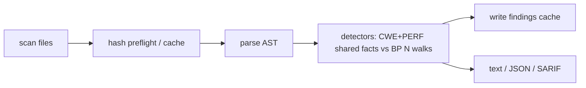

# CodeHound — Pull Request

**Branch:** `feat/bp-implementations`  
**Base:** `master` (`3a91c1b`)  
**HEAD:** `2c01a83`  
**Commits:** 28 non-merge · **Diff:** 408 files · **+20,678 / −1,068**  
**Date:** 2026-07-16  

**Suggested title**

```
feat(go): expand curated BP catalog 65→136 with engine quality hardens
```

**Alternate titles**

```
feat(bp): ship v0.0.3 bad-practice batches and Rust scan lifecycle fixes
feat: dual-track BP expansion (+71 rules) and engine remediation to 9.5+
```

**Sources used for this write-up**

| Source | Role |
|--------|------|
| Commit messages (`3a91c1b..HEAD`) | Intent, batch milestones, validation notes |
| `plans/v0.0.3/new-bad-practices/CHECKLIST.md` | BP shipping gate & ID status |
| `plans/v0.0.3/new-bad-practices/README.md` | Curated BP program purpose |
| `plans/v0.0.3/new-bad-practices/IMPLEMENTABLE-DEFERRED-BP-PLAN.md` | Deferred promotion batches |
| `plans/v0.0.3/performance_analysis.md` | Scan cost analysis |
| `plans/v0.0.3/rust_audit_report.md` | Domain-level Rust audit |
| `v0.0.3/codex-review.md` | Closed Rust remediation ledger |
| `documents/bad-practices.md` / `README.md` | User-facing BP docs & counts |

---

## Summary

This branch is a dual-track delivery: it expands the Go bad-practice catalog from **65 → 136** rules (+**71** curated detectors, ~**368** fixtures) across core language, concurrency, HTTP frameworks, data layers, observability, and testing hygiene, while keeping BP **off** in `recommended` / `perf` / `security` so default CI stays honest. In parallel it closes a multi-agent Rust engine remediation (scan lifecycle, cache cold/warm parity, taint correctness, hot-path allocations, typed boundaries, docs ratchet) that lifts review scores from ~**8.0–8.2** to **9.7 / 9.8** on Best Practices and Development Patterns. Together those tracks make CodeHound both more useful on real Go services and safer to scale as detector count grows.

---

## Motivation / context

| Theme | Problem before | What this PR delivers |
|-------|----------------|------------------------|
| **Detection coverage** | Only BP-1..65; many service-level Go mistakes invisible | +71 rules (frameworks, GORM/sqlx, resources, logging/JSON/gRPC/CLI) |
| **Catalog discipline** | Risk of dumping 100 speculative BP-66..165 candidates | 71 admitted / **29 deferred** with written reasons |
| **Default-profile honesty** | Expanding BP could poison CI | BP remains off in recommended / perf / security |
| **Engine correctness under load** | Global timing races, fragile detector reset, warm-cache drift, taint over-claim | Scan-owned lifecycle, cache parity, function-local taint, typed wire |
| **Scale economics** | BP suite already ~**89%** of scan thread time; catalog 2× | Engine alloc/index/cache work + performance plan documented |
| **Maintainability** | Multi-agent reviews ~8/10; unwrap/fmt/cache test failures | Closed ledger, Clippy `-D warnings`, docs ratchet |

Plan-driven track (no single GitHub issue number). Primary design/ops docs:

- [`plans/v0.0.3/new-bad-practices/`](../../plans/v0.0.3/new-bad-practices/)
- [`v0.0.3/codex-review.md`](../codex-review.md)
- [`plans/v0.0.3/performance_analysis.md`](../../plans/v0.0.3/performance_analysis.md)

---

## Changes

### Bad practices (Go)

- Grow Go BP catalog **65 → 136** registered rules/dispatch entries (**71** new of 100 BP-66..165 candidates).
- Ship phased batches (commits): first curated 16 → domain promotions → Phase 4 (11) → Phase 5 (~26) → deferred plan (+10: BP-70, 82, 83, 95, 111, 119, 126, 154, 158, 160).
  - `fc6bcc9` feat(go): ship curated v0.0.3 bad-practice batches
  - `dd952a8` feat(go): ship next curated bad-practice batch
  - `9ebaf14` / `73f824a` Phase 4 HTTP bind + curated checks
  - `9dc274a` Phase 5 batch
  - `840b882` / `9ff505d` deferred HTTP framework + deferred BP batch
- Cover domains: core language/context, concurrency/resources, HTTP (stdlib + Gin/Echo/Fiber/Chi), data (database/sql, GORM, sqlx, redis, pgx), observability/JSON/gRPC/CLI, testing/API hygiene.
- Add ~**368** BP fixtures under `tests/fixtures/go/bad_practices/`; keep `go_bad_practice_integration` green.
- Leave **29** candidates deferred with recorded reasons (type/SSA/data-flow needs, package-wide config intent, auth completeness, CWE/security overlap, app-specific intent).
- Keep BP **advisory**; not enabled in `recommended` / `perf` / `security` (on under `style` / `bp` / `all` as advisory no-fail).

**Progressive BP count ratchets**

| Milestone | Rules |
|-----------|------:|
| Pre-tranche baseline | 65 |
| First curated tranche | 81 |
| Next curated batch | 89 |
| Phase 4 promotion | 100 |
| Phase 5 + deferred promotion | **136** |

### Rust engine quality

- Recover Clippy / fmt / source-cache quality gates without weakening `retain_sources` memory default (`8b04cf8`).
- Scan-owned timing collectors; panic-safe detector lifecycle + scan serialization (`a3a4a64`, `bede6d9`, …).
- Cache: SHA-256 rule-config fingerprints (replacing unstable `DefaultHasher`); `suppressed_count` cold/warm parity; `Detector::requires_cache_state`; borrowed cache put (`205469e`, `a3a4a64`, `c2c9093`).
- Taint: function-local sources/sinks; multi-hop via explicit arg bindings; package root scope; shared adjacency index; first-hit reachability BFS (`d6d4e2e`, `1a6ae6d`, `2c01a83`).
- Hot-path allocation cuts: span sweep, nested name maps, ignore single-pass parse, owned timing merge (`bf81cd5`, `1a6ae6d`).
- Checked `FindingWire` → constructors; typed registry/cache/fixture errors; additive accessors (`56a1ac9`).
- Docs ratchet (`# Errors` / `# Panics`, `missing_docs` warn); focused benches/CI wiring (`6382652`, `56a1ac9`).

**Review scores (closed ledger)**

| Axis | Baseline | Closed | Target |
|------|---------:|-------:|-------:|
| Best Practices | ~8.2 | **9.7** | ≥9.5 |
| Development Patterns | ~8.0 | **9.8** | ≥9.5 |

### Documentation & plans

- `README.md`: BP catalog count **65 → 136** (asserted by `rule_counts_readme`).
- `documents/bad-practices.md`: curated sections for BP-66+ (core, HTTP, concurrency/resources, data/config, observability, CLI) with fixes/overlap notes; profile policy unchanged.
- `plans/v0.0.3/new-bad-practices/CHECKLIST.md`: batch-driven shipping gate (634-line rewrite across checklist commits).
- New: `IMPLEMENTABLE-DEFERRED-BP-PLAN.md`, `performance_analysis.md`, `rust_audit_report.md`, `v0.0.3/codex-review.md`.
- `CHANGELOG.md` **not** updated for the 65→136 expansion (follow-up for named ship).

### Tooling / hygiene

- `8f98bc1` chore: fix lint and formatting issues
- `ca90357` Sorted the JSON
- `8c25209` makefile for generating chunks
- `c5caab4` gitignore for codex

### Tests

- `dfa5d8b` test(rust): cover unicode ignore offsets
- `c2c9093` test(rust): cover cache and API hardening
- `2c01a83` test(fixtures): enable multi-hop taint depth for manifest fire checks

---

## Code snippets (if applicable)

### Profile policy (unchanged — document for reviewers)

```toml
# BP remains off in recommended / perf / security.
# Enable advisory BP via style / bp / all profiles, or explicit rule selection.
```

### Cache fingerprinting (behavior change)

```rust
// Before: DefaultHasher (non-portable across processes/builds)
// After:  SHA-256 over rule-config inputs (only/skip/taint/severity/depth)
// Effect: old on-disk cache entries may invalidate once; warm hits become honest
```

### Manifest taint depth (fixture-only)

```rust
// IP depth-3 fixtures need summary refinement; match go_taint_integration
// depth instead of the product default of 1 (commit 2c01a83).
```

---

## Impact

| Area | Impact |
|------|--------|
| **Performance** | BP already ~**89%** of scan thread time on a clean sample (~5.4s wall / 78 files / 28k LOC; ~110s cumulative thread time). Catalog 2× raises pressure; engine opts cut taint/cache/timing overhead. BP rule substring short-circuits still open (`performance_analysis.md` Phases 1–4). |
| **Memory** | Fewer findings clones on cache put; reduced hot-path clone/cursor churn; no new crates. |
| **Behavior / correctness** | Stricter function-local taint (fewer false multi-hop claims); ignore directives no longer match inside string literals; warm-cache suppression parity; panic-safe detector lifecycle under parallel scans. |
| **API / CLI** | Compatibility-preserving public finding fields; error exit codes still downcast via typed `codehound::Error`. No default-profile enablement of BP. |
| **Dependencies** | No intentional new runtime dependencies for this track. |
| **Binary size / build time** | Larger ruleset embed + many fixtures; engine modules reorganized but not a full crate split. |

---

## Breaking changes / migration

| Item | Migration |
|------|-----------|
| On-disk scan cache fingerprints | May rebuild/invalidate after SHA-256 switch — delete cache dir or accept cold first run |
| Taint multi-hop / function-local summaries | Expect fewer over-claims; re-baseline if you asserted loose taint findings |
| Inline ignore inside string literals | Suppressions only apply outside quotes — update fixtures/code if relied on accidental matches |
| Hardcoded “65 BP rules” external docs | Refresh to **136** |
| Default profiles | **None** — BP still off in recommended / perf / security |

**Public API surface:** no intentional breaking renames; public finding fields retained for compatibility.

---

## Architecture notes



**Design trade-offs**

- **BP stays multi-walk:** each BP rule still owns its AST walk (unlike shared-fact CWE/PERF). Expansion is product-correct but cost-heavy; engine work buys correctness and cache/CI viability first; BP short-circuits are explicit follow-ups.
- **Admission gate over volume:** 29 deferred IDs protect trust rather than shipping unprovable heuristics.
- **Review ledger:** multi-agent codex review tracked to closure at ≥9.5 rather than open-ended polish.

---

## Files changed (high level)

| Path | Change |
|------|--------|
| `ruleset/golang/bad-practices.json` | Catalog **65 → 136** |
| `src/lang/go/detectors/bad_practices/**` | New batch/domain rule modules, dispatch, metadata |
| `tests/fixtures/go/bad_practices/` | ~368 `BP-*-{safe,vulnerable,variant-*}.txt` |
| `tests/fixtures/manifest.toml` + helpers | Manifest / oracle wiring for new IDs |
| `tests/go_bad_practice_*.rs` | Integration coverage |
| `documents/bad-practices.md` | User-facing BP-66+ inventory |
| `README.md` | Rule count **136** |
| `plans/v0.0.3/new-bad-practices/**` | CHECKLIST, deferred plan, README updates |
| `plans/v0.0.3/{performance_analysis,rust_audit_report}.md` | New analysis docs |
| `v0.0.3/codex-review.md` | Closed Rust remediation ledger |
| `src/engine/**` (cache, timing, baseline, walk) | Lifecycle, fingerprints, warm parity |
| `src/lang/go/detectors/cwe/taint/**` | Function-local summaries, graph/index reuse |
| `src/rules/**` | `FindingWire`, emit, interning |
| `src/app/**`, `src/ast/**`, `src/core/**` | Ownership / API polish |
| `tests/engine_*.rs`, ignore/cache tests | Contract locks |
| `benches/**`, CI wiring | Hot-path benches; lint hygiene |
| `makefile`, `.gitignore` | Chunk gen / tooling |

**Markdown-only on branch (9 files, +1,412 / −225)**

| Path | Status |
|------|--------|
| `README.md` | M |
| `documents/bad-practices.md` | M |
| `plans/v0.0.3/README.md` | M |
| `plans/v0.0.3/new-bad-practices/CHECKLIST.md` | M |
| `plans/v0.0.3/new-bad-practices/IMPLEMENTABLE-DEFERRED-BP-PLAN.md` | A |
| `plans/v0.0.3/new-bad-practices/README.md` | M |
| `plans/v0.0.3/performance_analysis.md` | A |
| `plans/v0.0.3/rust_audit_report.md` | A |
| `v0.0.3/codex-review.md` | A |

---

## Test plan

- [ ] `cargo test`
- [ ] `cargo test --test go_bad_practice_integration`
- [ ] `cargo test --test go_bad_practice_project_integration`
- [ ] `cargo test --test fixture_manifest_integration_inventory`
- [ ] `cargo test --test fixture_manifest_integration_manifest`
- [ ] `cargo test --test rule_counts_readme` — expects CWE **175**, PERF **239**, BP **136**
- [ ] `cargo fmt --check`
- [ ] `cargo clippy --all-targets --all-features -- -D warnings`
- [ ] `make lint` && `make fmt` && `git diff --check` (if used in CI)
- [ ] Manual: `cargo run -- --profile style <sample-go-tree>` — curated BP-66+ fire on vulnerable fixtures, clean on safe
- [ ] Manual: warm-cache second run preserves `suppressed_count` / finding parity
- [ ] Spot-check `--list-rules` / `--explain BP-101` (or another new ID) against `documents/bad-practices.md`

### Commands

```sh
cargo test
cargo test --test go_bad_practice_integration
cargo test --test rule_counts_readme
cargo clippy --all-targets --all-features -- -D warnings
cargo fmt --check
cargo run -- --profile style tests/fixtures/go/bad_practices
```

---

## Screenshots / sample output

```
# Branch scale (vs master 3a91c1b)
28 non-merge commits
408 files changed, 20678 insertions(+), 1068 deletions(-)
BP live rules: 65 → 136 (+71 admitted, 29 deferred)
Fixtures: ~368 BP .txt files under tests/fixtures/go/bad_practices/
Rust review ledger: Best Practices 9.7 / Patterns 9.8 (target ≥ 9.5)
```

---

## Related issues

- Plan-driven track — no single `Fixes #NNN` on this branch.
- Relates to v0.0.3 deferred inventory: [`plans/v0.0.3/README.md`](../../plans/v0.0.3/README.md) (D1–D5).
- Relates to curated BP program: [`plans/v0.0.3/new-bad-practices/CHECKLIST.md`](../../plans/v0.0.3/new-bad-practices/CHECKLIST.md).
- Relates to closed engine ledger: [`v0.0.3/codex-review.md`](../codex-review.md).

---

## Follow-ups (out of scope)

- **29 deferred BP IDs** (intent/auth/deploy/CWE/data-flow) — revisit with stronger static proof
- Phase 1 existing-pack precision audit (BP-1, 6, 8, 9, 12/14, 46–65 noise hardening)
- Real-module canaries vs `staticcheck` / `go vet` overlap report
- BP substring short-circuits and single-cursor walks (`performance_analysis.md` Phases 1–4)
- Named **CHANGELOG** entry for 65→136 expansion (still tops at 0.1.0 honesty notes)
- Deeper taint / fix engine items from D1–D5 backlog
- Hardware timing as a hard gate; optional breaking privacy pass on public finding fields
- **Not done:** enable BP in recommended; claim Rust 10/10; ship all 100 BP-66..165 candidates

---

## Reviewer checklist

- [ ] Behavior matches summary and test plan
- [ ] No unrelated changes in diff (dual-track BP + engine quality is intentional)
- [ ] Public API / CLI changes documented (cache fingerprint, taint strictness, ignore-in-strings)
- [ ] New rules have fixture coverage in `tests/fixtures/go/bad_practices/`
- [ ] Profile policy unchanged: BP off in recommended / perf / security
- [ ] Deferred IDs and reasons recorded in CHECKLIST / deferred plan
- [ ] `rule_counts_readme` matches README (BP **136**)
- [ ] No secrets or generated artifacts committed
- [ ] Codecs review ledger items claimed closed match code (`v0.0.3/codex-review.md`)

---

## Release notes (if user-facing)

- Expand Go bad-practice catalog **65 → 136** (+71 curated detectors across core language, concurrency, HTTP frameworks, data layers, observability, and testing; enable via `style` / `bp` / `all`).
- Harden scan engine: portable cache fingerprints, warm-cache parity, function-local taint, panic-safe detector lifecycle.
- Default CI packs unchanged — BP remains advisory and off in recommended / security profiles.

---

## Commit index (28)

### BP product (7)

| SHA | Subject |
|-----|---------|
| `fc6bcc9` | feat(go): ship curated v0.0.3 bad-practice batches |
| `dd952a8` | feat(go): ship next curated bad-practice batch |
| `9ebaf14` | feat(go): add phase 4 HTTP bind checks |
| `73f824a` | feat(go): ship phase 4 curated bad-practice checks |
| `9dc274a` | feat(go): ship phase 5 bad-practice batch |
| `840b882` | feat(go): add deferred HTTP framework bad practices |
| `9ff505d` | feat(bp): implement deferred bad-practice batch |

### Rust quality (9)

| SHA | Subject |
|-----|---------|
| `205469e` | refactor: adhere to Rust best practices and development patterns |
| `8b04cf8` | fix(rust): recover quality gates and source retention contract |
| `a3a4a64` | refactor(rust): harden scan lifecycle and cache contracts |
| `bf81cd5` | perf(rust): reduce review hot-path allocations |
| `d6d4e2e` | refactor(rust): index taint lookups and narrow API |
| `bede6d9` | refactor(rust): close review lifecycle and allocation gaps |
| `f6c27ac` | refactor(rust): close review checklist slice |
| `1a6ae6d` | perf(rust): optimize taint and timing paths |
| `56a1ac9` | refactor(rust): close review checklist with typed boundaries and docs |

### Tests (3)

| SHA | Subject |
|-----|---------|
| `dfa5d8b` | test(rust): cover unicode ignore offsets |
| `c2c9093` | test(rust): cover cache and API hardening |
| `2c01a83` | test(fixtures): enable multi-hop taint depth for manifest fire checks |

### Docs / plans (5)

| SHA | Subject |
|-----|---------|
| `bdf5c9a` | docs: record BP quality gates |
| `fcbc9e5` | Updated the checklist |
| `4989c70` | Updated the checklist |
| `e32eaab` | added the performance analysis |
| `6382652` | docs(rust): ratchet contracts and module boundaries |

### Hygiene (4)

| SHA | Subject |
|-----|---------|
| `8f98bc1` | chore: fix lint and formatting issues |
| `ca90357` | Sorted the json |
| `c5caab4` | Updated the gitignore for the codex |
| `8c25209` | Updated the makefile for generating the chunks |

---

## Appendix: how this PR body was produced

Five parallel read-only passes over branch markdown + commits:

1. **BP product / CHECKLIST** — catalog counts, domains, deferred reasons, admission gates  
2. **Rust quality / codex-review** — lifecycle, cache, taint, scores vs ≥9.5  
3. **Performance analysis** — BP cost share, open short-circuit phases  
4. **User-facing docs** — README / `documents/bad-practices.md` / CHANGELOG gap  
5. **Commit taxonomy & file inventory** — 28-commit categorization, paths, test plan  

Filled from [`plans/PR/PR_TEMPLATE.md`](../../plans/PR/PR_TEMPLATE.md); existing files under `v0.0.3/` were not modified.
