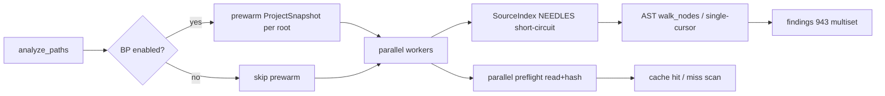

# CodeHound — Pull Request

**Branch:** `chore/perf`  
**Base:** `master` (`86b6811`)  
**HEAD:** `249b15e`  
**Commits:** 6 · **Diff:** 35 files · **+912 / −549**  
**Date:** 2026-07-17  

**Suggested title**

```
perf: cut cold scan ~12× (up to 5s → ~0.4s) with BP short-circuits
```

**Alternate titles**

```
perf(engine): ProjectSnapshot + BP needles for sub-second cold scans
perf(bp): Phase 0–7A cold-scan plan — 943 findings, ~400ms avg wall
```

**Sources used for this write-up**

| Source | Role |
|--------|------|
| Commit messages (`86b6811..HEAD`) | Intent, phase milestones, validation notes |
| `plans/v0.0.4/README.md` | Sprint overview & product before/after |
| `plans/v0.0.4/cold-scan-performance.md` | Phases 0–7A checklist ([x] done items) |
| `plans/v0.0.4/quality-gate.md` | Related quality-gate status (Done; separate workstream) |

---

## Summary

Cold full re-analysis of a real Go project (gopdfsuit, ~78 files / ~28k lines, profile `all`) dropped from **up to 5 seconds** to **~400ms average** (~370ms best) with an identical **943-finding** multiset. The win comes from per-BP-rule timing, expanded source-needle short-circuits, cheaper AST walks (`walk_nodes` / single-cursor), a shared **`ProjectSnapshot`** that collapses project-level WalkDir thrash, parallel cache preflight, and release-only product measurement via `make run`. Website and plan docs quote honest before/after wall times only.

---

## Motivation / context

On first analysis (full re-analysis / 0 cache hits), wall time was dominated by the **Go bad-practice suite**, especially repeated full-project WalkDir work in project-level rules (BP-47/50/54/55 and friends). Intermediate timing mislabeled the whole BP pack as “BP-1”, hiding the real hot path.

| Theme | Problem before | What this PR delivers |
|-------|----------------|------------------------|
| **Cold wall time** | Up to **5s** full re-analysis on gopdfsuit | **~400ms avg** / **~370ms best** (~**12×**) |
| **Correctness** | Risk of “faster by dropping findings” | **943 findings** multiset + severity histogram unchanged |
| **Instrumentation** | Pack labeled as first rule (BP-1) | Per-BP-rule TLS timing + honest pack labels |
| **Project thrash** | `is_project_anchor` WalkDir × files × rules | One **`ProjectSnapshot`** + prewarm per root |
| **Product timing honesty** | Debug `cargo run` inflated claims | **Release** `make run` (+ optional `SKIP_BUILD=1`) |
| **Warm path** | Already fast | Parallel preflight; warm still ≪ 100ms |
| **Developer test feedback** | `make test` serialized test binaries: **51.23s warm** | **30.39s** for 390 tests + 1 doctest; all pass |

Plan-driven track (v0.0.4 cold-scan performance). Primary docs:

- [`plans/v0.0.4/README.md`](./README.md)
- [`plans/v0.0.4/cold-scan-performance.md`](./cold-scan-performance.md)

---

## Changes

### Engine timing & reporting

- Add optional **per-BP-rule** timing when `debug_timing` is on (`measure_active` + TLS collector).
- Fix timing display: drop outer `detector_execution` double-count; pack labels `GoPerfScan` / `GoCweScan`; exclude wrapper phases from % view.
- Touch points: `src/engine/timing/collector.rs`, `src/engine/mod.rs`, `src/engine/walk/analyze.rs`, `src/engine/walk/scan_entry.rs`, `src/reporting/text/summary.rs`, `src/lang/go/detectors/bad_practices/mod.rs`.

### BP short-circuits & cheaper walks (Phases 1–2, 6C, 7A)

- Expand `SourceIndex` **NEEDLES** (`_`, `:=`, `defer`, `time.After`, `panic(`, `select`, frameworks, SQL, testing tokens, …).
- Wire short-circuits on hot rules (BP-1/2/3/5/7/9/10/11/13 and existing guards retained).
- Rewrite hot AST walks: BP-1 → `walk_nodes`; BP-10/11 loops → single-cursor DFS with loop-depth stack.
- Long-tail short-circuits: BP-75, BP-79, BP-15, BP-98, BP-151, BP-146.
- Residual Phase 7A needles: BP-30 (`interface`), BP-31 (`func New`), BP-66 (`%w`), BP-88 (`chan `), BP-99 (`NewCond` / `sync.Cond` / `.Wait(`).
- Limit package-scope helper collection to root named children (`collect_unexported_helpers`).

### Project-level memoization (Phases 3, 5–6, 7A)

- Introduce **`ProjectSnapshot`**: one WalkDir + text scan per project root; precomputed flags (`has_server_start`, `has_shutdown`, `has_signal_handling`, `has_public_route`, `has_rate_limiting`, `has_request_id`, `has_logging`).
- `is_project_anchor` and BP-47/50/54/55 read snapshot flags only (no per-rule full-tree rescan).
- Memoize project texts / go.mod / imports where still needed.
- **Prewarm** from `Analyzer::analyze_paths` after root discovery, before parallel workers.
- Gate prewarm when `bad_practices_enabled == false`; prewarm **every distinct** project root on multi-path scans.

### Cache preflight (Phase 4)

- Parallelize Phase 1 of `preflight_cache_hits` (Rayon read + hash + lookup) in `src/engine/walk/parallel.rs`.
- Keep lookups read-only against the store; warm path verified (78 hits, ≪ 100ms).

### Tooling / makefile

- `make run` uses the optimized, incremental **`perf-run`** profile for the local edit → scan loop; it keeps `opt-level=3` while avoiding release LTO/link cost.
- `make run RUN_PROFILE=release` remains the release-only path for publishable performance measurements; `run-perf-enhanced` and `run-sarif` continue to use the release binary.
- Optional `SKIP_BUILD=1` runs the existing release binary with no cargo work.
- Export product path: `make run RUN_ARGS="--export-context --export-chunks"`.
- `make test` runs all regular tests through bounded `cargo-nextest` parallelism
  (four test processes, four Rayon workers each) while the doctest runs concurrently.
  This retains all **390** regular tests plus the doctest; `CONTRIBUTING.md`
  documents the one-time `cargo install cargo-nextest --locked` prerequisite.

### Plans & website

- Restructure plans path; keep v0.0.4 cold-scan checklist as the source of truth (Phases **0–7A done**, 7C optional).
- Product docs quote **wall before/after only** (drop phase-wise intermediate benches as product claims).
- Frontend / docs site: update benchmark copy to **up to 5s → ~0.4s**.

### Commits on this branch

| SHA | Message |
|-----|---------|
| `5b82e12` | Chore: Restructured the plans path |
| `02e7d6f` | perf(engine): cut cold scan ~15× with BP short-circuits and project caches |
| `4d213a0` | perf(bp): Phase 6 project snapshot, release make run, sub-second cold scans |
| `024549b` | Updated the website |
| `552ac41` | Updating the benchmarks for the release before vs now |
| `249b15e` | perf(bp): Phase 7A residual needles + honest ~400ms product timings |

---

## Code snippets (if applicable)

### Project snapshot + prewarm (orchestration)

```rust
// After root discovery, before parallel workers — skip when BP is off;
// prewarm every distinct path root so multi-root scans stay correct.
#[cfg(feature = "go")]
if self.scan_context().bad_practices_enabled {
    let mut seen = std::collections::HashSet::new();
    for path in paths {
        let root = discover_project_root(path.as_ref());
        if seen.insert(root.clone()) {
            crate::lang::go::detectors::bad_practices::prewarm_project_cache(&root);
        }
    }
}
```

### Anchor without WalkDir thrash

```rust
// Before: full-tree WalkDir + sort on every is_project_anchor call
// After:  memoized ProjectSnapshot.anchor (one WalkDir per root)
pub(crate) fn is_project_anchor(unit: &ParsedUnit) -> bool {
    let root = discover_project_root(&unit.path);
    let Some(anchor) = project_snapshot_for_root(&root).anchor else {
        return false;
    };
    anchor == unit.path
}
```

### Product measurement (release only)

```sh
make run
make run RUN_ARGS="--export-context --export-chunks"
make run SKIP_BUILD=1   # no recompile; uses existing target/release/codehound
```

---

## Impact

| Area | Impact |
|------|--------|
| **Performance** | Cold full re-analysis **up to 5s → ~400ms avg** (~370ms best) on gopdfsuit; ~**12×** wall speedup |
| **Memory** | ProjectSnapshot flags avoid retaining multi-MB project text clones under mutex when flags cover consumers; prewarm is one-shot per root |
| **Behavior / correctness** | **943 findings** unchanged; severity 9H / 411M / 319L / 204I unchanged; top-rule multiset unchanged |
| **API / CLI** | No public CLI flag changes; `make run` uses `perf-run`, with explicit `RUN_PROFILE=release` for benchmark claims |
| **Dependencies** | None added |
| **Binary size / build time** | Negligible; local product path prefers release (LTO rebuild only when dirty) |

---

## Breaking changes / migration

| Item | Migration |
|------|-----------|
| None for CLI users | Findings, fingerprints, and export contents unchanged |
| Local `make run` | Uses optimized incremental `perf-run` by default. Use `RUN_PROFILE=release` for benchmark claims; use `SKIP_BUILD=1` to skip cargo when the selected profile binary exists |

---

## Architecture notes



**Root causes resolved** (from plan RC table): multi-walk ASTs, per-node TreeCursor thrash, missing fast-paths, deep package-scope walks, timing mislabel, serial preflight, and project-anchor WalkDir thrash.

---

## Files changed (high level)

| Path | Change |
|------|--------|
| `src/engine/timing/collector.rs` | Per-rule / active timing support |
| `src/engine/walk/analyze.rs` | Detector timing dispatch |
| `src/engine/walk/parallel.rs` | Rayon Phase 1 cache preflight |
| `src/engine/walk/scan_entry.rs` | No double-count wrapper timing |
| `src/engine/analyzer/scan.rs` | BP-gated multi-root prewarm |
| `src/lang/go/detectors/bad_practices/common.rs` | `ProjectSnapshot` + caches |
| `src/lang/go/detectors/bad_practices/source_index.rs` | Expanded NEEDLES |
| `src/lang/go/detectors/bad_practices/rules/*` | Short-circuits + cheaper walks |
| `src/reporting/text/summary.rs` | Timing summary honesty |
| `Cargo.toml` | `perf-run` profile: optimized incremental local scan loop; release LTO unchanged |
| `makefile` | Profile-selectable `make run` + `SKIP_BUILD`; bounded parallel `make test` + concurrent doctest |
| `CONTRIBUTING.md` | `cargo-nextest` setup and the default fast test command |
| `plans/v0.0.4/*` | Checklist + results docs |
| `frontend/` / `docs/` | Product before/after benchmark copy |

---

## Test plan

### Correctness oracle (held across phases)

- [x] `make test` green  
- [x] `make lint` green  
- [x] Cold gopdfsuit: **943 findings**  
- [x] Severity + top-rule multiset unchanged  
- [x] Export: 943 context / 38 chunks  

### Reviewer / re-verify

- [ ] `make test`
- [ ] `make lint` (`cargo clippy -- -D warnings` + `cargo fmt --check`)
- [ ] `cargo fmt --check`
- [ ] Cold product scan: `make run` — expect **~0.4s** wall, **943 findings**, 0 cache hits on first full re-analysis
- [ ] Export: `make run RUN_ARGS="--export-context --export-chunks"`
- [ ] Warm second run: 78 hits, ≪ 100ms
- [ ] Optional: `make run SKIP_BUILD=1` after a prior release build

### Commands

```sh
make test
make lint
make run
make run RUN_ARGS="--export-context --export-chunks"
make run SKIP_BUILD=1
```

### Product run results (verified 2026-07-17)

| Metric | Value |
|--------|-------|
| Command | `make run RUN_PROFILE=release` / `./target/release/codehound` (release, full re-analysis) |
| Cold wall | **~400ms average** · **~370ms best** (0 hits / 78 misses) |
| Findings | **943** (9 high, 411 medium, 319 low, 204 info) |
| Top rules | BP-1×181, PERF-6×94, PERF-32×59, BP-37×51, PERF-230×44 |
| Export | 943 context files + 38 chunk files |
| vs baseline | **up to 5s → ~0.4s** (~**12×** faster) |

### Test-runner result (verified 2026-07-17)

| Metric | Value |
|--------|-------|
| Command | `make test` |
| Coverage | **390** regular tests across 74 binaries + **1** doctest |
| Result | All tests passed; no tests removed or performance budgets relaxed |
| Warm wall | **30.39s** (previous serial runner: **51.23s**) |
| Cold constraint | A clean test-profile compile measured **43.02s** before execution, so sub-30s cold runs require separate compile-graph work |

---

## Screenshots / sample output

### Before (baseline)

```text
scanned 78 files (28120 lines) in 5.23s
  cache: 0 hits, 78 misses (full re-analysis)
943 findings
```

### After (product)

```text
# make run — release, cold full re-analysis
# ~400ms average wall · ~370ms best · 943 findings unchanged
# severity: 9H / 411M / 319L / 204I
```

---

## Related issues

- Plan: [`plans/v0.0.4/cold-scan-performance.md`](./cold-scan-performance.md) — Phases **0–7A done** (7C optional)
- Overview: [`plans/v0.0.4/README.md`](./README.md)
- Prior analysis: `plans/v0.0.3/performance_analysis.md`
- Quality gate (Done, related policy): [`plans/v0.0.4/quality-gate.md`](./quality-gate.md)

No GitHub issue number; plan-driven delivery.

---

## Follow-ups (out of scope)

Explicitly **not** in this PR (Phase 7C / deferred):

- Shared parse / fact reuse across PERF+CWE+BP (ownership / cache invalidation risk)
- GoPerfScan micro-opts for small `--only` sets; more pure-text needle batching
- Per-package method-set memoization for BP-62 / BP-149 / BP-30/31-style helpers
- Needle bitset batching (“which BP rules can fire” in one source pass)
- Incremental tree-sitter re-parse / on-disk trees (memory vs speed — likely not worth it for CLI)
- Optional `cargo flamegraph` / `perf record` wall attribution (measurement discipline, not a product change)
- Criterion benches as gopdfsuit product timing (keep for engine regression only)

---

## Reviewer checklist

- [ ] Behavior matches summary and test plan
- [ ] No unrelated changes in diff (perf + plans + product benchmark copy only)
- [ ] Public API / CLI changes documented (`make run` release path)
- [ ] Finding multiset / severity histogram unchanged on gopdfsuit
- [ ] Product claims use **release wall time** only (not debug, not CPU-sum under parallelism)
- [ ] `documents/architecture-performance.md` — N/A unless pipeline narrative needs a one-line refresh (plan lives under `plans/v0.0.4/`)
- [ ] No secrets or generated artifacts committed

---

## Release notes (if user-facing)

- **Cold scan ~12× faster:** full re-analysis on mid-size Go trees drops from multi-second (up to ~5s) to ~0.4s average with unchanged findings; local `make run` now uses the release binary for honest timings.

---

## Appendix: completed plan checklist (Phases 0–7A)

All items below are marked **[x] done** in `cold-scan-performance.md` / README:

| Phase | Outcome |
|-------|---------|
| **0** Baseline & instrumentation | Per-BP-rule timing; honest pack labels; baseline up to 5s / 943 findings |
| **1** Fast-path short-circuits | Expanded NEEDLES + wired BP-1/2/3/5/7/9/10/11/13 |
| **2** Single-cursor / `walk_nodes` | BP-1, BP-10/11 rewrites |
| **3** Package-scope + shared FS | Helpers limited; project texts / anchor / go.mod / imports memoized |
| **4** Preflight & I/O | Parallel Phase 1 preflight; warm path verified |
| **5** Ultra-fast stretch | Project WalkDir thrash fixed; cold full **&lt; 1.0s** |
| **6** Sub-1s / snapshot | `ProjectSnapshot` + prewarm; long-tail short-circuits; release `make run` |
| **7A** Residual squeeze | Prewarm gate + multi-root; BP-30/31/66/88/99 needles; **~400ms avg** |
| **7B** Measure correctly | Release-only product claims (discipline ongoing) |
| **Correctness guardrails** | No semantic change, no dropped findings, no deps, parallel safety held |
| **quality-gate.md** | **Done** (missing_docs zero-warning policy; related, not the main diff of this branch) |
