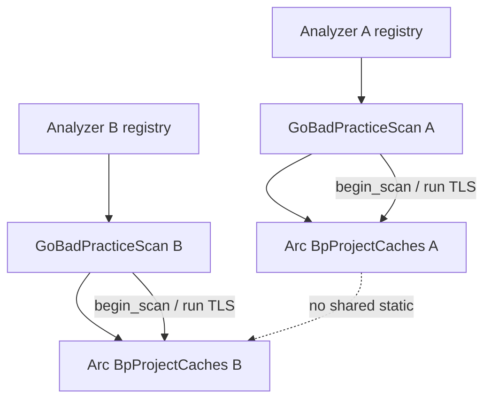

## Summary

Give each `GoBadPracticeScan` ownership of BP project-fact caches (project
snapshots, package-doc snapshots, go.mod, and project imports). Maps move off
process-global `OnceLock` into analyzer-owned state so concurrent analyzers
cannot clear or observe each other's memoization.

---

## Motivation / context

- Plan: `plans/v0.0.5/rust-architecture-review.md` §5.2
- Issues: see **Related issues**
- Phase 2.1 / #57 scoped cache *lifetime* to a scan via `begin_scan` /
  `end_scan` / `reset_state`, but the maps remained process-static. Separate
  analyzers are concurrent-capable (`Analyzer::analyze_paths` docs); one
  analyzer's `end_scan` could therefore evict another's in-flight facts.

---

## Changes

### Ownership

- New `session.rs`: `BpProjectCaches` holds the four `Mutex<HashMap<...>>`
  maps; `GoBadPracticeScan` owns `Arc<BpProjectCaches>`.
- Free-function detectors reach the owning instance through a **thread-local
  active session**:
  - `begin_scan` clears maps and installs them on the controlling thread so
    pack-local `prepare_project` prewarm hits the right owner.
  - `run` installs via `ActiveCachesGuard` for Rayon workers.
  - `end_scan` clears the TLS slot and the maps; `reset_state` only clears
    maps (mid-scan panic recovery).
- Off-lock construction + double-checked short insert retained for all four
  caches.

### Tests

- Concurrent two-analyzer regression: 8 threads × 12 rounds alternating safe
  vs vulnerable roots; each thread owns an `Analyzer` and must always see
  correct BP-41/47/50/54/55/57/59 results.
- Existing same-`Analyzer` rescan regression (#57) preserved.

---

## Code snippets

### Before (process-global)

```rust
fn snapshot_cache() -> &'static Mutex<SnapshotCache> {
    static CACHE: OnceLock<Mutex<SnapshotCache>> = OnceLock::new();
    CACHE.get_or_init(|| Mutex::new(HashMap::new()))
}
// GoBadPracticeScan was a unit struct; reset_state cleared the statics.
```

### After (analyzer-owned)

```rust
pub struct GoBadPracticeScan {
    caches: Arc<session::BpProjectCaches>,
}
fn begin_scan(&self, _ctx: &ScanContext) {
    self.caches.clear();
    session::set_active(Arc::clone(&self.caches));
}
fn run(&self, ctx: &ScanContext, unit: &ParsedUnit, out: &mut Vec<Finding>) {
    let _active = session::ActiveCachesGuard::install(&self.caches);
    // ...
}
```

---

## Impact

| Area | Impact |
|------|--------|
| **Performance** | Cold-scan path preserved: prewarm still runs from `prepare_project` into the active analyzer's maps; within-scan memoization and off-lock build unchanged. |
| **Memory** | Maps live on the detector instance; cleared at scan end; no process-global accumulation across analyzers. |
| **Behavior / correctness** | Concurrent analyzers no longer share/evict BP caches; same-analyzer rescan still refreshes facts. |
| **API / CLI** | None |
| **Dependencies** | None |
| **Binary size / build time** | Negligible |

---

## Breaking changes / migration

| Item | Migration |
|------|-----------|
| None | — |

---

## Architecture notes



TLS is only a dispatch bridge so free-function rule detectors keep their
existing signatures; ownership and clear lifecycle stay on the detector.

---

## Files changed (high level)

| Path | Change |
|------|--------|
| `src/lang/go/detectors/bad_practices/session.rs` | New: owned caches + active-session TLS |
| `src/lang/go/detectors/bad_practices/mod.rs` | `GoBadPracticeScan` owns `Arc<BpProjectCaches>`; begin/end/run lifecycle |
| `src/lang/go/detectors/bad_practices/common.rs` | Project snapshot map via active session |
| `src/lang/go/detectors/bad_practices/rules/code_organization.rs` | Package-doc map via active session |
| `src/lang/go/detectors/bad_practices/rules/dependency_hygiene.rs` | go.mod / import maps via active session |
| `src/lang/go/detectors/mod.rs` | `GoBadPracticeScan::new()` |
| `tests/go_bad_practice_project_integration.rs` | Concurrent two-analyzer regression |
| `plans/v0.0.5/pr-arch-bp-analyzer-ownership.md` | Filled PR body |

---

## Test plan

- [x] `make lint` — pass
- [x] `cargo test --locked --test go_bad_practice_integration` — 16 passed
- [x] `cargo test --locked --test go_bad_practice_project_integration` — 4 passed (incl. concurrent ownership + rescan)
- [x] `make test` — 435 passed, 0 failed (nextest)

### Commands

```sh
make lint
cargo test --locked --test go_bad_practice_integration -- --nocapture
cargo test --locked --test go_bad_practice_project_integration -- --nocapture
make test
```

---

## Related issues

- Closes #77
- Relates to #75

---

## PR metadata checklist (author)

- [x] Self-assigned (`--assignee @me`)
- [x] Labels applied (`enhancement`)
- [x] Related issues filled with real ticket IDs
- [x] Filled body committed under `plans/v0.0.5/pr-arch-bp-analyzer-ownership.md`

---

## Follow-ups (out of scope)

- §5.1 Conservative same-package method taint resolution
- §5.3 Fail closed if built-in registry materialization breaks
- Optional: pass `BpProjectCaches` through detector signatures to drop TLS

---

## Reviewer checklist

- [ ] Behavior matches summary and test plan
- [ ] No unrelated changes in diff
- [ ] Public API / CLI changes documented
- [ ] PR has assignee and labels
- [ ] Related issues use correct Closes/Relates keywords
- [ ] No secrets or generated artifacts committed

---

## Release notes (if user-facing)

refactor(go): BP project caches are owned per analyzer so concurrent scans cannot interfere.
