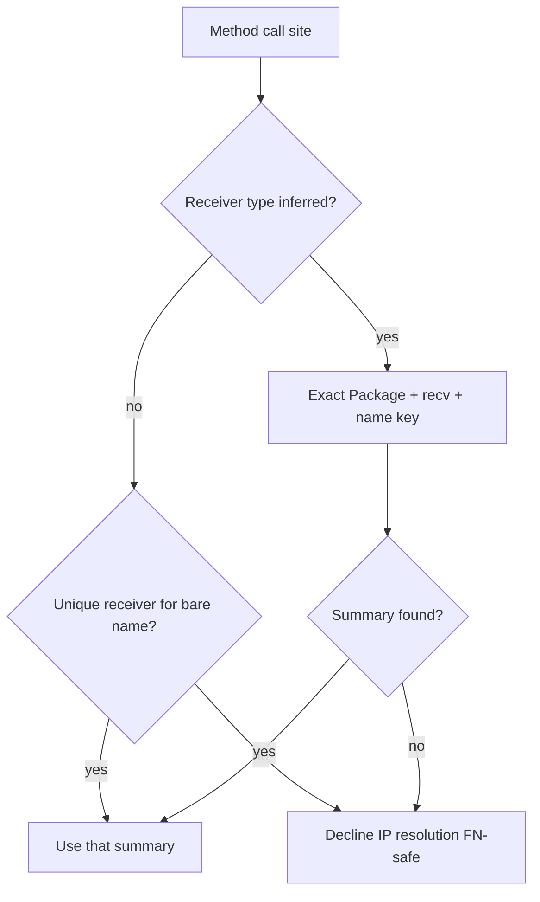

# fix(taint): resolve same-package method summaries conservatively

## Summary

Same-package inter-procedural method resolution no longer picks the first
stable candidate when multiple receiver types share a bare method name.
Call sites use the exact `PackageIdentity + receiver type + method name` key
when the receiver can be inferred (enclosing method’s own receiver parameter);
otherwise resolution is **declined** if more than one receiver exposes the
method. A false negative is safer than selecting the wrong taint summary.

Closes #76. Relates to #75 (epic). Implements
`plans/v0.0.5/rust-architecture-review.md` §5.1.

---

## Motivation / context

Phase 2.2 keyed declarations/summaries by package + receiver + name, which
fixed cross-package bare-name contamination. Method calls still fell back to
package + bare method name and selected the first stable candidate when the
call-site receiver type was unknown. Two receiver types in one package that
share a method name could therefore attach the wrong sink summary (e.g. a
safe `Safe.Open` call inheriting `Sink.Open`’s FileOpen summary).

Full local type inference is out of scope; until it exists, ambiguous method
summary resolution must fail closed.

- Plans: `plans/v0.0.5/rust-architecture-review.md` §5.1
- Issues: see **Related issues**

---

## Changes

### Method resolution (`src/lang/go/detectors/cwe/mod.rs`)

- `find_same_package_summary` for method calls:
  1. If the call-site receiver type can be inferred, look up the exact
     `TaintSymbolKey` (package + receiver + name). No fall-through to other
     receivers on miss.
  2. If the type is unknown and exactly one same-package receiver exposes the
     method (with a summary), resolve that unique candidate.
  3. If multiple receivers share the name without inference, return `None`
     (decline).
- Inference today: when the callee is invoked on the enclosing method’s own
  receiver parameter (e.g. `func (h *Handler) F() { h.Open(...) }` → `*Handler`).
- Free-function package qualification unchanged.
- Unit tests for inference and the multi-receiver decline rule.

### Fixtures / tests

- `tests/fixtures/go/taint_projects/method-receiver-ambiguous-safe` —
  `Sink.Open` (sink) and `Safe.Open` (safe) in the same package; free-function
  call on `Safe` with unknown receiver type must emit **no** CWE-22.
- `tests/fixtures/go/taint_projects/method-receiver-ambiguous-vulnerable` —
  same dual-receiver package; call on enclosing `*Sink` receiver still fires.
- Integration coverage in `tests/go_taint_integration.rs`.

### Docs / plan

- `documents/taint.md`: document conservative multi-receiver method resolution.
- `plans/v0.0.5/rust-architecture-review.md`: Phase 5 re-review findings; §5.1
  marked complete.

### Out of scope (unchanged)

- BP process-global caches / per-analyzer ownership (#77 / Phase 5.2).
- Registry fail-closed materialization (Phase 5.3).
- Full local-variable type inference for method receivers.
- Import-path cross-package taint wiring.

---

## Code snippets

### Before (first stable candidate wins)

```rust
// Method call: resolve by package + bare method name only.
let candidates = package_name_index.get(&(caller_package.clone(), bare))?;
for key in candidates {
    if let Some(summary) = summary_for_key(per_file, summary_index, key, bare_name) {
        return Some(summary); // first hit — may be wrong receiver
    }
}
```

### After (exact key or unique receiver only)

```rust
if let Some(inferred) = infer_call_site_receiver_type(raw_callee, caller_decl) {
    let exact = TaintSymbolKey::with_receiver(pkg, Some(&inferred), bare);
    return summary_for_key(..., &exact, ...); // no other-receiver fallthrough
}
// No inference: only resolve when all summary-bearing candidates share one receiver.
if !unique_receiver {
    return None; // ambiguous → decline
}
```

---

## Impact

| Area | Impact |
|------|--------|
| **Performance** | Negligible; same finalize-time maps, slightly stricter branching |
| **Memory** | None material |
| **Behavior / correctness** | Prevents wrong-summary selection for ambiguous same-package methods; may add honest FNs until type inference |
| **API / CLI** | None |
| **Dependencies** | None |
| **Binary size / build time** | Negligible |

---

## Breaking changes / migration

| Item | Migration |
|------|-----------|
| None | — |

---

## Architecture notes



---

## Files changed (high level)

| Path | Change |
|------|--------|
| `src/lang/go/detectors/cwe/mod.rs` | Conservative method summary resolution + unit tests |
| `tests/go_taint_integration.rs` | Dual-receiver project integration test |
| `tests/fixtures/go/taint_projects/method-receiver-ambiguous-*` | Safe/vulnerable fixtures |
| `documents/taint.md` | Limitation text for multi-receiver methods |
| `plans/v0.0.5/rust-architecture-review.md` | Phase 5 + §5.1 complete |
| `plans/v0.0.5/pr-arch-taint-method-receiver.md` | This PR body |

---

## Test plan

- [x] `make lint`
- [x] `cargo test --locked --test go_taint_integration`
- [x] `cargo test --locked --test go_cwe_detector_fixtures`
- [x] `make test`
- [x] Unit: multi-receiver decline + enclosing-receiver inference

### Commands

```sh
make lint
cargo test --locked --test go_taint_integration
cargo test --locked --test go_cwe_detector_fixtures
make test
```

### Observed

- `make lint` — pass
- `go_taint_integration` — 4/4 pass (includes dual-receiver fixture)
- `go_cwe_detector_fixtures` — 4/4 pass
- Unit tests in `cwe::tests` — multi-receiver decline + inference pass
- `make test` — 436/437; only pre-existing flake
  `engine_baseline_io::large_baseline_loads_and_filters_under_target` under
  parallel nextest load (~2.00s vs &lt;2s budget). Same test passes in
  isolation (~1.77s). Unrelated to this change.

---

## Related issues

- Closes #76
- Relates to #75

---

## Integration

This branch will integrate into epic #75 (`chore/epic-75-integration` or
equivalent) for combined validation with other Phase 5 workstreams.
Prefer reviewing/merging the integration PR when present.

---

## PR metadata checklist (author)

- [x] Self-assigned (`--assignee @me`)
- [x] Labels applied (`bug`, `enhancement`)
- [x] Related issues filled with real ticket IDs
- [x] Filled body committed under `plans/v0.0.5/pr-arch-taint-method-receiver.md`

---

## Follow-ups (out of scope)

- Local type inference for locals (`s := &Safe{}` → `*Safe`) so more method
  sites can use the exact key instead of declining.
- Per-analyzer BP cache ownership (Phase 5.2).
- Fail-closed built-in registry materialization (Phase 5.3).
- Cross-package import-path method wiring.

---

## Reviewer checklist

- [ ] Behavior matches summary and test plan
- [ ] No unrelated changes in diff
- [ ] Does not reintroduce “first stable candidate” bare-name selection
- [ ] Free-function package qualification and existing CWE/IP fixtures still pass
- [ ] PR has assignee and labels
- [ ] Related issues use correct Closes/Relates keywords

---

## Release notes (if user-facing)

fix(taint): decline ambiguous same-package method summary resolution when the call-site receiver type is unknown
