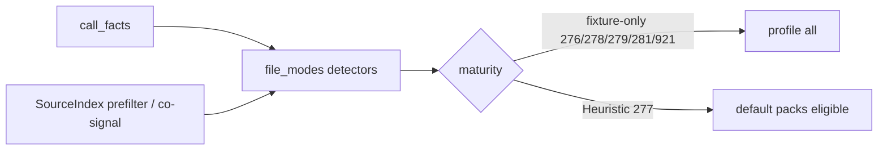

# fix(cwe): file-permissions Phase 2 detector tightening and maturity

## Summary

Oracle-safe Phase 2 of the access-control file-permissions trust tranche: tighten detectors toward call-facts primary where complete, label this family's NEEDLES, and set maturity dispositions for CWE-276, 277, 278, 279, 281, and 921.

---

## Motivation / context

Parent plan: [`plans/v0.0.5/cwe-file-permissions-trust.md`](./cwe-file-permissions-trust.md) Phase 2.  
Closes [#87](https://github.com/chinmay-sawant/codehound/issues/87). Relates to [#85](https://github.com/chinmay-sawant/codehound/issues/85).

These six rules already had stdlib/framework fixtures. Phase 2 establishes evidence-backed dispositions without bulk rewrites or structural promotion without real-module proof.

---

## Changes

### Per-rule disposition

| Rule | Disposition | Primary signal | Notes |
|------|-------------|----------------|-------|
| **CWE-276** | **fixture-only** | call_facts `os.WriteFile` + `0666` | Still requires sessions path / `session_data` / `X-Session-Data` co-signals |
| **CWE-277** | **Heuristic keep** | call_facts `syscall.Umask(0)` + `os.MkdirAll(..., 0777)` | Generalized production-shaped pair; no §1.3 promotion |
| **CWE-278** | **fixture-only** | call_facts `os.OpenFile` | Exact corpus formula `os.FileMode(hdr.Mode)` |
| **CWE-279** | **fixture-only** | call_facts `os.WriteFile` + `0777` | `strconv.ParseUint(` is co-presence only (not dataflow) |
| **CWE-281** | **fixture-only** | call_facts `os.Create` + `io.Copy(out,in)` | Exact copy shape; `info.Mode()` negative-gate |
| **CWE-921** | **fixture-only** | call_facts `os.WriteFile` + `0644` emit span | Still gated on corpus path `/tmp/integration.key` |

No rule promoted to Structural (insufficient real-module evidence / §1.3 bar).

### Detector hygiene (`file_modes.rs`)

- **CWE-276**: SI impossibility prefilter on `os.WriteFile(`; call_facts remain primary.
- **CWE-277**: comments only (already call_facts-complete).
- **CWE-278**: comments only (already call_facts with exact formula).
- **CWE-279**: comments; WriteFile call_facts primary; ParseUint SI co-signal labeled.
- **CWE-281**: prefer call_facts for `io.Copy(out, in)`; SI needle as fallback/oracle co-presence; `info.Mode()` negative-gate.
- **CWE-921**: emit span from call_facts WriteFile+0644; path/negative gates remain SI fixture literals.

### NEEDLES / maturity

- Family needles labeled `fixture-literal` / `negative-gate` with rule + rationale (no bulk labeling).
- `maturity.rs`: fixture-only for 276, 278, 279, 281, 921; Heuristic keep for 277; unit tests updated.

### Fixtures

- Unchanged IDs and oracles (no new boundary fixtures required).

---

## Impact

| Area | Impact |
|------|--------|
| **Performance** | Neutral (cheap SI prefilters only) |
| **Memory** | Negligible |
| **Behavior / correctness** | Fixture-only IDs leave recommended/security packs; still available under `--profile all` / `--only` |
| **API / CLI** | Pack membership for newly quarantined IDs |
| **Dependencies** | None |

### Canary

Not run in this Phase 2 PR (Phase 3 ownership). Dispositions do not depend on canary for fixture-only quarantine of corpus-shaped rules; CWE-277 remains Heuristic pending Phase 3 real-module evidence.

---

## Breaking changes / migration

| Item | Migration |
|------|-----------|
| CWE-276, 278, 279, 281, 921 fixture-only | Still under `--profile all` / `--only`; excluded from recommended/security default packs |
| CWE-277 Heuristic | Unchanged pack eligibility |

---

## Architecture notes



---

## Files changed (high level)

| Path | Change |
|------|--------|
| `src/lang/go/detectors/cwe/domains/access_control/file_permissions/file_modes.rs` | Phase 2 hygiene + call_facts primary where complete |
| `src/lang/go/detectors/cwe/source_index.rs` | Family NEEDLES labels |
| `src/rules/maturity.rs` | fixture-only + Heuristic keep + tests |
| `plans/v0.0.5/pr-cwe-file-perm-phase2.md` | This PR body |

---

## Test plan

- [x] `cargo test --locked --test go_cwe_detector_fixtures`
- [x] `cargo test --locked --lib rules::maturity`
- [x] `make lint`
- [x] `make test` — 443 passed
- [x] `git diff --check`

### Commands

```sh
cargo test --locked --test go_cwe_detector_fixtures
cargo test --locked --lib rules::maturity
make lint
make test
git diff --check
```

---

## Related issues

- Closes #87
- Relates to #85
- Plan: Phase 2 of `plans/v0.0.5/cwe-file-permissions-trust.md`
