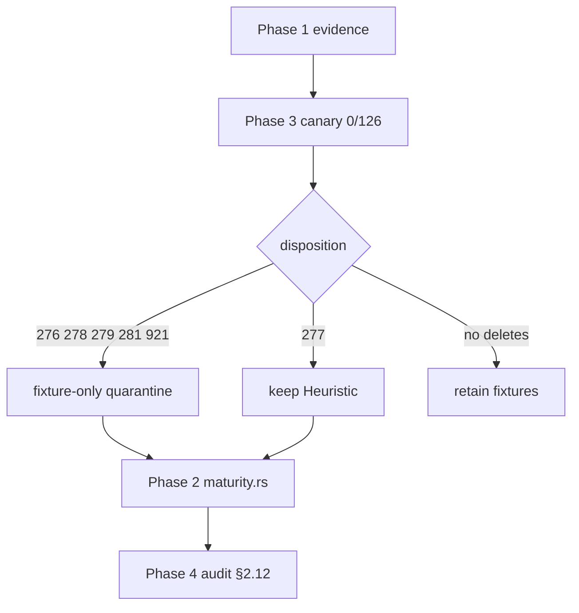

# chore(cwe): file-permissions Phase 3 canary and dispositions

## Summary

- Run the release-binary six-rule canary for `CWE-276/277/278/279/281/921` on gopdfsuit, monsoon, and go-retry.
- Record **0 findings / 126 scanned files** with target revisions and freeze keep/quarantine decisions (no deletes, no Structural promotion).
- Document the canary and dispositions; check off Phase 3 of the file-permissions trust plan.

---

## Motivation / context

Epic [#85](https://github.com/chinmay-sawant/codehound/issues/85) audits access-control file-permission siblings for catalog honesty. Phase 1 ([#86](https://github.com/chinmay-sawant/codehound/issues/86)) froze detector evidence; Phase 3 ([#88](https://github.com/chinmay-sawant/codehound/issues/88)) is the real-module disposition gate. Zero canary hits alone is **not** a delete or promote signal.

**Parallel Phase 2** ([#87](https://github.com/chinmay-sawant/codehound/issues/87)) may change detectors and maturity on a sibling branch. This canary is frozen on **this branch’s tree** (`e9485cb` / origin/master detectors). Integration should **re-canary after merge** if emit paths change — maturity quarantine does not alter `--profile all --only` hit counts.

---

## Changes

### Canary results (2026-07-20)

| Repository | Revision | Files scanned | Findings |
|---|---|---:|---:|
| gopdfsuit | `26d71268937136036c3be1770c0f7bdd89f87dc6` | 78 | 0 |
| monsoon | `e0f1027cb0c256853b835d8e20d8d206a96e44ed` | 43 | 0 |
| go-retry | `d3eb50afd37a09a9c0606c218d0dbe06e29d1544` | 5 | 0 |
| **Total** | | **126** | **0** |

Command shape:

```sh
cargo build --release --locked
target/release/codehound TARGET --profile all \
  --only CWE-276,CWE-277,CWE-278,CWE-279,CWE-281,CWE-921 \
  --format json --json-envelope --no-fail --no-cache
```

Paths: `/home/chinmay/ChinmayPersonalProjects/gopdfsuit`; main-repo `real-repos/{monsoon,go-retry}` (worktree has no local `real-repos/`).

### Frozen dispositions

| Rule | Disposition | Notes |
|------|-------------|--------|
| CWE-276 | **fixture-only quarantine** | Session co-signals gate emit |
| CWE-277 | **keep Heuristic** | Call-facts umask+mkdir; not §1.3 Structural |
| CWE-278 | **fixture-only quarantine** | Exact `os.FileMode(hdr.Mode)` formula |
| CWE-279 | **fixture-only quarantine** | ParseUint co-presence, no dataflow |
| CWE-281 | **fixture-only quarantine** | Exact `io.Copy(out, in)` museum shape |
| CWE-921 | **fixture-only quarantine** | `/tmp/integration.key` corpus path |

No rule deleted. No Structural promotion. Owner comparison N/A (zero hits).

### Docs

- `plans/v0.0.5/cwe-file-permissions-canary.md` — full canary table, classifications, revisit conditions
- `plans/v0.0.5/cwe-file-permissions-trust.md` — Phase 3 checkboxes + status
- This PR body

### Code

None (docs-only Phase 3). Detector/maturity application is Phase 2.

---

## Impact

| Area | Impact |
|------|--------|
| **Performance** | None |
| **Memory** | None |
| **Behavior / correctness** | None in this PR; dispositions authorize Phase 2 quarantine for 276/278/279/281/921 and Heuristic keep for 277 |
| **API / CLI** | None here |
| **Dependencies** | None |
| **Binary size / build time** | Unchanged |

---

## Breaking changes / migration

None.

---

## Architecture notes



---

## Files changed (high level)

| Path | Change |
|------|--------|
| `plans/v0.0.5/cwe-file-permissions-canary.md` | New canary + disposition record |
| `plans/v0.0.5/cwe-file-permissions-trust.md` | Phase 3 complete; status/canary links |
| `plans/v0.0.5/pr-cwe-file-perm-phase3.md` | This PR body |

---

## Test plan

- [x] `cargo build --release --locked`
- [x] Six-rule canary on gopdfsuit / monsoon / go-retry → 0 findings
- [x] Dispositions written for all six IDs with revisit conditions
- [ ] `make lint` — N/A (no Rust); re-run on integration if plan merge only

### Commands

```sh
cargo build --release --locked
target/release/codehound /home/chinmay/ChinmayPersonalProjects/gopdfsuit --profile all \
  --only CWE-276,CWE-277,CWE-278,CWE-279,CWE-281,CWE-921 \
  --format json --json-envelope --no-fail --no-cache
# same for real-repos/monsoon and real-repos/go-retry
```

---

## Related issues

- Closes #88
- Relates to #85
- Relates to #86
- Relates to #87

---

## Integration

This branch is docs-only Phase 3. Prefer merging with the epic integration PR when present
(`chore/epic-85-integration` or equivalent) so Phase 1/2/3/4 land together. **Re-canary after
Phase 2 detector merge** if emit paths differ from master detectors used here.

---

## PR metadata checklist (author)

- [x] Self-assigned (`--assignee @me`)
- [x] Labels applied (`documentation`, `enhancement`)
- [x] Related issues filled with real ticket IDs
- [x] Filled body under `plans/v0.0.5/pr-cwe-file-perm-phase3.md`

---

## Follow-ups (out of scope)

- Phase 2 detector rewrites / `is_fixture_only` application (#87)
- Phase 4 audit §2.12 narrative + full validation (#89)
- Structural promotion for CWE-277 (needs real-module hit + new scoped issue)
