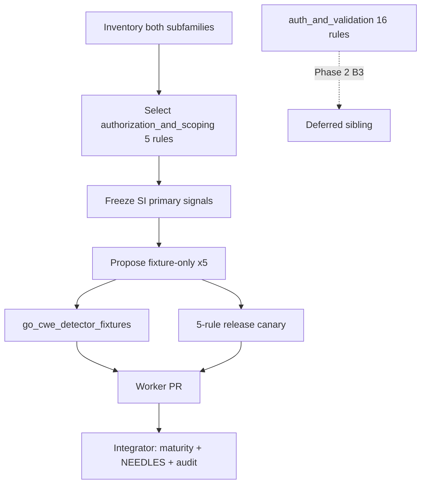

# chore(cwe): A4 access-control subfamily trust (authorization_and_scoping)

## Summary

- Inventory both access-control candidate subfamilies; **select**
  `access_control/authorization_and_scoping/` (five rules: CWE-425, 551, 653, 639, 1220).
- Freeze primary signals, negatives, fixtures, and maturity state for the selected family.
- Propose **fixture-only** dispositions for all five rules (integrator applies `maturity.rs` /
  SourceIndex NEEDLES labels).
- Oracle-safe detector comments only (no emit-path changes); run focused fixtures + five-rule
  real-module canary.

---

## Motivation / context

Phase 1 slice **A4** of [`parallel-catalog-program.md`](./parallel-catalog-program.md) §1.4 /
issue [#99](https://github.com/chinmay-sawant/codehound/issues/99). Relates to epic
[#95](https://github.com/chinmay-sawant/codehound/issues/95). File-permissions tranche complete
(#85 / #94) — **not reopened** here.

**Integration base SHA:** `217c0078d8a585e0e08b3b113e665898f6bf62dd`  
**Branch:** `chore/cwe-trust-access-control`  
**Structural bar:** [`cwe-catalog-trust-audit.md`](./cwe-catalog-trust-audit.md) §1.3

---

## Selection inventory

### Candidate A — `auth_and_validation/` (deferred → Phase 2 B3)

| Leaf | Rules | Lines (approx) | Fixture coverage |
|------|-------|----------------|------------------|
| `auth_flows.rs` | CWE-289, 290, 305, 306, 307, 308, 309, 620, 836 | ~294 | stdlib + frameworks each |
| `auth_tokens.rs` | CWE-294, 301, 303, 322, 408 | ~147 | stdlib + frameworks each |
| `cookies.rs` | CWE-603, 613 | ~71 | stdlib + frameworks each |
| **Total** | **16 rules** | **~512** | full pair coverage |

Larger surface; many authentication-policy and token shapes; better as a later bounded slice
(e.g. cookies-only or tokens-only) once this smaller family is dispositioned.

### Candidate B — `authorization_and_scoping/` (**selected**)

| Leaf | Rules | Lines (approx) | Fixture coverage |
|------|-------|----------------|------------------|
| `guards.rs` | CWE-425, 551, 653 | ~101 | stdlib + frameworks each |
| `scoping.rs` | CWE-639, 1220 | ~66 | stdlib + frameworks each |
| **Total** | **5 rules** | **~167** | full pair coverage |

### Why select B

1. **Smaller cohesive family** (5 vs 16) — fits one worktree evidence slice without subsetting.
2. **Corpus-shaped** — every detector is SourceIndex co-presence of project/fixture identifiers
   (admin path, invoice SQL, shared store names), so dispositions are unambiguous fixture-only.
3. **Existing fixture oracle** — vulnerable + safe for stdlib and frameworks; no new fixtures required.
4. **Clear sibling deferral** — `auth_and_validation/` remains Phase 2 B3 intact; no partial split.
5. **Recommendation alignment** — plan §1.4 prefers this family unless fixtures were missing (they are not).

Not narrowed to `guards.rs` only: the full five-rule subfamily is already small and cohesive
(guards + IDOR/granularity scoping share the same authorization domain).

---

## Frozen signals (selected family)

Runtime maturity today: all five default to **Heuristic** (`maturity_for` has no explicit
fixture-only / structural entry). Available under `--profile all` / `--only`; not on
recommended/security explicit allow-lists.

### CWE-425 — Direct Request (`Forced Browsing`)

| Field | Value |
|-------|--------|
| File | `authorization_and_scoping/guards.rs` → `detect_cwe_425` |
| Primary signal | SI `"/internal/admin/export.csv"` **and** `"SELECT email, ssn FROM customers"` |
| Negatives | SI `requireAdmin()` / `requireAdmin(` |
| Span | source find of export path |
| Fixtures | stdlib + frameworks vulnerable/safe |
| Call-facts? | No — missing-middleware is not a local call shape |
| **Proposed disposition** | **fixture-only** |

### CWE-551 — Incorrect Behavior Order: Authorization Before Parsing and Canonicalization

| Field | Value |
|-------|--------|
| File | `guards.rs` → `detect_cwe_551` |
| Primary signal | SI `raw := ` + `URL.Path` + exact `strings.HasPrefix(raw, "/admin")` + `strings.ReplaceAll(raw, "%2f", "/")` |
| Negatives | SI `url.PathUnescape(raw)` |
| Span | source find of HasPrefix call text |
| Fixtures | stdlib + frameworks vulnerable/safe |
| Call-facts? | HasPrefix alone is insufficient without corpus co-signals; keep SI primary |
| **Proposed disposition** | **fixture-only** |

### CWE-653 — Improper Isolation or Compartmentalization

| Field | Value |
|-------|--------|
| File | `guards.rs` → `detect_cwe_653` |
| Primary signal | SI `sharedDB` \| `sharedAuditStore` + `PublicSearch` + `AdminPurge` |
| Negatives | SI `readOnlyDB` / `readOnlyAuditStore` / `adminDB` / `adminAuditStore` |
| Span | `sharedDB` or `sharedAuditStore` text |
| Fixtures | stdlib + frameworks vulnerable/safe |
| Call-facts? | No — identifier museum |
| **Proposed disposition** | **fixture-only** |

### CWE-639 — Authorization Bypass Through User-Controlled Key

| Field | Value |
|-------|--------|
| File | `scoping.rs` → `detect_cwe_639` |
| Primary signal | SI `invoice_id` + exact unscoped invoice SELECT (or source contains SELECT+invoiceID) |
| Negatives | SI `AND user_id = $2` / `ownerID` / `X-User-ID` |
| Span | `invoice_id` text |
| Fixtures | stdlib + frameworks vulnerable/safe |
| Call-facts? | No IDOR dataflow; corpus SQL + key name |
| **Proposed disposition** | **fixture-only** |

### CWE-1220 — Insufficient Granularity of Access Control

| Field | Value |
|-------|--------|
| File | `scoping.rs` → `detect_cwe_1220` |
| Primary signal | SI `GetInvoice(` \| `GetInvoicePure(` + `Authorization` + `FROM invoices WHERE id = $1` |
| Negatives | SI `owner_id = $2` / `ownerID` / `X-User-ID` |
| Span | unscoped SQL fragment |
| Fixtures | stdlib + frameworks vulnerable/safe |
| Call-facts? | No — helper names + auth header co-presence |
| **Proposed disposition** | **fixture-only** |

### Disposition table

| Rule | Disposition | Primary signal class | Notes |
|------|-------------|----------------------|-------|
| **CWE-425** | **fixture-only** | SI path + PII SELECT | Exact admin export path |
| **CWE-551** | **fixture-only** | SI raw-path auth order | Exact HasPrefix/ReplaceAll shape |
| **CWE-653** | **fixture-only** | SI shared store ids | PublicSearch/AdminPurge museum |
| **CWE-639** | **fixture-only** | SI invoice_id + SQL | Unscoped IDOR corpus |
| **CWE-1220** | **fixture-only** | SI GetInvoice* + SQL | Auth present, owner scope absent |

No rule proposed for Heuristic keep or Structural. No deletes. No §1.3 promotion.

### CWE-277 note

Canary did not surface an actionable CWE-277 hit in this five-rule scan (CWE-277 was **not** in
`--only`). No new scoped structural-promotion issue filed. File-permissions subtree untouched.

---

## Changes

### Code (`authorization_and_scoping/` only)

- `guards.rs` / `scoping.rs`: proof-boundary comments freezing primary signal, negatives, and
  call-facts assessment. **No emit logic, messages, or span changes** (oracle preserved).

### Docs

- This PR body (`plans/v0.0.5/pr-cwe-trust-access-control.md`).

### Explicitly not changed (integrator / out of scope)

- `src/rules/maturity.rs` — propose adding all five to `is_fixture_only`
- `src/lang/go/detectors/cwe/source_index.rs` — propose NEEDLES labels (see below)
- profiles, `tests/fixtures/manifest.toml`, `cwe-catalog-trust-audit.md`, ledger §1.4 checkboxes
- `auth_and_validation/`, `file_permissions/`, A1/A2/A3 siblings

---

## Integrator proposals

### Maturity (`maturity.rs`)

Add to `is_fixture_only`:

```text
CWE-425, CWE-551, CWE-653, CWE-639, CWE-1220
```

Unit-test assertions mirroring other fixture-only families.

### SourceIndex NEEDLES labels (no reordering required)

| Needle (examples) | Label proposal |
|-------------------|----------------|
| `/internal/admin/export.csv`, `SELECT email, ssn FROM customers` | `fixture-literal: CWE-425` |
| `requireAdmin(`, `requireAdmin()` | `negative-gate: CWE-425` |
| `raw := `, `URL.Path`, `strings.HasPrefix(raw, "/admin")`, `strings.ReplaceAll(raw, "%2f", "/")` | `fixture-literal: CWE-551` |
| `url.PathUnescape(raw)` | `negative-gate: CWE-551` |
| `sharedDB`, `sharedAuditStore`, `PublicSearch`, `AdminPurge` | `fixture-literal: CWE-653` |
| `readOnlyDB`, `readOnlyAuditStore`, `adminDB`, `adminAuditStore` | `negative-gate: CWE-653` |
| `invoice_id`, invoice SELECT shapes | `fixture-literal: CWE-639` |
| `AND user_id = $2`, `ownerID`, `X-User-ID` | `negative-gate: CWE-639` / shared with 1220 |
| `GetInvoice(`, `GetInvoicePure(`, `FROM invoices WHERE id = $1`, `Authorization` | `fixture-literal: CWE-1220` (Authorization is broad co-signal) |
| `owner_id = $2` | `negative-gate: CWE-1220` |

### Fixtures

None required. Oracle unchanged.

### Findings-oracle impact

None expected (comment-only detector edit).

### Canary command (worker evidence; re-run after integration)

```sh
cargo build --release --locked
for t in /home/chinmay/ChinmayPersonalProjects/gopdfsuit \
         /home/chinmay/ChinmayPersonalProjects/codehound/real-repos/monsoon \
         /home/chinmay/ChinmayPersonalProjects/codehound/real-repos/go-retry; do
  echo "=== $t ==="
  target/release/codehound "$t" --profile all \
    --only CWE-425,CWE-551,CWE-653,CWE-639,CWE-1220 \
    --format json --json-envelope --no-fail --no-cache
done
```

---

## Canary results (2026-07-21)

Release binary built on this branch (`cargo build --release --locked`). Target revisions match
prior file-permissions canaries:

| Repository | Revision | Files scanned | Findings |
|---|---|---:|---:|
| gopdfsuit | `26d71268937136036c3be1770c0f7bdd89f87dc6` | 78 | 0 |
| monsoon | `e0f1027cb0c256853b835d8e20d8d206a96e44ed` | 43 | 0 |
| go-retry | `d3eb50afd37a09a9c0606c218d0dbe06e29d1544` | 5 | 0 |
| **Total** | | **126** | **0** |

Paths: `/home/chinmay/ChinmayPersonalProjects/gopdfsuit`; main-repo
`/home/chinmay/ChinmayPersonalProjects/codehound/real-repos/{monsoon,go-retry}` (worktree has no
local `real-repos/`).

Zero useful hits ⇒ fixture-only quarantine is consistent with prior museum families; **not** a
delete signal. No Structural promotion. Re-canary after integration if emit paths change.

---

## Impact

| Area | Impact |
|------|--------|
| **Performance** | None |
| **Memory** | None |
| **Behavior / correctness** | None in this PR (comments only). Integrator fixture-only quarantine removes default-pack *eligibility* if packs later expand; today these IDs are not on recommended/security allow-lists |
| **API / CLI** | None until maturity integration |
| **Dependencies** | None |

---

## Breaking changes / migration

| Item | Migration |
|------|-----------|
| None in this PR | — |
| Post-integration fixture-only | Still available under `--profile all` / `--only` |

---

## Architecture notes



---

## Files changed (high level)

| Path | Change |
|------|--------|
| `src/lang/go/detectors/cwe/domains/access_control/authorization_and_scoping/guards.rs` | Signal-freeze comments |
| `src/lang/go/detectors/cwe/domains/access_control/authorization_and_scoping/scoping.rs` | Signal-freeze comments |
| `plans/v0.0.5/pr-cwe-trust-access-control.md` | This PR body |

---

## Test plan

- [x] Inventory + selection rationale recorded
- [x] Signal freeze + disposition table
- [x] `make lint` — fmt check + clippy clean
- [x] `cargo test --locked --test go_cwe_detector_fixtures` — **4 passed**
- [x] `make test` — **443 nextest + 1 doctest passed**
- [x] Five-rule release canary — **0 findings / 126 files**
- [x] `git diff --check`

### Commands

```sh
make lint
cargo test --locked --test go_cwe_detector_fixtures
make test
cargo build --release --locked
# canary as above
git diff --check
```

---

## Related issues

- Closes #99
- Relates to #95
- Plan: `plans/v0.0.5/parallel-catalog-program.md` §1.4
- Deferred sibling: Phase 2 B3 `auth_and_validation/`
- File-permissions complete: #85 / #94 (not reopened)
