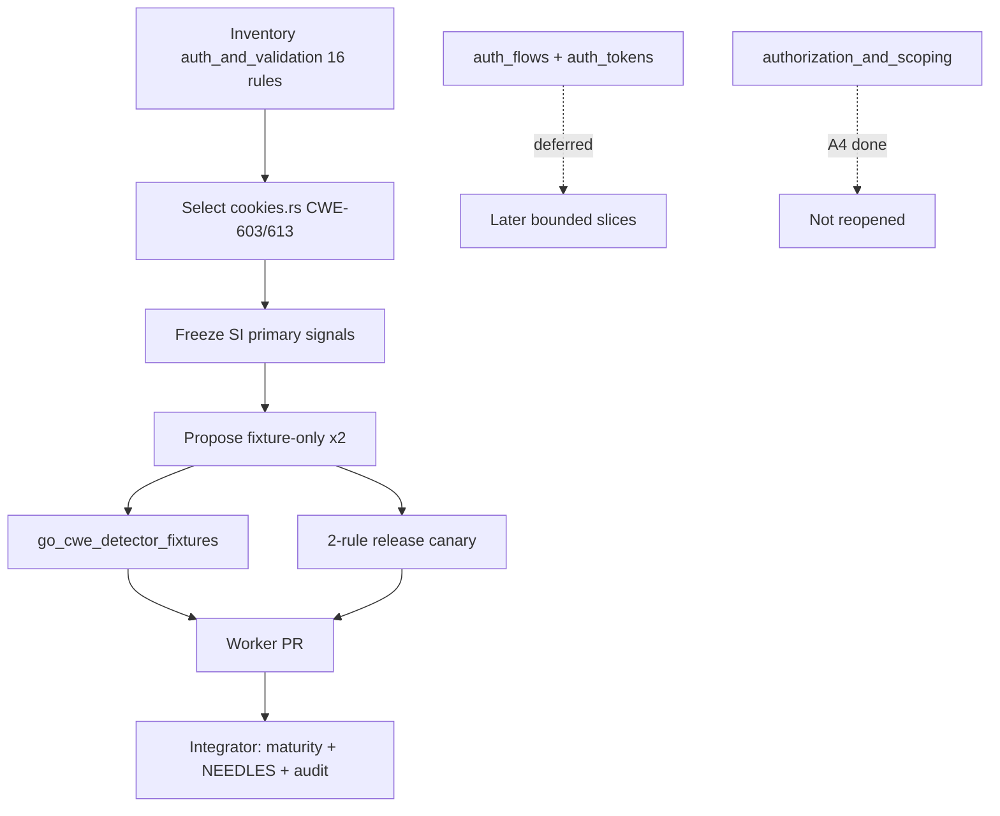

# chore(cwe): audit auth_and_validation trust (B3)

## Summary

- Inventory `access_control/auth_and_validation/`; **select** the bounded `cookies.rs`
  family only (**CWE-603**, **CWE-613**).
- Freeze primary signals, negatives, fixtures, and maturity state for the selected family.
- Propose **fixture-only** dispositions for both rules (integrator applies `maturity.rs` /
  SourceIndex NEEDLES labels).
- Oracle-safe detector comments only (no emit-path changes); run focused fixtures + two-rule
  real-module canary.

---

## Motivation / context

Phase 2 slice **B3** of [`parallel-catalog-program.md`](./parallel-catalog-program.md) §2.3 /
issue [#109](https://github.com/chinmay-sawant/codehound/issues/109). Relates to epic
[#105](https://github.com/chinmay-sawant/codehound/issues/105) and
[#111](https://github.com/chinmay-sawant/codehound/issues/111).

Phase 1 A4 already dispositioned the sibling
`authorization_and_scoping/` (#99 / batch-1 integration #104). This worker owns the deferred
sibling under `auth_and_validation/`, **one bounded rule family only**.

**Integration base SHA:** `9d66183c3b29d8589317328170226bff6d4323d1`  
**Branch:** `chore/cwe-trust-auth-validation`  
**Structural bar:** [`cwe-catalog-trust-audit.md`](./cwe-catalog-trust-audit.md) §1.3

---

## Selection inventory

### Owner seam — `auth_and_validation/`

| Leaf | Rules | Lines (approx) | Fixture coverage |
|------|-------|----------------|------------------|
| `auth_flows.rs` | CWE-289, 290, 305, 306, 307, 308, 309, 620, 836 | ~289 | stdlib + frameworks each |
| `auth_tokens.rs` | CWE-294, 301, 303, 322, 408 | ~147 | stdlib + frameworks each |
| `cookies.rs` | **CWE-603, 613** | ~71 | stdlib + frameworks each |
| **Total seam** | **16 rules** | **~512** | full pair coverage |

### Why select `cookies.rs` only

1. **Plan preference** — issue #109 / §2.3: prefer cookies (2 rules) when fixtures exist.
2. **Smallest cohesive family** — 2 vs 5 (tokens) or 9 (flows); fits one evidence slice.
3. **Existing fixture oracle** — vulnerable + safe for stdlib and frameworks; no new fixtures.
4. **Unambiguous museum shape** — exact header/SQL/cookie/handler co-presence; route and
   middleware-style names are policy evidence (per §2.3 guidance).
5. **Does not reopen** `file_permissions/` or `authorization_and_scoping/`.

Deferred within this seam (not in this PR): `auth_flows.rs`, `auth_tokens.rs`.

---

## Frozen signals (selected family)

Runtime maturity today: both default to **Heuristic** (`maturity_for` has no explicit
fixture-only / structural entry). Available under `--profile all` / `--only`; not on
recommended/security explicit allow-lists.

### CWE-603 — Use of Client-Side Authentication

| Field | Value |
|-------|--------|
| File | `auth_and_validation/cookies.rs` → `detect_cwe_603` |
| Primary signal | SI `X-Authenticated` **and** `"true"` **and** `UPDATE billing SET plan` |
| Negatives | SI `GetString("uid")` / `Header.Get("X-UID")` |
| Span | source find of `X-Authenticated` |
| Fixtures | stdlib + frameworks vulnerable/safe |
| Call-facts? | No — client-trust is not a local call shape; header + billing SQL are corpus |
| Policy evidence | Header name `X-Authenticated` treated as policy, not verified auth |
| **Proposed disposition** | **fixture-only** |

### CWE-613 — Insufficient Session Expiration

| Field | Value |
|-------|--------|
| File | `cookies.rs` → `detect_cwe_613` |
| Primary signal | SI `SetCookie("sid", sid, 0,` **or** exact stdlib `http.SetCookie(...Name: "sid"...HttpOnly: true)` **and** `LogoutHandler` |
| Negatives | SI `revokedSessions[sid]` / `revokedSessions[c.Value]` / `MaxAge: 900` / `, 900,` |
| Span | gin `SetCookie("sid", sid, 0,` or stdlib SetCookie sid shape |
| Fixtures | stdlib + frameworks vulnerable/safe |
| Call-facts? | SetCookie alone cannot prove non-expiring + missing revocation without corpus co-signals |
| Policy evidence | `LogoutHandler` name + `sid` cookie id are policy/corpus markers |
| **Proposed disposition** | **fixture-only** |

### Disposition table

| Rule | Disposition | Primary signal class | Notes |
|------|-------------|----------------------|-------|
| **CWE-603** | **fixture-only** | SI header + billing UPDATE | Exact `X-Authenticated` + plan SQL |
| **CWE-613** | **fixture-only** | SI non-expiring sid cookie + LogoutHandler | MaxAge/revocation museum |

No rule proposed for Heuristic keep or Structural. No deletes. No §1.3 promotion.

---

## Changes

### Code (`auth_and_validation/cookies.rs` only)

- Proof-boundary comments freezing primary signal, negatives, call-facts assessment, and
  policy-evidence treatment of route/header/handler names.
- **No emit logic, messages, or span changes** (oracle preserved).

### Docs

- This PR body (`plans/v0.0.5/pr-cwe-trust-auth-validation.md`).

### Explicitly not changed (integrator / out of scope)

- `src/rules/maturity.rs` — propose adding both to `is_fixture_only`
- `src/lang/go/detectors/cwe/source_index.rs` — propose NEEDLES labels (see below)
- profiles, `tests/fixtures/manifest.toml`, `cwe-catalog-trust-audit.md`, ledger §2.3 checkboxes
- `auth_flows.rs`, `auth_tokens.rs`, `authorization_and_scoping/`, `file_permissions/`
- Sibling B1/B2/B4 seams

---

## Integrator proposals

### Maturity (`maturity.rs`)

Add to `is_fixture_only`:

```text
CWE-603, CWE-613
```

Unit-test assertions mirroring other fixture-only families.

### SourceIndex NEEDLES labels (no reordering required)

| Needle (examples) | Label proposal |
|-------------------|----------------|
| `X-Authenticated`, `"true"`, `UPDATE billing SET plan` | `fixture-literal: CWE-603` |
| `GetString("uid")`, `Header.Get("X-UID")` | `negative-gate: CWE-603` |
| `SetCookie("sid", sid, 0,`, stdlib `http.SetCookie(...Name: "sid"...HttpOnly: true)`, `LogoutHandler` | `fixture-literal: CWE-613` |
| `revokedSessions[sid]`, `revokedSessions[c.Value]`, `MaxAge: 900`, `, 900,` | `negative-gate: CWE-613` |

### Fixtures

None required. Oracle unchanged.

### Findings-oracle impact

None expected (comment-only detector edit).

### Canary command (worker evidence; re-run after integration)

```sh
cargo build --release --locked
for t in /home/chinmay/ChinmayPersonalProjects/gopdfsuit \
         /home/chinmay/ChinmayPersonalProjects/codehound/real-repos/monsoon \
         /home/chinmay/ChinmayPersonalProjects/codehound/real-repos/go-retry; do
  echo "=== $t ==="
  target/release/codehound "$t" --profile all \
    --only CWE-603,CWE-613 \
    --format json --json-envelope --no-fail --no-cache
done
```

---

## Canary results (2026-07-21)

Release binary built on this branch (`cargo build --release --locked`). Target revisions match
prior access-control canaries:

| Repository | Revision | Files scanned | Findings |
|---|---|---:|---:|
| gopdfsuit | `26d71268937136036c3be1770c0f7bdd89f87dc6` | 78 | 0 |
| monsoon | `e0f1027cb0c256853b835d8e20d8d206a96e44ed` | 43 | 0 |
| go-retry | `d3eb50afd37a09a9c0606c218d0dbe06e29d1544` | 5 | 0 |
| **Total** | | **126** | **0** |

Paths: `/home/chinmay/ChinmayPersonalProjects/gopdfsuit`; main-repo
`/home/chinmay/ChinmayPersonalProjects/codehound/real-repos/{monsoon,go-retry}` (worktree has no
local `real-repos/`).

Zero useful hits ⇒ fixture-only quarantine is consistent with prior museum families; **not** a
delete signal. No Structural promotion. Re-canary after integration if emit paths change.

---

## Impact

| Area | Impact |
|------|--------|
| **Performance** | None |
| **Memory** | None |
| **Behavior / correctness** | None in this PR (comments only). Integrator fixture-only quarantine removes default-pack *eligibility* if packs later expand; today these IDs are not on recommended/security allow-lists |
| **API / CLI** | None until maturity integration |
| **Dependencies** | None |

---

## Breaking changes / migration

| Item | Migration |
|------|-----------|
| None in this PR | — |
| Post-integration fixture-only | Still available under `--profile all` / `--only` |

---

## Architecture notes



---

## Files changed (high level)

| Path | Change |
|------|--------|
| `src/lang/go/detectors/cwe/domains/access_control/auth_and_validation/cookies.rs` | Signal-freeze comments |
| `plans/v0.0.5/pr-cwe-trust-auth-validation.md` | This PR body |

---

## Test plan

- [x] Inventory + selection rationale recorded
- [x] Signal freeze + disposition table
- [x] `make lint` — fmt check + clippy clean
- [x] `cargo test --locked --test go_cwe_detector_fixtures` — **4 passed**
- [x] `make test` — **443 nextest + 1 doctest passed**
- [x] Two-rule release canary — **0 findings / 126 files**
- [x] `git diff --check`

### Commands

```sh
make lint
cargo test --locked --test go_cwe_detector_fixtures
make test
cargo build --release --locked
# canary as above
git diff --check
```

---

## Related issues

- Closes #109
- Relates to #105
- Relates to #111
- Plan: `plans/v0.0.5/parallel-catalog-program.md` §2.3
- Sibling A4 complete: #99 / integration #104 (`authorization_and_scoping/`)
- File-permissions complete: #85 / #94 (not reopened)
- Deferred within seam: `auth_flows.rs`, `auth_tokens.rs`
