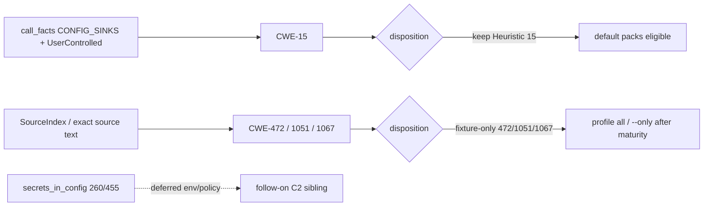

# chore(cwe): audit configuration residual trust (C2)

## Summary

Phase 3 slice **C2** of the parallel catalog program: inventory the
`configuration/` seam, **select config_hardcoding only** (CWE-15, 472, 1051,
1067), freeze corpus signals, keep **Heuristic** for project-agnostic CWE-15
(call_facts primary already), and propose **fixture-only** for museum siblings
472/1051/1067. Comment-only freeze in the owned detector file — no emit-path
changes, no shared-surface edits. Deferred sibling `secrets_in_config`
(CWE-260 env-requiredness, CWE-455 fail-fast/deployment policy).

---

## Motivation / context

- Plan: `plans/v0.0.5/parallel-catalog-program.md` §3.2 (C2)
- Evidence: `plans/v0.0.5/evidence-cwe-trust-configuration-residual.md`
- Parent audit: `plans/v0.0.5/cwe-catalog-trust-audit.md` (§1.3 structural bar)
- Issues: see **Related issues**
- Integration base SHA: `7d912d5be8528f80df0122259d24130c6f394df9`
- Branch: `chore/cwe-trust-configuration-residual`

---

## Selection inventory

| Leaf | Rules | Selected? |
|------|-------|-----------|
| `config_hardcoding.rs` | CWE-15, 472, 1051, 1067 | **Yes** |
| `secrets_in_config.rs` | CWE-260, 455 | Deferred (env-requiredness / fail-fast policy) |

### Why config_hardcoding

1. **Project-agnostic contract** — CWE-15: request-derived values must not open
   databases (`sql.Open` / fixture `factory` + user-controlled bindings).
2. Cohesive single-file family with full stdlib + frameworks fixture pairs.
3. Call_facts primary already exists for the flagship rule; siblings are
   unambiguous museums for fixture-only disposition.
4. Clear §3.2 deferral of env-requiredness (260) and deployment-mode fail-fast (455).

Deferred leaf left untouched for a follow-on issue under the same seam.

---

## Changes

### Per-rule disposition

| Rule | Disposition | Primary signal after this PR | Notes |
|------|-------------|------------------------------|-------|
| **CWE-15** | **keep Heuristic** | **call_facts** `is_configuration_sink` + `UserControlled` arg binding | Project-agnostic external control; not Structural (§1.3; `factory` sink fixture-shaped) |
| **CWE-472** | **fixture-only** (proposed) | SI role form field; negative `SELECT role FROM users` | Org-policy / assumed-immutable parameter museum |
| **CWE-1051** | **fixture-only** (proposed) | SI ChargeCard* + `10.20.30.40:9090` + NewRequest + X-Card-Token | Deployment hard-coded host museum |
| **CWE-1067** | **fixture-only** (proposed) | SI leading-wildcard sprintf + LIKE + notes corpus | Sequential-scan performance museum |

No rule promoted to Structural.

### Detector hygiene (`config_hardcoding.rs`)

- Module freeze documenting family selection and deferred sibling leaf.
- Per-rule freeze comments: primary signals, negatives, call-facts analysis,
  ownership neighbors, disposition.
- **No emit-path, span, or needle changes** — fixture oracle preserved.

### Fixtures

- Unchanged IDs and oracles (no new boundary fixtures; no `manifest.toml` edits).

### Shared surfaces (integrator only — not in this PR)

- Proposed maturity: fixture-only for CWE-472 / 1051 / 1067; keep Heuristic for CWE-15.
- Proposed NEEDLES labels: see **Handoff for integrator**.
- No edits to `maturity.rs`, `source_index.rs`, profile allow-lists, audit ledger,
  `parallel-catalog-program.md`, or `CONFIG_SINKS` / `sinks.rs` on this branch.

---

## Code snippets (if applicable)

### Module freeze (family selection)

```rust
// Configuration C2 trust freeze (config_hardcoding.rs).
// Selected family for parallel-catalog-program §3.2 / issue #113:
// config hardcoding / external control of configuration settings
// (CWE-15, CWE-472, CWE-1051, CWE-1067). Deferred sibling leaf:
// secrets_in_config.rs (CWE-260 env-requiredness; CWE-455 fail-fast /
// deployment-mode policy) — deferred unless an explicit policy profile
// is approved.
```

No call_facts rewrite: CWE-15 already uses call_facts primary; museum rules
cannot gain complete primary without over-firing (same bar as B1 comment-only
freeze).

---

## Impact

| Area | Impact |
|------|--------|
| **Performance** | Neutral (comments only) |
| **Memory** | None |
| **Behavior / correctness** | Fixture oracle preserved. Real-module: see canary below |
| **API / CLI** | None until integrator applies fixture-only maturity for 472/1051/1067 (then leave recommended/security default packs; still under `--profile all` / `--only`) |
| **Dependencies** | None |
| **Binary size / build time** | Negligible |

### Canary (worker pre-integration) — 2026-07-21

| Repository | Revision | Files scanned | Findings |
|---|---|---:|---:|
| gopdfsuit | `26d71268937136036c3be1770c0f7bdd89f87dc6` | *(pending)* | *(pending)* |
| monsoon | `e0f1027cb0c256853b835d8e20d8d206a96e44ed` | *(pending)* | *(pending)* |
| go-retry | `d3eb50afd37a09a9c0606c218d0dbe06e29d1544` | *(pending)* | *(pending)* |

**Totals:** *(pending)*. Per-rule: CWE-15 ×?, CWE-472 ×?, CWE-1051 ×?, CWE-1067 ×?.

---

## Breaking changes / migration

| Item | Migration |
|------|-----------|
| None in this PR | Maturity quarantine for 472/1051/1067 is proposed for the integrator branch only |
| After integrator applies fixture-only for 472/1051/1067 | Still under `--profile all` / `--only`; excluded from recommended/security default packs |
| CWE-15 | Remains Heuristic — no pack change |

---

## Architecture notes



---

## Files changed (high level)

| Path | Change |
|------|--------|
| `src/lang/go/detectors/cwe/domains/configuration/config_hardcoding.rs` | Freeze comments only; family selection + per-rule disposition |
| `plans/v0.0.5/evidence-cwe-trust-configuration-residual.md` | Freeze inventory, ownership, canary, handoff proposals |
| `plans/v0.0.5/pr-cwe-trust-configuration-residual.md` | This PR body |

---

## Test plan

- [x] `make lint`
- [ ] `cargo test --locked --test go_cwe_detector_fixtures`
- [ ] `make test`
- [ ] Release canary on gopdfsuit, monsoon, go-retry

### Commands

```sh
make lint
cargo test --locked --test go_cwe_detector_fixtures
make test
cargo build --release --locked
ONLY="CWE-15,CWE-472,CWE-1051,CWE-1067"
for t in /home/chinmay/ChinmayPersonalProjects/gopdfsuit \
         /home/chinmay/ChinmayPersonalProjects/codehound/real-repos/monsoon \
         /home/chinmay/ChinmayPersonalProjects/codehound/real-repos/go-retry; do
  echo "=== $t ==="
  target/release/codehound "$t" --profile all --only "$ONLY" \
    --format json --json-envelope --no-fail --no-cache 2>/dev/null | \
    python3 -c "import sys,json; d=json.load(sys.stdin); print('findings', d.get('findingCount')); print('files', d.get('stats',{}).get('files_scanned')); print([(f.get('rule_id'), f.get('file'), f.get('line')) for f in d.get('findings',[])])"
done
```

---

## Handoff for integrator

### Maturity proposals

| Rule | Proposed maturity |
|------|-------------------|
| CWE-15 | keep Heuristic |
| CWE-472 | fixture-only |
| CWE-1051 | fixture-only |
| CWE-1067 | fixture-only |
| CWE-260 / CWE-455 | **no change** (deferred family; no disposition) |

### NEEDLES (optional labels)

See evidence doc table (`Role form…`, `10.20.30.40:9090`, ChargeCard helpers, leading-wildcard sprintf, notes corpus, negatives).

### Owned needles / findings-oracle

- No new NEEDLES strings introduced.
- No findings-oracle fixture impact expected.

### Canary command

See evidence doc / Test plan above — re-run on integrated tree after maturity apply.

---

## Related issues

Closes #113 · Relates to #105
