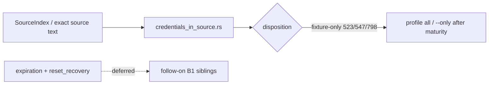

# chore(cwe): audit credential-lifecycle trust (B1)

## Summary

Phase 2 slice **B1** of the parallel catalog program: inventory the
`credential_lifecycle/` seam, **select credentials-in-source only**
(CWE-523, CWE-547, CWE-798), freeze corpus signals, and propose
**fixture-only** dispositions for all three (798 already fixture-only from
Tranche 1). Comment-only freeze in the owned detector file — no emit-path
changes, no shared-surface edits. Zero-hit real-module canary supports
museum quarantine.

---

## Motivation / context

- Plan: `plans/v0.0.5/parallel-catalog-program.md` §2.1 (B1)
- Evidence: `plans/v0.0.5/evidence-cwe-trust-credential-lifecycle.md`
- Parent audit: `plans/v0.0.5/cwe-catalog-trust-audit.md` (§1.3 structural bar)
- Issues: see **Related issues**
- Integration base SHA: `9d66183c3b29d8589317328170226bff6d4323d1`
- Branch: `chore/cwe-trust-credential-lifecycle`

---

## Selection inventory

| Leaf | Rules | Selected? |
|------|-------|-----------|
| `credentials_in_source.rs` | CWE-523, 547, 798 | **Yes** |
| `key_expiration.rs` | CWE-324 | Deferred (expiration) |
| `password_aging.rs` | CWE-262, 263 | Deferred (expiration sibling) |
| `reset_recovery.rs` | CWE-549, 640 | Deferred (reset/recovery) |

### Why credentials-in-source

1. Cohesive single-file family (cleartext login credentials, hard-coded signing
   constants, hard-coded DSN).
2. Completes Tranche 1 CWE-798 disposition with sibling 523/547 audit.
3. Unambiguous museum signals — dispositions do not require §1.3 structural debate.
4. Clear ownership vs CWE-319 (payment cleartext listen), CWE-1052 (bootstrap DSN),
   BP-152 (retired-duplicate of 798).
5. Full stdlib + frameworks fixture pairs; no new fixtures required.

Deferred families left untouched for follow-on issues under the same seam.

---

## Changes

### Per-rule disposition

| Rule | Disposition | Primary signal after this PR | Notes |
|------|-------------|------------------------------|-------|
| **CWE-523** | **fixture-only** (proposed) | SI `/login` + `password` + (`Addr: ":8080"` \| `StartCleartextLogin`); negatives `requireTLS(` / TLS-nil checks | Deployment/topology TLS assumption; avoid CWE-319 collision |
| **CWE-547** | **fixture-only** (proposed) | SI `const jwtSecret = ` \| `const sessionMACKey = `; negatives env JWT/SESSION keys | Const-name museum; crypto call_facts would over-fire |
| **CWE-798** | **keep fixture-only** | Exact reporting DSN source text; negative `REPORTING_DSN` env | Tranche 1 reaffirm; BP-152 already retire-duplicate |

No rule promoted to Structural. No Heuristic keep (zero real-module hits; no generalized production-shaped sink).

### Detector hygiene (`credentials_in_source.rs`)

- Module freeze documenting family selection and deferred siblings.
- Per-rule freeze comments: primary signals, negatives, call-facts analysis,
  ownership neighbors, disposition.
- **No emit-path, span, or needle changes** — fixture oracle preserved.

### Fixtures

- Unchanged IDs and oracles (no new boundary fixtures; no `manifest.toml` edits).

### Shared surfaces (integrator only — not in this PR)

- Proposed maturity: fixture-only for CWE-523 / CWE-547; keep CWE-798 fixture-only.
- Proposed NEEDLES labels: see **Handoff for integrator**.
- No edits to `maturity.rs`, `source_index.rs`, profile allow-lists, audit ledger,
  or `parallel-catalog-program.md` on this branch.

---

## Code snippets (if applicable)

### Module freeze (family selection)

```rust
// Credential-lifecycle B1 trust freeze (credentials_in_source.rs).
// Selected family for parallel-catalog-program §2.1 / issue #107:
// credentials-in-source (CWE-523, CWE-547, CWE-798). Deferred siblings:
// key_expiration (324), password_aging (262/263), reset_recovery (549/640).
//
// Primary evidence for all three rules is SourceIndex / exact source-text
// corpus co-presence, not generalized call_facts.
```

No call_facts rewrite: rewrites would not strengthen the proof boundary while
preserving oracle (same bar as A4 comment-only freeze / CWE-256 needle-primary).

---

## Impact

| Area | Impact |
|------|--------|
| **Performance** | Neutral (comments only) |
| **Memory** | None |
| **Behavior / correctness** | Fixture oracle preserved. Real-module: 0 findings on selected rule IDs |
| **API / CLI** | None until integrator applies fixture-only maturity for 523/547 (then leave recommended/security default packs; still under `--profile all` / `--only`) |
| **Dependencies** | None |
| **Binary size / build time** | Negligible |

### Canary (worker pre-integration) — 2026-07-21

| Repository | Revision | Files scanned | Findings |
|---|---|---:|---:|
| gopdfsuit | `26d71268937136036c3be1770c0f7bdd89f87dc6` | 78 | **0** |
| monsoon | `e0f1027cb0c256853b835d8e20d8d206a96e44ed` | 43 | **0** |
| go-retry | `d3eb50afd37a09a9c0606c218d0dbe06e29d1544` | 5 | **0** |

**Totals:** 126 scanned files. Per-rule: CWE-523 ×0, CWE-547 ×0, CWE-798 ×0.

Zero hits confirm museum/fixture-only shapes; no Heuristic-keep or Structural signal under §1.3.

---

## Breaking changes / migration

| Item | Migration |
|------|-----------|
| None in this PR | Maturity quarantine for 523/547 is proposed for the integrator branch only |
| After integrator applies fixture-only for 523/547 | Still under `--profile all` / `--only`; excluded from recommended/security default packs |
| CWE-798 | Already fixture-only — no change |

---

## Architecture notes



---

## Files changed (high level)

| Path | Change |
|------|--------|
| `src/lang/go/detectors/cwe/domains/credentials_and_secrets/credential_lifecycle/credentials_in_source.rs` | Freeze comments only; family selection + per-rule disposition |
| `plans/v0.0.5/evidence-cwe-trust-credential-lifecycle.md` | Freeze inventory, ownership, canary, handoff proposals |
| `plans/v0.0.5/pr-cwe-trust-credential-lifecycle.md` | This PR body |

---

## Test plan

- [x] `make lint`
- [x] `cargo test --locked --test go_cwe_detector_fixtures` (4 passed)
- [x] `make test` — 443 passed + 1 doctest
- [x] Release canary on gopdfsuit, monsoon, go-retry (counts above)

### Commands

```sh
make lint
cargo test --locked --test go_cwe_detector_fixtures
make test
cargo build --release --locked
ONLY="CWE-523,CWE-547,CWE-798"
for t in /home/chinmay/ChinmayPersonalProjects/gopdfsuit real-repos/monsoon real-repos/go-retry; do
  echo "=== $t ==="
  target/release/codehound "$t" --profile all --only "$ONLY" \
    --format json --json-envelope --no-fail --no-cache 2>/dev/null | \
    python3 -c "import sys,json; d=json.load(sys.stdin); print('findings', d.get('findingCount')); print('files', d.get('stats',{}).get('files_scanned'))"
done
```

---

## Related issues

- Closes #107
- Relates to #105
- Relates to #111
- Plan: `plans/v0.0.5/parallel-catalog-program.md` §2.1

---

## Integration

This branch is intended for merge into `chore/epic-105-phase2-integration`.
Prefer reviewing the integration PR when present. Worker canary is pre-integration
evidence only; re-run the combined Phase 2 `--only` canary on the integrated tree.

---

## Handoff for integrator

### Proposed maturity (`src/rules/maturity.rs`)

- `is_fixture_only`: add `CWE-523`, `CWE-547`
- `CWE-798`: already present — keep
- Do **not** add any of these to the structural allow-list
- Update maturity unit tests accordingly

### Proposed NEEDLES labels (`source_index.rs`)

| Needle | Label |
|--------|-------|
| `StartCleartextLogin` | `fixture-literal` (CWE-523 pure helper) |
| `Addr: ":8080"` | `fixture-literal` (CWE-523 cleartext listen) |
| `requireTLS(` | `negative-gate` (CWE-523) |
| `Request.TLS == nil` | `negative-gate` (CWE-523) if indexed |
| `r.TLS == nil` | `negative-gate` (CWE-523) if indexed |
| `const jwtSecret = ` | `fixture-literal` (CWE-547 frameworks) |
| `const sessionMACKey = ` | `fixture-literal` (CWE-547 pure) |
| `os.Getenv("JWT_SIGNING_KEY")` | `negative-gate` (CWE-547) |
| `os.Getenv("SESSION_MAC_KEY")` | `negative-gate` (CWE-547) |
| `os.Getenv("REPORTING_DSN")` | `negative-gate` (CWE-798) |
| `/login` | leave unlabeled alone (too common; 523 requires co-signals) |
| bare `password` | leave unlabeled (too generic) |
| exact reporting DSN | optional `fixture-literal` if ever NEEDLES-indexed (currently `source.contains`) |

### Fixture wiring

- None (oracle unchanged; no new `.txt` files).

### Findings-oracle impact

- Fixture suite: no expected change.
- Real-module: 0 findings on selected IDs — intentional (museum shapes).

### Exact canary command

```sh
target/release/codehound TARGET --profile all \
  --only CWE-523,CWE-547,CWE-798 \
  --format json --json-envelope --no-fail --no-cache
```

Re-run on the integrated tree; worker canary is evidence, not final proof.

### Audit ledger update (integrator)

Record family selection (credentials-in-source), deferred siblings, dispositions,
and canary in `plans/v0.0.5/cwe-catalog-trust-audit.md` and check off §2.1 in
`parallel-catalog-program.md` after Phase 2 batch merge.

---

## PR metadata checklist (author)

- [x] Self-assigned (`--assignee @me`)
- [x] Labels applied (`documentation`, `enhancement`)
- [x] Related issues filled with real ticket IDs
- [x] Filled body committed under `plans/v0.0.5/pr-cwe-trust-credential-lifecycle.md`

---

## Follow-ups (out of scope)

- Integrator maturity / NEEDLES / audit ledger edits
- Sibling streams B2 response-leaks, B3 access-control sibling, B4 privilege/lifecycle
- Deferred credential_lifecycle families: expiration (324/262/263), reset/recovery (549/640)
- Generalized hard-coded-secret or DSN recognition (would need secret-scanner-class design, not this seam)
- Structural promotion of any credentials-in-source rule (fails §1.3 without generalized sinks + real-module signal)

---

## Reviewer checklist

- [ ] Behavior matches summary and test plan
- [ ] No unrelated changes in diff (owned subtree + plans only)
- [ ] No edits to `maturity.rs`, `source_index.rs`, profiles, or `manifest.toml`
- [ ] Fixture oracle still holds
- [ ] PR has assignee and labels
- [ ] Related issues use Closes #107 / Relates to #105 / Relates to #111
- [ ] No secrets or generated artifacts committed
- [ ] Only one lifecycle family selected (credentials-in-source)

---

## Release notes (if user-facing)

- Internal catalog-trust audit for credential-lifecycle credentials-in-source CWE
  rules; no user-facing CLI change until maturity quarantine for CWE-523/547 lands
  on the Phase 2 integration branch.
