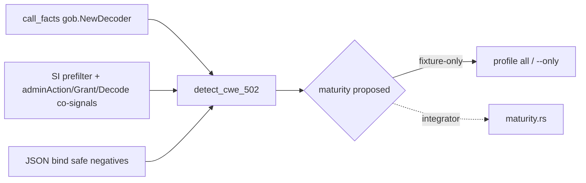

# chore(cwe): audit deserialization trust (CWE-502)

## Summary

Phase 1 slice **A3** of the parallel catalog program: freeze evidence for **CWE-502**, determine that the detector is **corpus-shaped** (admin-action gob decode), apply an **oracle-safe call-facts rewrite** for `gob.NewDecoder`, and propose **fixture-only** maturity for the integrator.

---

## Motivation / context

Parent ledger: [`plans/v0.0.5/parallel-catalog-program.md`](./parallel-catalog-program.md) §1.3.  
Closes [#98](https://github.com/chinmay-sawant/codehound/issues/98). Relates to [#95](https://github.com/chinmay-sawant/codehound/issues/95).

**Integration base SHA:** `217c0078d8a585e0e08b3b113e665898f6bf62dd`  
**Branch:** `chore/cwe-trust-deserialization`

CWE-502 lived as a pure SourceIndex conjunction of `encoding/gob` + `gob.NewDecoder(` + `.Decode(&action)` + `adminAction` + `Grant`. That is an exact corpus formula for privileged gob admin-action decode, not a generalized unsafe-deserialization boundary.

---

## Evidence freeze

### Detector / API shape

| Layer | Evidence |
|-------|----------|
| Primary sink (after rewrite) | `call_facts` callee exact `gob.NewDecoder` |
| SI impossibility prefilter | `gob.NewDecoder(` **or** `encoding/gob` |
| Corpus co-signals (non-primary) | `adminAction` + `Grant` + exact `.Decode(&action)` |
| Safe negatives | `ShouldBindJSON(&req)` **or** `json.NewDecoder(r.Body).Decode(&req)` |
| Emit message | `user-controlled gob data is deserialized into a privileged admin action` |
| Out of scope | Arbitrary `.Decode` without receiver proof; json/xml/yaml type-sensitive expansion |

### SourceIndex needles (owned / used; integrator may label)

| Needle | Role |
|--------|------|
| `encoding/gob` | SI prefilter / import co-presence |
| `gob.NewDecoder(` | SI impossibility prefilter |
| `.Decode(&action)` | Fixture-literal decode target (`action`) |
| `adminAction` | Fixture type / identifier |
| `Grant` | Fixture field co-signal |
| `ShouldBindJSON(&req)` | Negative-gate (framework safe) |
| `json.NewDecoder(r.Body).Decode(&req)` | Negative-gate (stdlib safe) |

**Not edited in this PR:** `source_index.rs` (integrator ownership). Proposed labels: co-signal needles → `fixture-literal: CWE-502 adminAction gob corpus`; bind paths → `negative-gate: CWE-502 safe JSON paths`.

### Fixtures

| Path | Variant | Expectation |
|------|---------|-------------|
| `tests/fixtures/go/stdlib/CWE-502-vulnerable.txt` | pure-go | fires: gob decode of `adminAction` from request body |
| `tests/fixtures/go/stdlib/CWE-502-safe.txt` | pure-go | silent: `json.NewDecoder(r.Body).Decode(&req)` + grant allowlist |
| `tests/fixtures/go/frameworks/CWE-502-vulnerable.txt` | gin/gorm | fires: same gob + adminAction shape |
| `tests/fixtures/go/frameworks/CWE-502-safe.txt` | gin/gorm | silent: `ShouldBindJSON(&req)` + grant allowlist |

No new fixtures; oracle IDs unchanged. Manifest wiring owned by integrator (no `manifest.toml` edits).

### Generalized vs corpus determination

**Corpus-only admin-action shape.** The rule does **not** detect a generalized unsafe deserialization boundary:

1. Requires exact type/name co-signals `adminAction` and `Grant`.
2. Requires exact decode target `.Decode(&action)`.
3. Only models `encoding/gob` / `gob.NewDecoder`, not untrusted JSON/XML/YAML into interface{} or privileged structs generally.
4. Safe fixtures are unrelated validated JSON role-change handlers, not “gob with allowlisted action types.”

A generalized CWE-502 would need untrusted-source → decoder dataflow, receiver-typed Decode proof, and structural negatives for trusted codecs — deferred (type-sensitive decoder expansion out of scope per §1.3 / Phase 5 gate).

### Sibling inventory (`trust_mixing.rs`)

| Rule | File | In scope for A3? |
|------|------|------------------|
| CWE-349 | `trust_mixing.rs` | **No** — mixed-trust JSON RawMessage / profile blob |
| CWE-501 | `trust_mixing.rs` | **No** — Approved bool trust-merge shape |
| CWE-502 | `decoders.rs` | **Yes** |

Compile-only dependency: domain `mod.rs` re-exports both files; no code changes to trust_mixing.

---

## Changes

### Detector rewrite (`decoders.rs`)

Oracle-safe rewrite modeled on CWE-319 / CWE-552 patterns:

1. SI cheap prefilter for gob construction / import.
2. Corpus co-signals retained as **non-primary** gates (oracle).
3. Safe JSON negatives retained.
4. **Primary:** `call_facts` for `gob.NewDecoder` provides sink proof + emit span.
5. Explicit comment that arbitrary `Decode` methods are out of scope without receiver proof.

Behavior vs fixtures: **oracle-preserving** (vulnerable fire, safe silent). No expansion of hit surface beyond existing corpus formula.

### Explicitly not changed (integrator / out of scope)

- `src/rules/maturity.rs` — propose fixture-only only
- `src/lang/go/detectors/cwe/source_index.rs` — propose NEEDLES labels only
- Profiles / packs / `tests/fixtures/manifest.toml`
- `plans/v0.0.5/cwe-catalog-trust-audit.md` / parallel ledger checkboxes
- `trust_mixing.rs` (CWE-349 / 501)
- Sibling A1 / A2 / A4

---

## Proposed disposition (integrator)

| Rule | Current maturity (fallthrough) | Proposed disposition | Rationale |
|------|--------------------------------|----------------------|-----------|
| **CWE-502** | Heuristic (default) | **fixture-only** quarantine | Emit still requires `adminAction` + `Grant` + `.Decode(&action)` corpus co-signals; call_facts only proves `gob.NewDecoder`. Zero real-module canary hits. **Not** structural-promoted. |

### Integrator proposals

1. Add `"CWE-502"` to `is_fixture_only` in `maturity.rs` with comment: adminAction gob corpus + call_facts NewDecoder primary; unit-test assert FixtureOnly.
2. Optionally label NEEDLES in `source_index.rs` for the seven strings above (no removals).
3. Append dated disposition to `cwe-catalog-trust-audit.md` (e.g. §2.x Deserialization — CWE-502) with canary table below.
4. Check off §1.3 boxes in `parallel-catalog-program.md` only after integration review.
5. Do **not** promote to Structural; do **not** expand to bare gob/json Decode without receiver + untrusted-source proof.
6. Phase 1 combined canary should include `CWE-502` in the batch `--only` list.

---

## Canary (release binary, this worktree)

```sh
cargo build --release --locked
for t in /home/chinmay/ChinmayPersonalProjects/gopdfsuit \
  /home/chinmay/ChinmayPersonalProjects/codehound/real-repos/monsoon \
  /home/chinmay/ChinmayPersonalProjects/codehound/real-repos/go-retry; do
  target/release/codehound "$t" --profile all \
    --only CWE-502 \
    --format json --json-envelope --no-fail --no-cache
done
```

| Repository | Path | Revision | Files scanned | Findings |
|---|---|---|---:|---:|
| gopdfsuit | `/home/chinmay/ChinmayPersonalProjects/gopdfsuit` | `26d71268937136036c3be1770c0f7bdd89f87dc6` | 78 | **0** |
| monsoon | `codehound/real-repos/monsoon` | `e0f1027cb0c256853b835d8e20d8d206a96e44ed` | 43 | **0** |
| go-retry | `codehound/real-repos/go-retry` | `d3eb50afd37a09a9c0606c218d0dbe06e29d1544` | 5 | **0** |

**Totals:** 126 scanned files (78+43+5). Per-rule: CWE-502 ×0.

Worktree note: this isolated worktree has no local `real-repos/`; canary used absolute paths under the main `codehound` checkout (same revs as prior file-permissions canaries).

---

## Impact

| Area | Impact |
|------|--------|
| **Performance** | Neutral (SI prefilter + single call_facts scan) |
| **Memory** | Negligible |
| **Behavior / correctness** | Oracle-preserving; no new positives beyond corpus formula |
| **Pack membership** | Unchanged until integrator applies fixture-only (still Heuristic fallthrough today) |
| **API / CLI** | None |
| **Dependencies** | None |

---

## Architecture notes



---

## Files changed

| Path | Change |
|------|--------|
| `src/lang/go/detectors/cwe/domains/deserialization/decoders.rs` | Oracle-safe call_facts primary + evidence comments |
| `plans/v0.0.5/pr-cwe-trust-deserialization.md` | This PR body / handoff |

---

## Validation

```sh
make lint
cargo test --locked --test go_cwe_detector_fixtures
make test
git diff --check
```

| Gate | Result |
|------|--------|
| `make lint` | pass |
| `go_cwe_detector_fixtures` | 4 passed |
| `make test` | 443 passed |
| Release canary CWE-502 | 0 / 126 files |

---

## Integration notes / blockers

1. **Maturity quarantine is integrator-owned** — without it, CWE-502 remains Heuristic and pack-eligible despite fixture-only evidence.
2. **No real-module positives** — zero-hit canary supports quarantine, not structural promotion.
3. **Do not expand Decode** without receiver proof (hard scope from §1.3).
4. **CWE-349 / CWE-501** remain unaudited in this slice; schedule separately if needed.
5. Merge order: detector rewrite first; then batch integration applies maturity + NEEDLES + audit + ledger.

### Blockers

None for this worker slice. Shared-file edits deliberately omitted.

---

## Closes

- Closes [#98](https://github.com/chinmay-sawant/codehound/issues/98)
- Relates to [#95](https://github.com/chinmay-sawant/codehound/issues/95)
