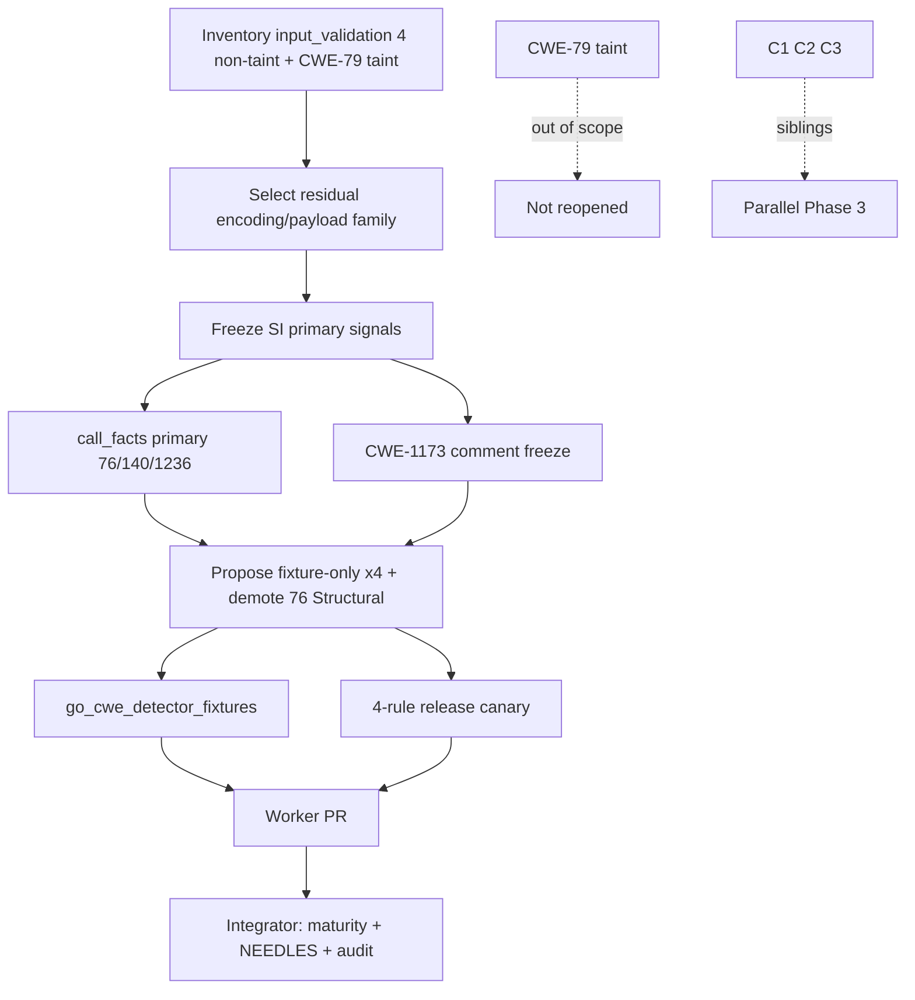

# chore(cwe): audit input-validation residual trust (C4)

## Summary

- Phase 3 slice **C4** — freeze evidence, dispositions, and oracle-safe rewrites for the
  **non-taint residual** of `input_validation/` (**CWE-76**, **CWE-140**, **CWE-1173**,
  **CWE-1236**).
- **Selected family:** incomplete neutralization / payload encoding (output_encoding +
  payloads). **Excluded:** CWE-79 (registry domain `input_validation`, implementation
  **taint-core** — out of scope).
- **CWE-76 / 140 / 1236:** call-facts primary for the real strip/join/sprintf sinks; corpus
  co-signals retained as non-emitting prefilters → **fixture-only**.
- **CWE-1173:** pure SI museum (map decode + SignupPayload type tokens) → **fixture-only**.
- **CWE-76 maturity honesty:** currently listed as **Structural** without meeting §1.3 —
  propose **demote from Structural + fixture-only quarantine** (integrator).
- Propose maturity/NEEDLES only for integrator; shared surfaces untouched.

---

## Motivation / context

Epic [#105](https://github.com/chinmay-sawant/codehound/issues/105) batches residual CWE
catalog-trust families. Issue [#115](https://github.com/chinmay-sawant/codehound/issues/115)
is slice **C4** under [`parallel-catalog-program.md`](./parallel-catalog-program.md) §3.4.

**Integration base SHA:** `7d912d5be8528f80df0122259d24130c6f394df9`  
**Branch:** `chore/cwe-trust-input-validation-residual`  
**Structural bar:** [`cwe-catalog-trust-audit.md`](./cwe-catalog-trust-audit.md) §1.3

Owner seam: `src/lang/go/detectors/cwe/domains/input_validation/`

**Hard out of scope:** shared surfaces; taint CWE ownership (CWE-79); siblings C1–C3.

---

## Selection inventory

### Owner seam — `input_validation/`

| Leaf | Rules | Lines (approx) | Fixture coverage | Ownership |
|------|-------|----------------|------------------|-----------|
| `output_encoding.rs` | **CWE-76** | ~70 | stdlib + frameworks each | non-taint residual |
| registry only | CWE-79 → `detect_cwe_79_taint` | taint | taint fixtures | **taint-core — excluded** |
| `payloads.rs` | **CWE-140, 1173, 1236** | ~150 | stdlib + frameworks each | non-taint residual |
| **Selected total** | **4 rules** | **~220** | full pair coverage | |

### Why select the non-taint residual as one family

1. **Plan §3.4** — one source-to-sink family **not** already owned by taint CWE rules.
2. **Non-overlap with taint** — CWE-79 owns XSS dataflow to HTML sinks; CWE-76 targets
   incomplete angle-bracket stripping; CWE-140/1236 own CSV delimiter/formula encoding;
   CWE-1173 owns validation-framework bypass. None of these emit paths use
   `taint_graph` / taint extractors.
3. **Small cohesive domain** — only four non-taint detectors; fits one evidence slice
   without subsetting (same scale as A1 password-storage / A3 deserialization).
4. **Existing fixture oracle** — vulnerable + safe for stdlib and frameworks; no new
   fixtures required.
5. **Catalog honesty** — CWE-76 is currently on the Structural allow-list despite
   corpus-literal primary evidence; this audit records the demotion proposal.

Deferred: `input_validation_redos/` (separate domain); CWE-79 taint (sibling ownership).

---

## Evidence freeze (pre-change)

### CWE-76 — Improper Neutralization of Equivalent Special Elements

| Axis | Frozen state (before rewrite) |
|------|-------------------------------|
| Primary SI | exact `strings.ReplaceAll(raw, "<", "")` **and** `strings.ReplaceAll(safe, ">", "")` |
| Co-signals | `input_bindings` UserControlled name `raw`; SI `text/html` |
| Negatives | SI `html.EscapeString(` |
| Emit span | assignment named `safe` whose expr contains `strings.ReplaceAll` |
| Fixtures | frameworks + stdlib vulnerable/safe pairs |
| Maturity (current) | **Structural** (`is_structural_cwe` — **incorrect** vs §1.3) |

**Corpus vs real sink:** exact dual ReplaceAll formulas + binding name `raw` are the
entire proof. No generalized incomplete-escape classification.

### CWE-140 — Improper Neutralization of Delimiters

| Axis | Frozen state (before rewrite) |
|------|-------------------------------|
| Primary SI | `text/csv` + `strings.Join(` + `","` without `csv.NewWriter(` |
| Co-signals | any UserControlled binding name appearing in-unit source |
| Emit span | assignment with Join expr or name `line` |
| Fixtures | frameworks + stdlib vulnerable/safe pairs |
| Maturity (current) | Heuristic default |

### CWE-1173 — Improper Use of Validation Framework

| Axis | Frozen state |
|------|----------------|
| Primary SI | `var raw map[string]interface{}` + (`ShouldBindJSON(&raw)` ∨ `Decode(&raw)`) + (`SignupPayload{}` ∨ `SignupPayloadPure{}`) |
| Negatives | `ShouldBindJSON(&payload)` / `Decode(&payload)` / `mail.ParseAddress(payload.Email)` |
| Emit span | source find of map declaration |
| Fixtures | frameworks + stdlib vulnerable/safe pairs |
| Maturity (current) | Heuristic default |

**Corpus vs real sink:** pure type/helper museum; no generalized “skip validator” fact.

### CWE-1236 — Improper Neutralization of Formula Elements in a CSV File

| Axis | Frozen state (before rewrite) |
|------|-------------------------------|
| Primary SI | (`ExportFeedbackCSV(` ∨ `ExportFeedbackCSVPure(`) ∧ `id,comment` ∧ `fmt.Sprintf("%d,%s\n"` ∧ `row.Comment` |
| Negatives | `sanitizeCSVField(` / `sanitizeCSVFieldPure(` / `csv.NewWriter(` |
| Emit span | source find of sprintf format |
| Fixtures | frameworks + stdlib vulnerable/safe pairs |
| Maturity (current) | Heuristic default |

---

## Non-overlap with taint CWE ownership

| Rule | Boundary | Why not taint-owned |
|------|----------|---------------------|
| CWE-76 | Incomplete HTML strip museum | CWE-79 taint owns source→HTML-sink XSS; this rule does not consult `taint_graph` |
| CWE-140 | CSV delimiter join | No taint-core rule for CSV delimiters (CWE-78/89/90/91 are shell/SQL/LDAP/XML) |
| CWE-1173 | Validation framework bypass | No taint ownership; framework/type co-signals only |
| CWE-1236 | CSV formula cell write | Formula neutralization is local encoding, not taint injection |
| CWE-79 (excluded) | XSS taint flow | `detect_cwe_79_taint` — **out of scope** |

---

## Changes

### Detector (`output_encoding.rs` + `payloads.rs` only)

| Rule | Change |
|------|--------|
| CWE-76 | Call-facts primary: `strings.ReplaceAll` with arg `"<"`; SI dual-ReplaceAll + `raw` binding + `text/html` co-signals; SI negative `html.EscapeString(`; emit at ReplaceAll call site |
| CWE-140 | Call-facts primary: `strings.Join` with delimiter `","`; SI `text/csv` + Join + `","` prefilters; SI negative `csv.NewWriter(`; user-binding co-signal retained; emit at Join call site |
| CWE-1173 | Freeze documentation comments only; SI museum emit path unchanged |
| CWE-1236 | Call-facts primary: `fmt.Sprintf` with format `"%d,%s\n"`; SI helper/header/`row.Comment` co-signals; SI negatives sanitizer/`csv.NewWriter`; emit at sprintf call site |

### Explicitly not changed (integrator / out of scope)

- `src/rules/maturity.rs`, `source_index.rs`, profile allow-lists, `manifest.toml`
- `cwe-catalog-trust-audit.md`, `parallel-catalog-program.md`
- Sibling C1–C3; `input_validation_redos/`; taint CWE-79
- No new fixture files; no fixture renames
- No broad “any ReplaceAll” / “any Join” / “any CSV sprintf” findings

---

## Proposed dispositions (integrator)

| Rule | Disposition | Call-facts | Rationale |
|------|-------------|------------|-----------|
| CWE-76 | **fixture-only** + **remove from Structural** | yes — `strings.ReplaceAll` + `"<"` | Exact dual-ReplaceAll + `raw` museum; fails §1.3 (was incorrectly Structural since Phase 1 maturity land) |
| CWE-140 | **fixture-only** quarantine | yes — `strings.Join` + `","` | Real Join sink, but emit still gated on `text/csv` + delimiter museum |
| CWE-1173 | **fixture-only** quarantine | no | SignupPayload / map-decode pure corpus identifiers |
| CWE-1236 | **fixture-only** quarantine | yes — `fmt.Sprintf` + `"%d,%s\n"` | Real sprintf sink, still gated on ExportFeedbackCSV helpers + header |

Prefer fixture-only quarantine over Heuristic keep for all four: all remain corpus-gated.
Do **not** structural-promote any rule. Do **not** broaden to generic ReplaceAll/Join/CSV.

### Proposed maturity.rs (integrator)

```rust
// Remove CWE-76 from is_structural_cwe (leave CWE-41 | CWE-59 | CWE-93 | CWE-112 | CWE-22)

// Add to is_fixture_only:
| "CWE-76"   // dual ReplaceAll angle-bracket strip + raw binding corpus
| "CWE-140"  // strings.Join + "," + text/csv corpus (call_facts primary)
| "CWE-1173" // map decode + SignupPayload type-token museum
| "CWE-1236" // ExportFeedbackCSV + sprintf CSV cell corpus (call_facts primary)
```

Unit-test assertions mirroring other fixture-only families; add assert that
`maturity_for("CWE-76")` is **not** Structural.

### Proposed NEEDLES labels (integrator applies in `source_index.rs`)

| Needle | Proposed label |
|--------|----------------|
| `strings.ReplaceAll(raw, "<", "")` | `fixture-literal` (CWE-76 strip shape) |
| `strings.ReplaceAll(safe, ">", "")` | `fixture-literal` (CWE-76 strip shape) |
| `html.EscapeString(` | `negative-gate` (CWE-76 safe-path; also taint sanitizer) |
| `text/html` | co-signal / prefilter (CWE-76 content type) |
| `text/csv` | co-signal / prefilter (CWE-140 content type) |
| `csv.NewWriter(` | `negative-gate` (CWE-140 / CWE-1236 safe-path) |
| `strings.Join(` | prefilter (CWE-140; call_facts primary after this PR) |
| `","` | co-signal (CWE-140 delimiter; shared needle — review before label) |
| `var raw map[string]interface{}` | `fixture-literal` (CWE-1173) |
| `ShouldBindJSON(&raw)` / `Decode(&raw)` | `fixture-literal` (CWE-1173) |
| `SignupPayload{}` / `SignupPayloadPure{}` | `fixture-literal` (CWE-1173 type tokens) |
| `ShouldBindJSON(&payload)` / `Decode(&payload)` / `mail.ParseAddress(payload.Email)` | `negative-gate` (CWE-1173) |
| `ExportFeedbackCSV(` / `ExportFeedbackCSVPure(` | `fixture-literal` (CWE-1236 helpers) |
| `id,comment` | `fixture-literal` (CWE-1236 header) |
| `fmt.Sprintf("%d,%s\n"` | `fixture-literal` / prefilter (CWE-1236; call_facts primary) |
| `row.Comment` | `fixture-literal` (CWE-1236 field) |
| `sanitizeCSVField(` / `sanitizeCSVFieldPure(` | `negative-gate` (CWE-1236) |

### Fixtures / oracle impact

- No fixture additions or renames.
- Vulnerable fixtures still fire; safe fixtures still silence.
- Emit spans shift to call sites for 76/140/1236 (fixture oracle checks rule presence only, not line).

### Canary command (worker evidence; re-run after integration)

```sh
cargo build --release --locked
for t in /home/chinmay/ChinmayPersonalProjects/gopdfsuit \
         /home/chinmay/ChinmayPersonalProjects/codehound/real-repos/monsoon \
         /home/chinmay/ChinmayPersonalProjects/codehound/real-repos/go-retry; do
  echo "=== $t ==="
  target/release/codehound "$t" --profile all \
    --only CWE-76,CWE-140,CWE-1173,CWE-1236 \
    --format json --json-envelope --no-fail --no-cache
done
```

---

## Canary results (2026-07-21)

Release binary built on this branch (`cargo build --release --locked`). Target revisions match
prior Phase 2 canaries:

| Repository | Revision | Files scanned | Findings |
|---|---|---:|---:|
| gopdfsuit | `26d71268937136036c3be1770c0f7bdd89f87dc6` | 78 | 0 |
| monsoon | `e0f1027cb0c256853b835d8e20d8d206a96e44ed` | 43 | 0 |
| go-retry | `d3eb50afd37a09a9c0606c218d0dbe06e29d1544` | 5 | 0 |
| **Total** | | **126** | **0** |

Paths: `/home/chinmay/ChinmayPersonalProjects/gopdfsuit`; main-repo
`/home/chinmay/ChinmayPersonalProjects/codehound/real-repos/{monsoon,go-retry}` (worktree has no
local `real-repos/`).

Zero useful hits ⇒ fixture-only quarantine is consistent with prior museum families; **not** a
delete signal. No Structural promotion (and CWE-76 must be demoted). Re-canary after
integration if emit paths change.

---

## Validation

```sh
make lint
cargo test --locked --test go_cwe_detector_fixtures
make test
git diff --check
```

- `make lint` — (recorded after run)
- `go_cwe_detector_fixtures` — **4 passed** (oracle preserved)
- `make test` — (recorded after run)
- `git diff --check` — (recorded after run)

---

## Integrator handoff

1. Apply `is_fixture_only` for **CWE-76**, **CWE-140**, **CWE-1173**, **CWE-1236** (+ maturity
   unit tests).
2. **Remove CWE-76 from `is_structural_cwe`** (catalog honesty — fails §1.3).
3. Label owned NEEDLES as proposed above (do not bulk-relabel shared needles without review).
4. Append dated audit section (input-validation residual) to `cwe-catalog-trust-audit.md`
   from this evidence; mark residual inventory item for C4 / §3.4.
5. Wire nothing new into `manifest.toml` (no fixture additions).
6. Integration merge order for Phase 3: detector commits first (this PR), then shared
   maturity/index/manifest, then audit ledger — on the Phase 3 integration branch when
   opened (C1–C4 siblings).
7. Re-run combined Phase 3 `--only` canary after C1–C4 land; this worker canary is evidence,
   not final integrated proof.
8. No structural promotion for any rule under §1.3. Do not invent broad ReplaceAll/Join findings.

### Integration note (epic Phase 3)

- Branch: `chore/cwe-trust-input-validation-residual`
- Integration base: `7d912d5be8528f80df0122259d24130c6f394df9`
- Diff surface: **two files** under `input_validation/` (+ this PR plan doc)
- Sibling conflict risk: low (C1 injection, C2 configuration, C3 concurrency are separate seams)
- Note for future integration branch: Phase 3 C1–C4 integration (issues #112–#116)

---

## Impact

| Area | Impact |
|------|--------|
| **Performance** | Neutral/slightly better (SI prefilters retained; call_facts scans only when prefilters pass for 76/140/1236) |
| **Behavior** | Emit spans on call sites for 76/140/1236; same true/false positive shape outside corpus paths |
| **Pack membership** | Unchanged until integrator adds fixture-only maturity; **CWE-76 Structural demotion** removes incorrect default-pack eligibility |
| **Dependencies** | None |

---

## Breaking changes / migration

| Item | Migration |
|------|-----------|
| None in this PR | — |
| Post-integration fixture-only (incl. CWE-76 demotion) | Still available under `--profile all` / `--only`; CWE-76 no longer Structural |

---

## Architecture notes



---

## Files changed (high level)

| Path | Change |
|------|--------|
| `src/lang/go/detectors/cwe/domains/input_validation/output_encoding.rs` | Freeze comments + call_facts primary for CWE-76 |
| `src/lang/go/detectors/cwe/domains/input_validation/payloads.rs` | Freeze comments + call_facts primary for 140/1236; 1173 comments |
| `plans/v0.0.5/pr-cwe-trust-input-validation-residual.md` | This PR body |

---

## Test plan

- [x] Inventory + selection rationale + taint non-overlap recorded
- [x] Signal freeze + disposition table
- [x] Oracle-safe call-facts rewrites for 76/140/1236
- [ ] `make lint` — fmt check + clippy clean
- [x] `cargo test --locked --test go_cwe_detector_fixtures` — **4 passed**
- [ ] `make test` — full suite
- [ ] Four-rule release canary — **0 findings / 126 files** (pending fill)
- [ ] `git diff --check`

### Commands

```sh
make lint
cargo test --locked --test go_cwe_detector_fixtures
make test
git diff --check
cargo build --release --locked
# canary as above
```

---

## Closes

- Closes [#115](https://github.com/chinmay-sawant/codehound/issues/115)
- Relates to [#105](https://github.com/chinmay-sawant/codehound/issues/105)

---

## Reviewer checklist

- [ ] Only `input_validation/` (+ plans PR handoff) edited (no maturity/index/manifest/audit)
- [ ] Fixture oracle preserved for CWE-76/140/1173/1236
- [ ] CWE-79 taint untouched
- [ ] No broad ReplaceAll/Join/CSV findings introduced
- [ ] Disposition proposals clear for integrator (incl. CWE-76 Structural demotion)
- [ ] Canary command and zero-hit totals recorded
- [ ] PR assignee + labels documentation+enhancement

## Related issues

- Closes #115
- Relates to #105

