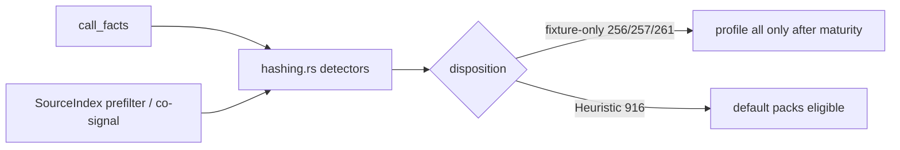

# chore(cwe): audit password-storage trust (CWE-256/257/261/916)

## Summary

Audit and oracle-safe tighten of the password-storage hashing family (CWE-256, CWE-257, CWE-261, CWE-916). Freeze corpus signals, promote call-facts primary where the password-storage proof boundary still holds, and propose fixture-only maturity for three museum-shaped rules while keeping CWE-916 Heuristic after real-module canary hits.

---

## Motivation / context

- Plan: `plans/v0.0.5/parallel-catalog-program.md` §1.1 (A1)
- Evidence: `plans/v0.0.5/evidence-cwe-trust-password-storage.md`
- Parent audit: `plans/v0.0.5/cwe-catalog-trust-audit.md` (§1.3 structural bar)
- Issues: see **Related issues**
- Integration base SHA: `217c0078d8a585e0e08b3b113e665898f6bf62dd`

---

## Changes

### Per-rule disposition

| Rule | Disposition | Primary signal after this PR | Notes |
|------|-------------|------------------------------|-------|
| **CWE-256** | **fixture-only** (proposed) | Exact GORM `Password: c.PostForm("password")` or exact SQL `db.Exec("INSERT INTO credentials…", login, pass)`; negatives on hash helpers | Needle/source-text primary retained — call facts cannot prove password→store without dataflow |
| **CWE-257** | **fixture-only** (proposed) | **call_facts** `aes.NewCipher` + `cipher.NewGCM` + `.Seal` + `base64.StdEncoding.EncodeToString`; SI co-signals `"password": encoded` / `VALUES(?, ?)", login, encoded)` | Crypto chain production-shaped; emit still corpus-gated on password persistence |
| **CWE-261** | **fixture-only** (proposed) | **call_facts** `base64.StdEncoding.EncodeToString`; SI co-signals `Secret: encoded` / `Store(user, encoded)` | Base64 alone is not password-storage proof |
| **CWE-916** | **keep Heuristic** | **call_facts** `md5.Sum`; SI prefilter + `password` co-signal; negatives bcrypt / `hashIterations = 100_000` | Mirrors CWE-328 sink; gopdfsuit PDF password MD5 hits; **not** structural (§1.3) |

No rule promoted to Structural.

### Detector hygiene (`password_storage/hashing.rs`)

- **CWE-256:** freeze comments only; needle/source-text primary unchanged.
- **CWE-257:** SI impossibility prefilter + persistence co-signals; call_facts primary for AES-GCM + base64; span from `aes.NewCipher` call.
- **CWE-261:** SI prefilter + storage co-signals; call_facts primary for base64 encode; span from that call.
- **CWE-916:** SI prefilter + password co-signal + safe-path negatives; call_facts primary for `md5.Sum`; span from that call.

### Fixtures

- Unchanged IDs and oracles (no new boundary fixtures required; no `manifest.toml` edits).

### Shared surfaces (integrator only — not in this PR)

- Proposed maturity: fixture-only for CWE-256 / 257 / 261; Heuristic keep for CWE-916.
- Proposed NEEDLES labels: see **Handoff for integrator**.
- No edits to `maturity.rs`, `source_index.rs`, profile allow-lists, or audit ledger on this branch.

---

## Code snippets (if applicable)

### CWE-916 after rewrite (call_facts primary)

```rust
// Cheap impossibility prefilter: no `md5.Sum` text ⇒ no weak-hash call of this shape.
if !facts.source_index.has("md5.Sum(") {
    return;
}
// Domain co-signal + safe-path negatives remain SourceIndex.
// Primary signal: call facts — `md5.Sum` callee.
let Some(md5_call) = facts
    .call_facts
    .iter()
    .find(|call| call.callee.as_ref() == "md5.Sum")
else {
    return;
};
```

---

## Impact

| Area | Impact |
|------|--------|
| **Performance** | Neutral (cheap SI prefilters + existing call_facts walk) |
| **Memory** | Negligible |
| **Behavior / correctness** | Fixture oracle preserved. Real-module: CWE-916 still fires on PDF password MD5 in gopdfsuit; CWE-256/257/261 remain zero-hit museum shapes |
| **API / CLI** | None until integrator applies fixture-only maturity (then 256/257/261 leave recommended/security default packs; still available under `--profile all` / `--only`) |
| **Dependencies** | None |
| **Binary size / build time** | Negligible |

### Canary (worker pre-integration) — 2026-07-21

| Repository | Revision | Files scanned | Findings |
|---|---|---:|---:|
| gopdfsuit | `26d71268937136036c3be1770c0f7bdd89f87dc6` | 78 | **2** (CWE-916 ×2) |
| monsoon | `e0f1027cb0c256853b835d8e20d8d206a96e44ed` | 43 | 0 |
| go-retry | `d3eb50afd37a09a9c0606c218d0dbe06e29d1544` | 5 | 0 |

**Totals:** 126 scanned files. Per-rule: CWE-256 ×0, CWE-257 ×0, CWE-261 ×0, CWE-916 ×2.

Sample hits:

- `CWE-916` `internal/pdf/encryption/encrypt.go:79` (`computeOwnerHash` / PDF owner password MD5)
- `CWE-916` `internal/pdf/redact/encryption_inhouse.go:241` (PDF password-derived key MD5 iterations)

---

## Breaking changes / migration

| Item | Migration |
|------|-----------|
| None in this PR | Maturity quarantine is proposed for the integrator branch only |
| After integrator applies fixture-only for 256/257/261 | Still under `--profile all` / `--only`; excluded from recommended/security default packs |

---

## Architecture notes



---

## Files changed (high level)

| Path | Change |
|------|--------|
| `src/lang/go/detectors/cwe/domains/credentials_and_secrets/password_storage/hashing.rs` | Freeze comments; call_facts primary for 257/261/916 |
| `plans/v0.0.5/evidence-cwe-trust-password-storage.md` | Freeze inventory, canary, handoff proposals |
| `plans/v0.0.5/pr-cwe-trust-password-storage.md` | This PR body |

---

## Test plan

- [x] `make lint`
- [x] `cargo test --locked --test go_cwe_detector_fixtures` (4 passed)
- [x] `make test` — 443 passed + 1 doctest
- [x] Release canary on gopdfsuit, monsoon, go-retry (counts above)

### Commands

```sh
make lint
cargo test --locked --test go_cwe_detector_fixtures
make test
cargo build --release --locked
for t in /home/chinmay/ChinmayPersonalProjects/gopdfsuit real-repos/monsoon real-repos/go-retry; do
  echo "=== $t ==="
  target/release/codehound "$t" --profile all \
    --only CWE-256,CWE-257,CWE-261,CWE-916 \
    --format json --json-envelope --no-fail --no-cache 2>/dev/null | \
    python3 -c "import sys,json; d=json.load(sys.stdin); print('findings', d.get('findingCount')); print('files', d.get('stats',{}).get('files_scanned'))"
done
```

---

## Related issues

- Closes #96
- Relates to #95
- Plan: `plans/v0.0.5/parallel-catalog-program.md` §1.1

---

## Integration

This branch is also intended for merge into `chore/epic-cwe-trust-batch-1-integration`. Prefer reviewing the integration PR when present.

---

## Handoff for integrator

### Proposed maturity (`src/rules/maturity.rs`)

- `is_fixture_only`: add `CWE-256`, `CWE-257`, `CWE-261`
- `CWE-916`: keep default **Heuristic** (do not add to structural allow-list)
- Update maturity unit tests accordingly

### Proposed NEEDLES labels (`source_index.rs`)

| Needle | Label |
|--------|-------|
| `Password: c.PostForm("password")` | `fixture-literal` (CWE-256 GORM) |
| `GenerateFromPassword(` | `negative-gate` (CWE-256) |
| `hashPassphrase(` | `negative-gate` (CWE-256) |
| `"password": encoded` | `fixture-literal` (CWE-257) |
| `VALUES(?, ?)", login, encoded)` | `fixture-literal` (CWE-257) |
| `aes.NewCipher(` | already `negative-gate` (CWE-1240); dual-use CWE-257 prefilter — extend comment |
| `base64.StdEncoding.EncodeToString(` | prefilter / `negative-gate` (CWE-257 / CWE-261) |
| `Secret: encoded` | `fixture-literal` (CWE-261) |
| `Store(user, encoded)` | `fixture-literal` (CWE-261) |
| `md5.Sum(` | already `negative-gate` (CWE-328 / CWE-916) |
| `bcrypt.GenerateFromPassword` | `negative-gate` (CWE-916) |
| `hashIterations = 100_000` | `fixture-literal` (CWE-916 safe stretch) |
| bare `digest` / `hash` / `password` | leave unlabeled (too generic) |

### Fixture wiring

- None (oracle unchanged; no new `.txt` files).

### Findings-oracle impact

- Fixture suite: no expected change.
- Real-module: CWE-916 ×2 on gopdfsuit is intentional/reviewed (PDF password MD5); not a regression from this rewrite.

### Exact canary command

```sh
target/release/codehound TARGET --profile all \
  --only CWE-256,CWE-257,CWE-261,CWE-916 \
  --format json --json-envelope --no-fail --no-cache
```

Re-run on the integrated tree; worker canary is evidence, not final proof.

### Audit ledger update (integrator)

Record family dispositions + canary in `plans/v0.0.5/cwe-catalog-trust-audit.md` and check off §1.1 in `parallel-catalog-program.md` after batch merge.

---

## PR metadata checklist (author)

- [x] Self-assigned (`--assignee @me`)
- [x] Labels applied (`documentation`, `enhancement`)
- [x] Related issues filled with real ticket IDs
- [x] Filled body committed under `plans/v0.0.5/pr-cwe-trust-password-storage.md`

---

## Follow-ups (out of scope)

- Integrator maturity / NEEDLES / audit ledger edits
- Sibling streams A2 transport, A3 deserialization, A4 access-control
- Credential lifecycle Phase 2
- Structural promotion of CWE-916 (needs broader negative coverage beyond bare `password`)
- Generalized password→persistence dataflow for CWE-256

---

## Reviewer checklist

- [ ] Behavior matches summary and test plan
- [ ] No unrelated changes in diff (owned subtree + plans only)
- [ ] No edits to `maturity.rs`, `source_index.rs`, profiles, or `manifest.toml`
- [ ] Fixture oracle still holds
- [ ] PR has assignee and labels
- [ ] Related issues use Closes #96 / Relates to #95
- [ ] No secrets or generated artifacts committed

---

## Release notes (if user-facing)

- Internal catalog-trust audit for password-storage CWE rules; no user-facing CLI change until maturity quarantine lands on the integration branch.
