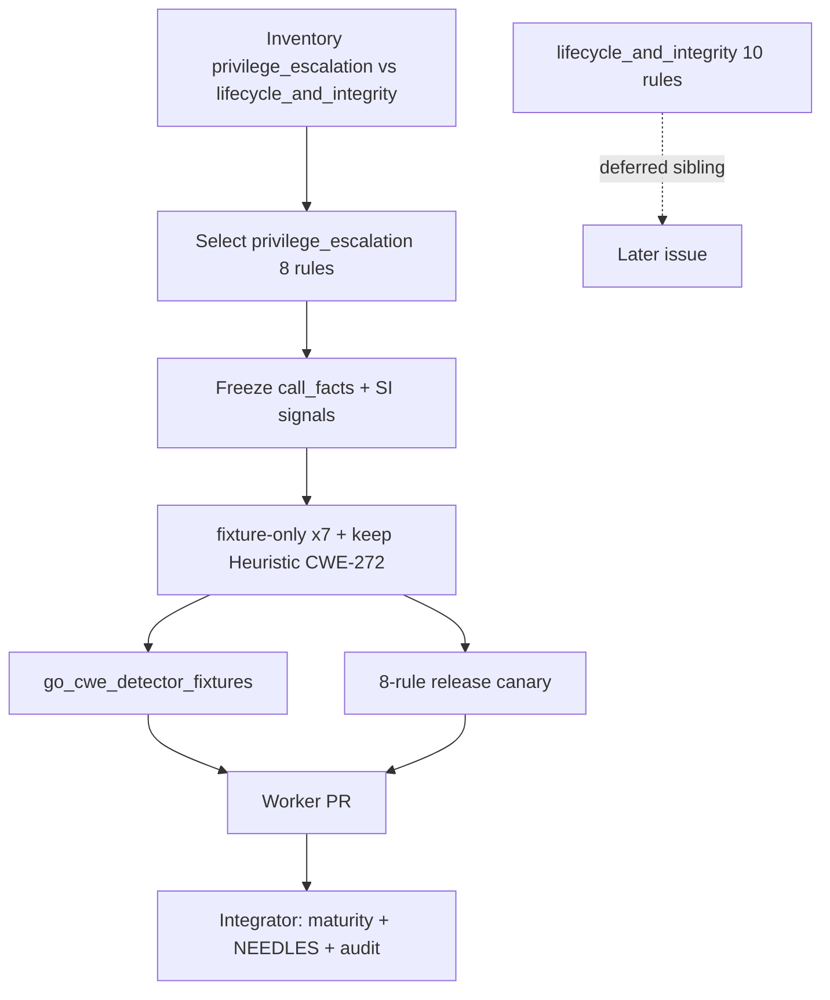

# chore(cwe): audit privilege/lifecycle trust (B4)

## Summary

- Inventory both general-security candidate families; **select**
  `general_security/privilege_escalation/` (eight rules: CWE-266, 267, 268, 270, 272, 273, 274, 1265).
- **Defer** `general_security/lifecycle_and_integrity/` (lifecycle / plugins / runtime_state — topology and whole-program lifecycle proof).
- Freeze primary signals, negatives, fixtures, and maturity state for the selected family only.
- Propose dispositions: **fixture-only** ×7 + **keep Heuristic** for CWE-272 (integrator applies `maturity.rs` / SourceIndex NEEDLES labels).
- Oracle-safe detector comments only (no emit-path changes); run focused fixtures + eight-rule real-module canary.

---

## Motivation / context

Phase 2 slice **B4** of [`parallel-catalog-program.md`](./parallel-catalog-program.md) §2.4 /
issue [#110](https://github.com/chinmay-sawant/codehound/issues/110). Relates to epic
[#105](https://github.com/chinmay-sawant/codehound/issues/105) and Phase 2 sibling
[#111](https://github.com/chinmay-sawant/codehound/issues/111).

**Integration base SHA:** `9d66183c3b29d8589317328170226bff6d4323d1`  
**Branch:** `chore/cwe-trust-privilege-lifecycle`  
**Structural bar:** [`cwe-catalog-trust-audit.md`](./cwe-catalog-trust-audit.md) §1.3

---

## Selection inventory

### Candidate A — `privilege_escalation/` (**selected**)

| Leaf | Rules | Lines (approx) | Fixture coverage |
|------|-------|----------------|------------------|
| `role_scope.rs` | CWE-266, 267, 268 | ~109 | stdlib + frameworks each (4 files / rule) |
| `transitions.rs` | CWE-270, 272, 273, 274, 1265 | ~198 | stdlib + frameworks each (4 files / rule) |
| **Total** | **8 rules** | **~312** | **full pair coverage** |

Clear sink/API boundaries already present on several rules:

- `call_facts` for `os.Remove`, `db.Queryx` / `json.NewEncoder`, `c.Set` /
  `context.WithValue`, `syscall.Setuid`, `os.Chown`, `os.Rename`
- assignment + `InputKind::UserControlled` for role provisioning (CWE-266)
- Safe negatives for restore / drop / EPERM / helper-split shapes

### Candidate B — `lifecycle_and_integrity/` (**deferred**)

| Leaf | Rules | Lines (approx) | Fixture coverage |
|------|-------|----------------|------------------|
| `lifecycle.rs` | CWE-765, 778, 826, 1322 | ~122 | stdlib + frameworks each |
| `plugins.rs` | CWE-618, 829, 1125 | ~92 | stdlib + frameworks each |
| `runtime_state.rs` | CWE-515, 544, 605 | ~100 | stdlib + frameworks each |
| **Total** | **10 rules** | **~321** | full pair coverage |

Fixtures exist, but the family is dominated by whole-program / topology evidence:

- premature `db.Close` vs background task lifetime (CWE-826)
- public route surface co-mounting debug/admin/internal (CWE-1125)
- cross-request covert global flag (CWE-515)
- vendor native-bridge path + plugin load path policy (CWE-618 / 829)
- inconsistent error-path panic vs log (CWE-544)

These depend on deployment topology, service ownership, or lifecycle proof that the
B4 contract explicitly defers. Prefer a later dedicated slice once privilege
dispositions land.

### Why select A

1. **Plan preference** — §2.4 prefers the smaller privilege_escalation family when fixtures are complete (they are).
2. **Clearer sink/API boundary** — Setuid/Chown/Rename/Remove/context-switch call_facts vs lifecycle co-presence museums.
3. **Existing safe fixtures** — every selected rule has stdlib + frameworks vulnerable/safe pairs; no new fixtures required.
4. **Cohesive eight-rule slice** — role_scope + transitions share the privilege domain without subsetting.
5. **Clean sibling deferral** — full `lifecycle_and_integrity/` remains intact for a later issue.

---

## Frozen signals (selected family)

Runtime maturity today: all eight default to **Heuristic** (`maturity_for` has no explicit
fixture-only / structural entry). Available under `--profile all` / `--only`; not on
recommended/security explicit allow-lists.

### CWE-266 — Incorrect Privilege Assignment

| Field | Value |
|-------|--------|
| File | `privilege_escalation/role_scope.rs` → `detect_cwe_266` |
| Primary signal | assignment `name == "role"` + `InputKind::UserControlled` binding `"role"` + SI `"Role: role"` \| `"Store(userID, role)"` |
| Negatives | safe fixtures assign fixed server-side role (no user-controlled `"role"` binding) |
| Span | role assignment start_byte |
| Fixtures | stdlib + frameworks vulnerable/safe |
| Call-facts? | No — membership proof is SI corpus; assignment+input alone not sufficient |
| **Proposed disposition** | **fixture-only** |

### CWE-267 — Privilege Defined with Unsafe Actions

| Field | Value |
|-------|--------|
| File | `role_scope.rs` → `detect_cwe_267` |
| Primary signal | SI reviewer-role guard (`!= "reviewer"` / `.Get("X-Role") != "reviewer"`) + `call_facts` `os.Remove` |
| Negatives | safe fixtures avoid reviewer→Remove pairing |
| Span | `os.Remove` call |
| Fixtures | stdlib + frameworks vulnerable/safe |
| Call-facts? | Sink only; role policy is SI museum |
| **Proposed disposition** | **fixture-only** |

### CWE-268 — Privilege Chaining

| Field | Value |
|-------|--------|
| File | `role_scope.rs` → `detect_cwe_268` |
| Primary signal | SI read/export scope co-presence + `call_facts` `db.Queryx` (arg contains `password_hash`) **or** `json.NewEncoder` + SI `Encode(userRecords)` + `"hash"` |
| Negatives | safe fixtures avoid chained-scope + sensitive dump |
| Span | sensitive sink call |
| Fixtures | stdlib + frameworks vulnerable/safe |
| Call-facts? | Sink partial; scope names + combination predicate are corpus-shaped |
| **Proposed disposition** | **fixture-only** |

### CWE-270 — Privilege Context Switching Error

| Field | Value |
|-------|--------|
| File | `privilege_escalation/transitions.rs` → `detect_cwe_270` |
| Primary signal | `call_facts` `c.Set("effective_user", "root"\|"maintenance")` **or** `context.WithValue(..., effectiveUserKey, "root"\|"maintenance")` without restore SI |
| Negatives | SI `defer c.Set("effective_user", original)` **or** `defer func()` + `context.WithValue(r.Context(), effectiveUserKey, original)` |
| Span | context-switch call |
| Fixtures | stdlib + frameworks vulnerable/safe |
| Call-facts? | Yes for switch; keys/values are fixture literals |
| **Proposed disposition** | **fixture-only** |

### CWE-272 — Least Privilege Violation

| Field | Value |
|-------|--------|
| File | `transitions.rs` → `detect_cwe_272` |
| Primary signal | `call_facts` `syscall.Setuid` arg `"0"` + `os.Chown` + absence of `syscall.Setuid` arg `"1000"` |
| Negatives | drop via `Setuid(1000)` after privileged work |
| Span | elevate `Setuid(0)` call |
| Fixtures | stdlib + frameworks vulnerable/safe |
| Call-facts? | **Yes — strongest API boundary in the family** |
| Limitation | drop detection is uid-literal `1000` only |
| **Proposed disposition** | **keep Heuristic** (not fixture-only; **not** structural — zero real-module hits, no generalized drop proof) |

### CWE-273 — Improper Check for Dropped Privileges

| Field | Value |
|-------|--------|
| File | `transitions.rs` → `detect_cwe_273` |
| Primary signal | `call_facts` `syscall.Setuid(1000)` without SI `if err := syscall.Setuid(1000); err != nil` and without elevate `Setuid(0)` co-presence |
| Negatives | exact err-check SI (stdlib safe); elevate path deferred to CWE-272 |
| Span | drop `Setuid(1000)` call |
| Fixtures | stdlib + frameworks vulnerable/safe |
| Call-facts? | Drop call only; uid + err-check SI are corpus-shaped |
| **Proposed disposition** | **fixture-only** |

### CWE-274 — Improper Handling of Insufficient Privileges

| Field | Value |
|-------|--------|
| File | `transitions.rs` → `detect_cwe_274` |
| Primary signal | `call_facts` `os.Rename` + SI `if err != nil {` + (`c.JSON(200, gin.H{"rotated": true})` \| `w.WriteHeader(http.StatusOK)`) without `errors.Is(err, syscall.EPERM)` |
| Negatives | SI `errors.Is(err, syscall.EPERM)` |
| Span | `os.Rename` call |
| Fixtures | stdlib + frameworks vulnerable/safe |
| Call-facts? | Rename sink; success-on-error response shapes are corpus-shaped |
| **Proposed disposition** | **fixture-only** |

### CWE-1265 — Unintended Reentrant Invocation of Non-reentrant Code

| Field | Value |
|-------|--------|
| File | `transitions.rs` → `detect_cwe_1265` |
| Primary signal | SI `UpdateBalance(`\|`UpdateBalancePure(` + `ledgerMu.Lock()`\|`ledgerMuPure.Lock()` + `PostTransfer(`\|`PostTransferPure(` |
| Negatives | SI `applyBalanceDelta(`\|`applyBalanceDeltaPure(` helper split |
| Span | source find of UpdateBalance* text |
| Fixtures | stdlib + frameworks vulnerable/safe |
| Call-facts? | No — pure identifier museum; no lock-set analysis |
| **Proposed disposition** | **fixture-only** |

### Disposition table

| Rule | Disposition | Primary signal class | Notes |
|------|-------------|----------------------|-------|
| **CWE-266** | **fixture-only** | assignment + input + SI membership | Store/Role needles |
| **CWE-267** | **fixture-only** | SI role + call_facts Remove | reviewer museum |
| **CWE-268** | **fixture-only** | SI scopes + call_facts dump | read∧export chaining |
| **CWE-270** | **fixture-only** | call_facts switch + SI restore | effective_user keys |
| **CWE-272** | **keep Heuristic** | call_facts Setuid(0)+Chown | drop uid 1000 limited; not structural |
| **CWE-273** | **fixture-only** | call_facts Setuid(1000) + SI err | corpus drop check |
| **CWE-274** | **fixture-only** | call_facts Rename + SI success-on-err | rotated JSON museum |
| **CWE-1265** | **fixture-only** | SI reentry museum | ledger/UpdateBalance names |

No deletes. No §1.3 Structural promotion. No emit-path rewrites (oracle already call_facts-backed where useful).

---

## Changes

### Code (`privilege_escalation/` only)

- `role_scope.rs` / `transitions.rs`: proof-boundary comments freezing primary signal,
  negatives, and call-facts assessment. **No emit logic, messages, or span changes**
  (oracle preserved).

### Docs

- This PR body (`plans/v0.0.5/pr-cwe-trust-privilege-lifecycle.md`).

### Explicitly not changed (integrator / out of scope)

- `src/rules/maturity.rs` — propose adding seven IDs to `is_fixture_only`; leave CWE-272 Heuristic
- `src/lang/go/detectors/cwe/source_index.rs` — propose NEEDLES labels (see below)
- profiles, `tests/fixtures/manifest.toml`, `cwe-catalog-trust-audit.md`, ledger §2.4 checkboxes
- `lifecycle_and_integrity/` (deferred sibling)
- Sibling B1/B2/B3 seams

---

## Integrator proposals

### Maturity (`maturity.rs`)

Add to `is_fixture_only`:

```text
CWE-266, CWE-267, CWE-268, CWE-270, CWE-273, CWE-274, CWE-1265
```

**Do not** add `CWE-272` (keep Heuristic).

Unit-test assertions mirroring other fixture-only families; assert CWE-272 remains Heuristic
(default fallthrough).

### SourceIndex NEEDLES labels (no reordering required)

| Needle (examples) | Label proposal |
|-------------------|----------------|
| `Role: role`, `Store(userID, role)` | `fixture-literal: CWE-266` |
| `!= "reviewer"`, `.Get("X-Role") != "reviewer"` | `fixture-literal: CWE-267` |
| `p == "read"`, `case "read":`, `p == "export"`, `case "export":`, `hasRead && hasExport`, `hasExport && hasRead`, `Encode(userRecords)`, `"hash"`, `password_hash` (co-signal only; may be shared) | `fixture-literal: CWE-268` (shared needles stay unlabeled if multi-owner) |
| `defer c.Set("effective_user", original)`, `context.WithValue(r.Context(), effectiveUserKey, original)` | `negative-gate: CWE-270` |
| `if err := syscall.Setuid(1000); err != nil` | `negative-gate: CWE-273` |
| `c.JSON(200, gin.H{"rotated": true})`, `w.WriteHeader(http.StatusOK)` (latter is broad — label carefully) | `fixture-literal: CWE-274` for rotated JSON; StatusOK may stay unlabeled |
| `errors.Is(err, syscall.EPERM)` | `negative-gate: CWE-274` |
| `UpdateBalance(`, `UpdateBalancePure(`, `ledgerMu.Lock()`, `ledgerMuPure.Lock()`, `PostTransfer(`, `PostTransferPure(` | `fixture-literal: CWE-1265` |
| `applyBalanceDelta(`, `applyBalanceDeltaPure(` | `negative-gate: CWE-1265` |
| `Setuid(` | already labeled for CWE-648; leave dual-use note (also CWE-272/273 shape) |

### Fixtures

None required. Oracle unchanged.

### Findings-oracle impact

None expected (comment-only detector edit).

### Canary command (worker evidence; re-run after integration)

```sh
cargo build --release --locked
for t in /home/chinmay/ChinmayPersonalProjects/gopdfsuit \
         /home/chinmay/ChinmayPersonalProjects/codehound/real-repos/monsoon \
         /home/chinmay/ChinmayPersonalProjects/codehound/real-repos/go-retry; do
  echo "=== $t ==="
  target/release/codehound "$t" --profile all \
    --only CWE-266,CWE-267,CWE-268,CWE-270,CWE-272,CWE-273,CWE-274,CWE-1265 \
    --format json --json-envelope --no-fail --no-cache
done
```

---

## Canary results (2026-07-21)

Release binary built on this branch (`cargo build --release --locked`). Target revisions match
prior Phase 1 canaries:

| Repository | Revision | Files scanned | Findings |
|---|---|---:|---:|
| gopdfsuit | `26d71268937136036c3be1770c0f7bdd89f87dc6` | 78 | 0 |
| monsoon | `e0f1027cb0c256853b835d8e20d8d206a96e44ed` | 43 | 0 |
| go-retry | `d3eb50afd37a09a9c0606c218d0dbe06e29d1544` | 5 | 0 |
| **Total** | | **126** | **0** |

Paths: `/home/chinmay/ChinmayPersonalProjects/gopdfsuit`; main-repo
`/home/chinmay/ChinmayPersonalProjects/codehound/real-repos/{monsoon,go-retry}` (worktree has no
local `real-repos/`).

Zero useful hits ⇒ fixture-only quarantine for the seven museum-gated rules is consistent with
prior families. **CWE-272 keep Heuristic** is still correct (call_facts Setuid(0)+Chown boundary is
production-shaped) but **not** Structural — canary did not surface a real-module hit. Re-canary
after integration if emit paths change.

---

## Impact

| Area | Impact |
|------|--------|
| **Performance** | None |
| **Memory** | None |
| **Behavior / correctness** | None in this PR (comments only). Integrator fixture-only quarantine removes default-pack *eligibility* if packs later expand; today these IDs are not on recommended/security allow-lists |
| **API / CLI** | None until maturity integration |
| **Dependencies** | None |

---

## Breaking changes / migration

| Item | Migration |
|------|-----------|
| None in this PR | — |
| Post-integration fixture-only (7 IDs) | Still available under `--profile all` / `--only` |
| CWE-272 remains Heuristic | Unchanged default maturity |

---

## Architecture notes



---

## Files changed (high level)

| Path | Change |
|------|--------|
| `src/lang/go/detectors/cwe/domains/general_security/privilege_escalation/role_scope.rs` | Signal-freeze comments |
| `src/lang/go/detectors/cwe/domains/general_security/privilege_escalation/transitions.rs` | Signal-freeze comments |
| `plans/v0.0.5/pr-cwe-trust-privilege-lifecycle.md` | This PR body |

---

## Test plan

- [x] Inventory + selection rationale recorded
- [x] Signal freeze + disposition table
- [x] `make lint` — fmt check + clippy clean
- [x] `cargo test --locked --test go_cwe_detector_fixtures` — **4 passed**
- [x] `make test` — **443 nextest + 1 doctest passed**
- [x] Eight-rule release canary — **0 findings / 126 files**
- [x] `git diff --check`

### Commands

```sh
make lint
cargo test --locked --test go_cwe_detector_fixtures
make test
cargo build --release --locked
# canary as above
git diff --check
```

---

## Related issues

- Closes #110
- Relates to #105
- Relates to #111
- Plan: `plans/v0.0.5/parallel-catalog-program.md` §2.4
- Deferred sibling: `general_security/lifecycle_and_integrity/` (lifecycle, plugins, runtime_state)
