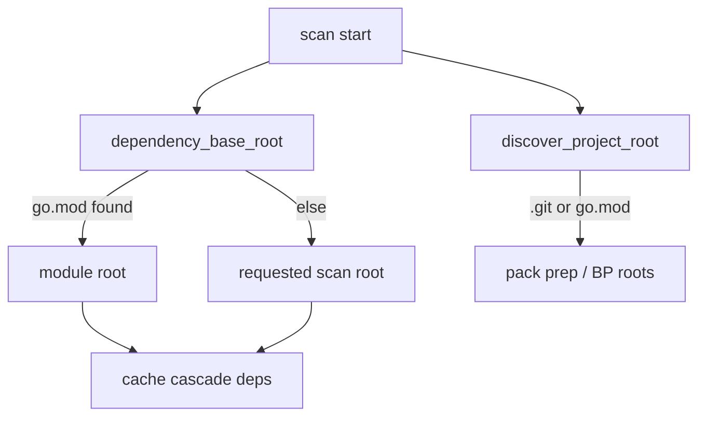

# fix(engine): preserve scan root for go.mod-less dependency cascade

## Summary

- Stop using a bare parent `.git` as the dependency extraction root when no `go.mod` exists, so local imports resolve inside the scanned tree.
- Restore the go.mod-less cache cascade regression under the environment-sensitive topology (parent VCS sentinel).

## Motivation / context

After the language-neutral plugin dep seam, `Analyzer::analyze_paths` passed `discover_project_root(start)` into cascade dependency extraction. That walks up to `.git` **or** `go.mod`. For a go.mod-less project under a parent with `.git` (CI sandboxes, custom `TMPDIR`), `import "pkg/db"` resolved under the VCS parent instead of the scan root, producing empty deps and failing:

`transitive_invalidation_works_without_go_mod_using_cwd_fallback_paths`

Plan: `plans/v0.0.5/rust-architecture-review.md` §6.2  
Issue: #83

## Changes

### Dependency base

- New `dependency_base_root(start)`:
  - Prefer directory with `go.mod` when walking up
  - Else fall back to the **requested scan root** (path itself, or parent if file)
  - Does **not** stop at bare parent `.git`
- `discover_project_root` unchanged for pack prep / BP (still `.git` or `go.mod`)
- `analyze_paths` uses `dependency_base_root` only for cache dependency extraction

### Tests

- Parent `.git` sentinel in the no-go.mod cascade regression
- Unit tests: prefers go.mod over parent git; falls back to scan root not parent git

### Plan

- §6.2 checkboxes marked complete in the architecture review

## Code snippets (if applicable)

### Before

```rust
let project_root = discover_project_root(start);
// deps resolved against parent .git when no go.mod
scan_entries_parallel(..., &project_root, ...);
```

### After

```rust
let prep_root = discover_project_root(start);      // BP / prepare
let dependency_root = dependency_base_root(start); // cache cascade
scan_entries_parallel(..., &dependency_root, ...);
```

## Impact

| Area | Impact |
|------|--------|
| **Performance** | Neutral |
| **Memory** | None |
| **Behavior / correctness** | go.mod-less local import deps correct under parent `.git`; cascade invalidation restored |
| **API / CLI** | New public `dependency_base_root` export on engine |
| **Dependencies** | None |
| **Binary size / build time** | Unchanged |

## Breaking changes / migration

| Item | Migration |
|------|-----------|
| None | — |

## Architecture notes



## Files changed (high level)

| Path | Change |
|------|--------|
| `src/engine/dependencies/project_root.rs` | `dependency_base_root` + unit tests |
| `src/engine/analyzer/scan.rs` | split prep root vs dependency root |
| `src/engine/dependencies/mod.rs` / `src/engine/mod.rs` | re-export |
| `tests/engine_cache_invalidation.rs` | parent `.git` regression topology |
| `plans/v0.0.5/rust-architecture-review.md` | §6.2 done |
| `plans/v0.0.5/pr-dep-base-scan-root.md` | this body |

## Test plan

- [x] `make lint`
- [x] `cargo test --all-features --locked --test engine_cache_invalidation`
- [x] Hostile TMPDIR with parent `.git` (repro that was red)
- [x] `cargo test --all-features --locked` (full suite green)

### Commands

```sh
make lint
cargo test --all-features --locked --test engine_cache_invalidation
cargo test --all-features --locked
```

## Related issues

- Closes #83
- Relates to #75
- Plan: `plans/v0.0.5/rust-architecture-review.md` §6.2

## PR metadata checklist (author)

- [x] Self-assigned (`--assignee @me`)
- [x] Labels applied (`bug`, `enhancement`)
- [x] Related issues filled with real ticket IDs
- [x] Filled body committed under `plans/v0.0.5/pr-dep-base-scan-root.md`

## Follow-ups (out of scope)

- Additional module markers beyond `go.mod` (e.g. pyproject) if multi-lang dep roots need them
- Formal architecture re-rate note after merge

## Release notes (if user-facing)

Fix go.mod-less incremental cache dependency resolution when a parent directory contains `.git`.
