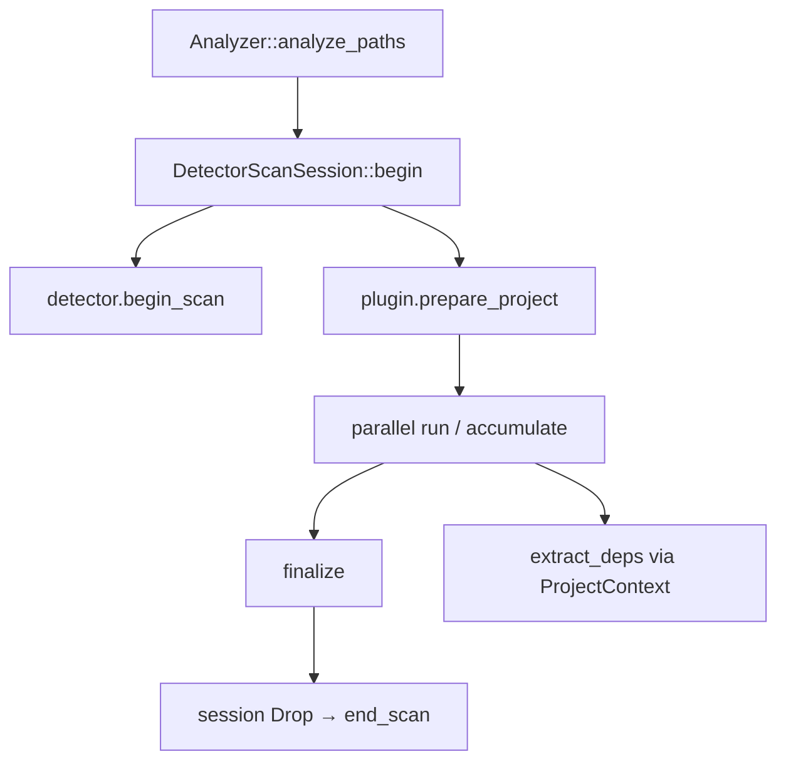

# chore: integrate epic #56 architecture review workstreams

## Summary

- Merge the five parallel architecture-review branches into one integration branch so BP scan-scoped facts, taint symbol qualification, language-neutral plugin deps, detector lifecycle, and Phase 3 P2 quality land **together**.
- Full suite green on the integrated tree: `make lint`, `make test` (**434 passed**), and strict rustdoc.
- Prefer merging **this** PR into `master` instead of the five child PRs separately (avoids merge-order risk).

## Motivation / context

Plans: `plans/v0.0.5/rust-architecture-review.md` (senior review, 8.9 → target 9.5+).

Child PRs (#62–#66) each target `master` and were tested **in isolation**. Combined validation requires a single branch that contains all commits and the resolved composition of overlapping seams (`Detector`, `LanguagePlugin`, `Analyzer::analyze_paths`, `tree_sitter_lang!`).

| Child issue | Branch | Standalone PR |
|------------:|--------|---------------|
| #57 | `fix/arch-bp-scan-scoped` | #62 |
| #58 | `fix/arch-taint-symbols` | #65 |
| #59 | `refactor/arch-plugin-deps` | #64 |
| #60 | `refactor/arch-detector-lifecycle` | #63 |
| #61 | `chore/arch-p2-quality` | #66 |

Parent epic: #56

## Changes

### Integrated workstreams

| Area | Outcome |
|------|---------|
| BP scan-scoped facts (#57) | Process caches cleared on scan lifecycle; off-lock builds; same-Analyzer rescan regression |
| Taint symbols (#58) | `PackageIdentity` + receiver-qualified keys; two-package duplicate-callee fixture |
| Plugin deps (#59) | `ProjectContext { root }`; Go derives `go.mod` inside plugin; non-Go test plugin |
| Detector lifecycle (#60) | `begin_scan` / `end_scan` session; `prepare_project` on plugins; no Go special-case in engine |
| Phase 3 P2 (#61) | Pack/timing metadata; single-shot registry; source-index ptr+len; strict rustdoc |

### Integration composition notes

Overlapping files were merged so all seams compose:

- `Detector`: pack/timing metadata **and** begin/end scan session
- `LanguagePlugin`: `ProjectContext` extract_deps **and** `prepare_project`
- `Analyzer::analyze_paths`: `DetectorScanSession` + language-neutral `project_root` (no `module_prefix`)
- `tree_sitter_lang!`: optional extract_deps + prepare_project with plain rustdoc (no private intra-doc links)

### Integration method

```text
origin/master
  + chore/arch-p2-quality
  + fix/arch-taint-symbols
  + fix/arch-bp-scan-scoped
  + refactor/arch-plugin-deps
  + refactor/arch-detector-lifecycle
```

Conflicts resolved on integration for plan doc + the four overlapping engine/plugin seams; re-validated after resolution.

## Impact

| Area | Impact |
|------|--------|
| **Performance** | Neutral to slightly better for multi-root BP (shared prepare, off-lock builds) |
| **Memory** | BP snapshots no longer accumulate across independent scans |
| **Behavior / correctness** | Taint no longer cross-contaminates bare names across packages; BP rescan reflects filesystem changes |
| **API / CLI** | Plugin `extract_deps` signature change (`ProjectContext`); detector begin/end defaults |
| **Dependencies** | None |
| **Binary size / build time** | Unchanged |

## Breaking changes / migration

| Item | Migration |
|------|-----------|
| Custom `LanguagePlugin::extract_deps` | Use `ProjectContext` instead of `(project_root, module_prefix)`; derive module data inside the plugin |
| Custom long-lived detectors | Prefer `begin_scan` / `end_scan` (defaults call `reset_state`) |

## Architecture notes



## Files changed (high level)

| Path | Change |
|------|--------|
| `src/core/detector.rs` | pack/timing + begin/end scan |
| `src/core/language/plugin.rs` | ProjectContext + prepare_project |
| `src/engine/analyzer/scan.rs` | session orchestration, no Go BP special-case |
| `src/lang/plugin.rs` | macro: deps + prepare + plain rustdoc |
| `src/lang/go/**` | BP clear/off-lock, taint keys, prepare hook |
| `src/rules/pack.rs` | RulePack / TimingGranularity |
| `src/engine/registry.rs` | single-shot materialize + plugins() |
| `src/lang/source_index.rs` | ptr+len cache identity |
| `tests/**` | BP rescan, taint two-package, lifecycle, registry counter |
| `plans/v0.0.5/**` | review plan + per-stream PR bodies |

## Test plan

- [x] `make lint`
- [x] `RUSTDOCFLAGS='-D warnings' cargo doc --all-features --no-deps --locked`
- [x] `make test` — **434 passed**, 0 failed (integrated tree)
- [x] Focused areas covered by child suites: BP project integration, taint integration, embedder seams, registry, source_index

### Commands

```sh
git checkout chore/epic-56-integration
make lint
RUSTDOCFLAGS='-D warnings' cargo doc --all-features --no-deps --locked
make test
```

## Related issues

- Closes #57
- Closes #58
- Closes #59
- Closes #60
- Closes #61
- Closes #56

## Integration note for child PRs

Standalone PRs #62–#66 are **superseded** by this integration PR. Merge this one; close the others without merging if GitHub does not auto-close them.

## PR metadata checklist (author)

- [x] Self-assigned (`--assignee @me`)
- [x] Labels applied (`enhancement`, `documentation`, `bug` where child streams fixed correctness)
- [x] Related issues filled with real ticket IDs
- [x] Filled body committed under `plans/v0.0.5/pr-epic-56-integration.md`

## Follow-ups (out of scope)

- Full cross-package import-path taint wiring (deliberately deferred)
- Re-rate architecture score to 9.5+ in a follow-up review note after merge
- Further CWE residual inventory unrelated to this epic

## Release notes (if user-facing)

Architecture hardening for embedders: scan-scoped Go BP facts, package-qualified taint symbols, language-neutral plugin dependency context, and explicit detector/plugin lifecycle hooks.

## Reviewer checklist

- [ ] Behavior matches summary and test plan
- [ ] No unrelated changes in diff
- [ ] Public API / CLI changes documented
- [ ] New rules have fixture coverage in `tests/fixtures/` (two-package taint fixture present)
- [ ] PR has assignee and labels
- [ ] Related issues use correct Closes/Relates keywords
- [ ] Prefer merge **this** PR only; supersede #62–#66
- [ ] No secrets or generated artifacts committed
