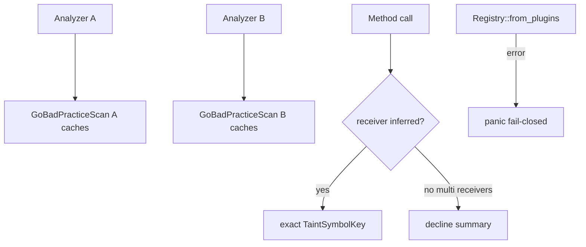

# chore: integrate epic #75 Phase 5 architecture workstreams

## Summary

- Merge the three Phase 5 residual branches into one integration branch so conservative method-taint resolution, per-analyzer BP cache ownership, and fail-closed registry materialization land **together**.
- Full suite green on the integrated tree: `make lint`, `make test` (**441 passed**), and strict rustdoc.
- Prefer merging **this** PR into `master` instead of the three child PRs separately.

## Motivation / context

Plans: `plans/v0.0.5/rust-architecture-review.md` Phase 5 (re-review residual items after 9.3 / 10).

Post–Phase 2/3 re-review left one P1 and two P2s before a defensible **9.5+**. Child PRs (#79–#81) each target `master` and were tested in isolation; combined validation requires a single branch.

| Child issue | Branch | Standalone PR |
|------------:|--------|---------------|
| #78 | `fix/arch-registry-fail-closed` | #79 |
| #76 | `fix/arch-taint-method-receiver` | #80 |
| #77 | `refactor/arch-bp-analyzer-ownership` | #81 |

Parent epic: #75  
Prior epic: #56 (Phases 2–4)

## Changes

### Integrated workstreams

| Area | Outcome |
|------|---------|
| Method taint (#76) | Exact key when receiver inferred; decline when multiple same-package receivers share a bare method name |
| BP ownership (#77) | `GoBadPracticeScan` owns `Arc<BpProjectCaches>`; concurrent two-analyzer regression |
| Registry fail-closed (#78) | Built-in `from_plugins` panics on composition failure; no empty successful registry |

### Integration method

```text
origin/master
  + fix/arch-registry-fail-closed
  + fix/arch-taint-method-receiver
  + refactor/arch-bp-analyzer-ownership
```

Clean merges (no conflict resolution required).

## Impact

| Area | Impact |
|------|--------|
| **Performance** | Neutral (per-analyzer BP maps; same off-lock build pattern) |
| **Memory** | BP caches no longer shared across concurrent analyzers |
| **Behavior / correctness** | Ambiguous method receivers no longer pick wrong taint summary; registry composition failures abort startup |
| **API / CLI** | Production built-in registry fail is panic (invariant); embedder `with_plugins` still returns `RegistryError` |
| **Dependencies** | None |

## Breaking changes / migration

| Item | Migration |
|------|-----------|
| None for normal CLI use | Built-in packs continue to load; only broken composition aborts |
| Concurrent embedders | Each analyzer's BP detector owns independent caches (expected) |

## Architecture notes



## Test plan

- [x] `make lint`
- [x] `RUSTDOCFLAGS='-D warnings' cargo doc --all-features --no-deps --locked`
- [x] `make test` — **441 passed**, 0 failed (integrated tree)
- [x] Focused: taint method fixtures, BP concurrent ownership, registry unit tests

### Commands

```sh
git checkout chore/epic-75-integration
make lint
RUSTDOCFLAGS='-D warnings' cargo doc --all-features --no-deps --locked
make test
```

## Related issues

- Closes #76
- Closes #77
- Closes #78
- Closes #75

## Integration note for child PRs

Standalone PRs #79–#81 are **superseded** by this integration PR. Merge this one; close the others without merging if GitHub does not auto-close them.

## PR metadata checklist (author)

- [x] Self-assigned (`--assignee @me`)
- [x] Labels applied (`enhancement`, `documentation`, `bug`)
- [x] Related issues filled with real ticket IDs
- [x] Filled body committed under `plans/v0.0.5/pr-epic-75-integration.md`

## Follow-ups (out of scope)

- Full local type inference for method receivers
- Post-merge architecture re-rate write-up to **>= 9.5 / 10**

## Release notes (if user-facing)

Architecture hardening: conservative same-package method taint resolution, per-analyzer BP project caches, and fail-closed built-in registry materialization.

## Reviewer checklist

- [ ] Behavior matches summary and test plan
- [ ] Prefer merge **this** PR only; supersede #79–#81
- [ ] PR has assignee and labels
- [ ] Related issues use correct Closes keywords
