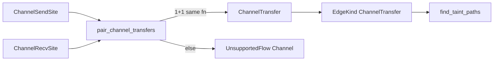

## Summary

Ship the G5 v0 pilot for **same-function** channel handoff: dedicated `ChannelTransfer` records (not assignment sugar), conservative pairing (one send + one recv on one binding), and path-finder edges so classic source→send→recv→sink can fire. Quarantine the IP-010 source-on-send quirk so docs and behavior tell one story.

---

## Motivation / context

- Plans: `plans/v0.0.6/g5-channel-capability-contract.md`, `plans/v0.0.6/g5-channel-design-sketch.md`
- Continues from closed gates PR #183 / issue #156
- Issues: see **Related issues**

---

## Changes

### Taint model / extractor

- Add `ChannelSendSite`, `ChannelRecvSite`, `ChannelTransfer`, and `EdgeKind::ChannelTransfer`
- Stage sends/recvs during walk; pair per lexical function scope
- Pairing succeeds only for: same function, one channel name, exactly one send + one recv with LHS, not in `select`, not buffered `make(chan T, N)`
- Declined sites keep `UnsupportedFlowKind::Channel`
- IP-010 quarantine: `result_variable_of_call` no longer binds the channel on `send_statement`

### Graph / path finder

- Skip ordinary RHS→LHS edges for `y := <-ch`
- Wire paired transfers as `EdgeKind::ChannelTransfer` (value refs or inline source/sanitizer call → recv LHS)

### Fixtures / docs

- Update `documents/taint.md` Limitations (v0 support vs still FN)
- Quarantine IP-010: deferred in integration; manifest expects silence; fixture headers document FN
- Unit tests: vuln path, safe constant, sanitized, multi-channel non-interference, multi-send/select decline, IP-010 shape

---

## Impact

| Area | Impact |
|------|--------|
| **Performance** | Negligible — O(sends+recvs) pairing per unit |
| **Memory** | Small staging vectors on annotations |
| **Behavior / correctness** | Same-function single-channel handoff can fire; cross-goroutine / select / multi-send stay FN; IP-010 no longer fires via quirk |
| **API / CLI** | None |
| **Dependencies** | None |

---

## Breaking changes / migration

| Item | Migration |
|------|-----------|
| IP-010 vulnerable fixture | Now honest FN (quarantined); do not treat as channel-support TP |

---

## Architecture notes



---

## Files changed (high level)

| Path | Change |
|------|--------|
| `src/.../taint/model.rs` | Transfer records + edge kind |
| `src/.../taint/extract/walker_*.rs` | Staging + pairing + IP-010 quarantine |
| `src/.../taint/graph_query/build.rs` | Wire transfers |
| `src/.../taint/graph_query/tests.rs` | G5 unit coverage |
| `documents/taint.md` | Honesty update |
| `tests/fixtures/go/taint/IP-010-*.txt` | Quarantine notes |
| `tests/go_taint_integration.rs` | Defer IP-010 |

---

## Test plan

- [x] `make lint`
- [x] `make test` — 476 passed
- [x] `cargo test --locked --lib channel_` — 9 passed
- [x] Pairing unit tests in `walker_core::pair_tests`

### Commands

```sh
make lint
cargo test --locked --lib channel_
make test
```

### Results (author machine)

```
make lint — pass
cargo test --locked --lib channel_ — 9 passed
make test — 476 passed (nextest)
```

---

## Related issues

- Closes #184
- Relates to #151
- Relates to #156

---

## PR metadata checklist (author)

- [x] Self-assigned (`--assignee @me`)
- [x] Labels applied (`enhancement`)
- [x] Related issues filled with real ticket IDs
- [x] Filled body under `plans/v0.0.6/pr-g5-channel-handoff.md`

---

## Follow-ups (out of scope)

- `select` / buffered capacity / close / range-over-channel
- Multi-goroutine MHP edges
- External-package summaries / decoder receivers (other G5 siblings)
- G6 Python

---

## Release notes (if user-facing)

Go taint (G5 v0): same-function single-channel send→recv handoff can now propagate taint; select/buffer/cross-goroutine remain unsupported.
