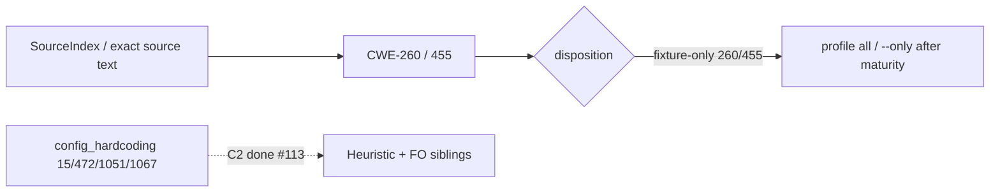

# chore(cwe): audit secrets_in_config trust (R1)

## Summary

Phase 3 slice **R1** of the parallel catalog program: complete disposition for
the deferred C2 sibling leaf `secrets_in_config.rs` (CWE-260, CWE-455). Both
rules encode org/deployment policy museums — env-requiredness (260) and
fail-fast TLS startup policy (455) — not project-agnostic security contracts.
Comment-only freeze in the owned detector file; **fixture-only** disposition
proposed for both rules. No emit-path, span, or needle changes; no shared-surface
edits.

---

## Motivation / context

- Plan: `plans/v0.0.5/parallel-catalog-program.md` §3.2 (C2 deferred sibling)
- Residual checklist: `plans/v0.0.6/residual-secrets-in-config.md`
- Evidence: `plans/v0.0.6/evidence-r1-secrets-in-config.md`
- Parent audit: `plans/v0.0.5/cwe-catalog-trust-audit.md` (§1.3 structural bar)
- Prior C2 work: `plans/v0.0.5/evidence-cwe-trust-configuration-residual.md` (#113)
- Issues: see **Related issues**
- Integration base SHA: `0ff071f`
- Branch: `chore/cwe-trust-secrets-in-config`

---

## Selection inventory

| Leaf | Rules | Selected? |
|------|-------|-----------|
| `secrets_in_config.rs` | CWE-260, 455 | **Yes (R1)** |
| `config_hardcoding.rs` | CWE-15, 472, 1051, 1067 | C2 sibling (done #113) |

### Why secrets_in_config (deferred from C2)

1. **Env-requiredness museum (CWE-260)** — secret struct fields loaded from disk
   config without `os.Getenv(` is org policy, not a universal correctness sink.
2. **Fail-fast / degraded-mode museum (CWE-455)** — continuing after TLS material
   failure (`continuing without mTLS`) vs `log.Fatalf(` is deployment topology policy.
3. Cohesive single-file family with full stdlib + frameworks fixture pairs.
4. SI primary with exact corpus co-signals; call_facts cannot prove either policy
   without over-firing.

---

## Changes

### Per-rule disposition

| Rule | Disposition | Primary signal after this PR | Notes |
|------|-------------|------------------------------|-------|
| **CWE-260** | **fixture-only** (proposed) | SI: `Password string` / `Secret   string` + `cfg.Password` / `cfg.Secret`; negative `os.Getenv(` | Env-requiredness museum |
| **CWE-455** | **fixture-only** (proposed) | SI: `tls.LoadX509KeyPair(` + `continuing without mTLS`; negative `log.Fatalf(` | Fail-fast / deployment-mode museum |

No rule promoted to Structural or Heuristic keep.

### Detector hygiene (`secrets_in_config.rs`)

- Module freeze documenting R1 family selection and env-requiredness vs
  project-agnostic security contract analysis.
- Per-rule freeze comments: primary signals, negatives, call-facts analysis,
  ownership neighbors, disposition.
- **No emit-path, span, or needle changes** — fixture oracle preserved.

### Fixtures

- Unchanged IDs and oracles (no new boundary fixtures; no `manifest.toml` edits).

### Shared surfaces (integrator only — not in this PR)

- Proposed maturity: fixture-only for CWE-260 and CWE-455.
- Proposed NEEDLES labels: see **Handoff for integrator**.
- No edits to `maturity.rs`, `source_index.rs`, profile allow-lists, audit ledger,
  `parallel-catalog-program.md`, or sibling detectors on this branch.

---

## Code snippets (if applicable)

### Module freeze (family selection)

```rust
// Configuration R1 trust freeze (secrets_in_config.rs).
// Selected deferred sibling from C2 / parallel-catalog-program §3.2 / issue #158:
// secrets-from-config env-requiredness (CWE-260) and fail-fast TLS startup
// policy (CWE-455). Parent family: configuration/ (CWE-15 deferred to
// config_hardcoding in #113).
```

No call_facts rewrite: both rules remain SI primary; museum co-signals required
for emit; call_facts would over-fire on production-shaped config/TLS paths.

---

## Impact

| Area | Impact |
|------|--------|
| **Performance** | Neutral (comments only) |
| **Memory** | None |
| **Behavior / correctness** | Fixture oracle preserved. Real-module: see canary below |
| **API / CLI** | None until integrator applies fixture-only maturity (then leave recommended/security default packs; still under `--profile all` / `--only`) |
| **Dependencies** | None |
| **Binary size / build time** | Negligible |

### Canary (worker pre-integration) — 2026-07-22

| Repository | Revision | Files scanned | Findings |
|---|---|---:|---:|
| gopdfsuit | `26d71268937136036c3be1770c0f7bdd89f87dc6` | 78 | 0 |
| monsoon | `e0f1027cb0c256853b835d8e20d8d206a96e44ed` | 43 | 0 |
| go-retry | `d3eb50afd37a09a9c0606c218d0dbe06e29d1544` | 5 | 0 |
| gorl | `ec54aaf15ce4d0f3f8014eac2548986c91d0f001` | 28 | 0 |
| no-mistakes | `0a2c82f993b9467c5ab84992313dfd13b66830af` | 222 | 0 |

**Totals:** 376 files scanned, 0 findings. Per-rule: CWE-260 ×0, CWE-455 ×0.

---

## Breaking changes / migration

| Item | Migration |
|------|-----------|
| None in this PR | Maturity quarantine for 260/455 is proposed for the integrator branch only |
| After integrator applies fixture-only for 260/455 | Still under `--profile all` / `--only`; excluded from recommended/security default packs |

---

## Architecture notes



---

## Files changed (high level)

| Path | Change |
|------|--------|
| `src/lang/go/detectors/cwe/domains/configuration/secrets_in_config.rs` | Freeze comments only; R1 family selection + per-rule disposition |
| `plans/v0.0.6/evidence-r1-secrets-in-config.md` | Freeze inventory, ownership, canary, handoff proposals |
| `plans/v0.0.6/residual-secrets-in-config.md` | R1 checklist |
| `plans/v0.0.6/pr-r1-secrets-in-config.md` | This PR body |

---

## Test plan

- [x] `make lint`
- [x] `make test`
- [x] Release canary on gopdfsuit, monsoon, go-retry, gorl, no-mistakes

### Commands

```sh
make lint
make test
cargo build --release --locked
ONLY="CWE-260,CWE-455"
for t in /home/chinmay/ChinmayPersonalProjects/gopdfsuit \
         /home/chinmay/ChinmayPersonalProjects/codehound/real-repos/monsoon \
         /home/chinmay/ChinmayPersonalProjects/codehound/real-repos/go-retry \
         /home/chinmay/ChinmayPersonalProjects/codehound/real-repos/gorl \
         /home/chinmay/ChinmayPersonalProjects/codehound/real-repos/no-mistakes; do
  echo "=== $t ==="
  target/release/codehound "$t" --profile all --only "$ONLY" \
    --format json --json-envelope --no-fail --no-cache 2>/dev/null | \
    python3 -c "import sys,json; d=json.load(sys.stdin); print('findings', d.get('findingCount')); print('files', d.get('stats',{}).get('files_scanned')); print([(f.get('rule_id'), f.get('file'), f.get('line')) for f in d.get('findings',[])])"
done
```

---

## Handoff for integrator

### Maturity proposals

| Rule | Proposed maturity |
|------|-------------------|
| CWE-260 | fixture-only |
| CWE-455 | fixture-only |

### NEEDLES (optional labels)

| Needle | Proposed label |
|--------|----------------|
| `Password string` | `fixture-literal` (CWE-260 frameworks yaml password field) |
| `Secret   string` | `fixture-literal` (CWE-260 stdlib json secret field; note spacing) |
| `cfg.Password` | `fixture-literal` (CWE-260 loaded password use) |
| `cfg.Secret` | `fixture-literal` (CWE-260 loaded secret use) |
| `os.Getenv(` | `negative-gate` (CWE-260 env-requiredness safe path) |
| `tls.LoadX509KeyPair(` | dual-use generic — leave unlabeled or note CWE-455 co-signal only |
| `continuing without mTLS` | `fixture-literal` (CWE-455 continue-after-failure log) |
| `log.Fatalf(` | `negative-gate` (CWE-455 fail-fast safe path) |

### Owned needles / findings-oracle

- No new NEEDLES strings introduced.
- No findings-oracle fixture impact expected.

### Canary command

See evidence doc / Test plan above — re-run on integrated tree after maturity apply.

---

## Related issues

Closes #158 · Relates to #151
