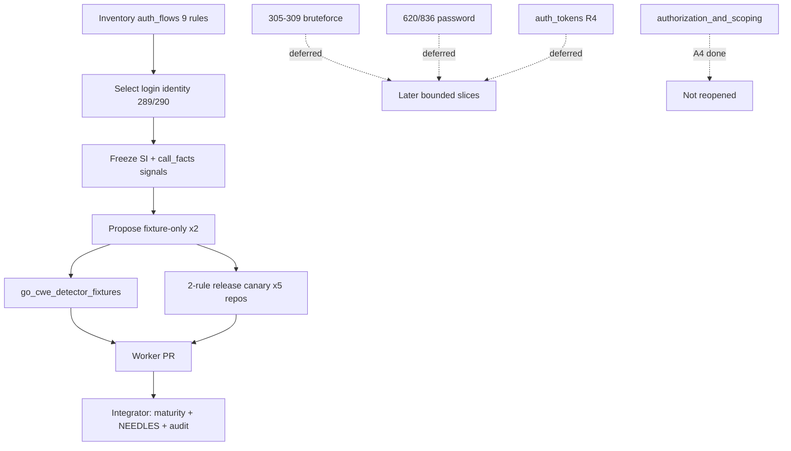

# chore(cwe): audit auth_flows bounded trust (R3)

## Summary

- Inventory `auth_flows.rs` (9 rules); **select** the bounded **login identity trust** subfamily only (**CWE-289**, **CWE-290**).
- Freeze primary signals, negatives, fixtures, and maturity state for the selected subfamily.
- Propose **fixture-only** dispositions for both rules (integrator applies `maturity.rs` /
  SourceIndex NEEDLES labels).
- Oracle-safe detector comments only (no emit-path changes); run focused fixtures + two-rule
  real-module canary on the expanded pin set.

---

## Motivation / context

v0.0.6 residual **R3** of epic [#151](https://github.com/chinmay-sawant/codehound/issues/151) /
issue [#160](https://github.com/chinmay-sawant/codehound/issues/160).
Plan: [`residual-auth-flows.md`](./residual-auth-flows.md).

Phase 2 B3 already dispositioned `cookies.rs` (#109). This worker owns the deferred
`auth_flows.rs` sibling — **one bounded subfamily only** (not all nine rules).

**Integration base SHA:** `0ff071f`  
**Branch:** `chore/cwe-trust-auth-flows`  
**Structural bar:** [`cwe-catalog-trust-audit.md`](../v0.0.5/cwe-catalog-trust-audit.md) §1.3

---

## Selection inventory

### Owner seam — `auth_flows.rs`

| Subfamily | Rules | Theme | Selected? |
|-----------|-------|-------|-----------|
| **Login identity trust** | **289, 290** | Realm strip / trusted header identity | **Yes** |
| Bruteforce / MFA gaps | 305–309 | Debug bypass, missing gates, rate limits, MFA, WebAuthn | Deferred |
| Password credential flows | 620, 836 | Unverified password change / hash-as-password | Deferred |

Full seam: 9 rules (~294 lines). This PR touches **2 rules** only.

### Why select login identity trust (289 + 290)

1. **Smallest cohesive subfamily** — two rules sharing caller-controlled/stripped identity theme; matches B3 cookies slice size.
2. **Phase-3 optional split** — named `auth_flows_login.rs (289, 290)` partition.
3. **Existing fixture oracle** — vulnerable + safe for stdlib and frameworks; no new fixtures.
4. **Unambiguous museum shape** — exact `"@")[0]` subscript (289) and exact `X-Remote-User` header name (290); route/header naming is policy evidence.
5. **Does not reopen** `file_permissions/` or `authorization_and_scoping/`.

Deferred within this seam (not in this PR): CWE-305–309, 620, 836; sibling `auth_tokens.rs` (R4).

---

## Frozen signals (selected subfamily)

Runtime maturity today: both default to **Heuristic** (`maturity_for` has no explicit
fixture-only / structural entry). Available under `--profile all` / `--only`; not on
recommended/security explicit allow-lists.

### CWE-289 — Authentication Bypass by Alternate Name

| Field | Value |
|-------|--------|
| File | `auth_flows.rs` → `detect_cwe_289` |
| Primary signal | SI `strings.Split(` **and** `"@")[0]` without `canonical_name = ?` |
| Negatives | SI `canonical_name = ?` |
| Span | source find of `strings.Split(` |
| Fixtures | stdlib + frameworks vulnerable/safe |
| Call-facts? | No — `strings.Split` alone is too broad; exact subscript is corpus |
| Policy evidence | Split subscript text is museum marker |
| **Proposed disposition** | **fixture-only** |

### CWE-290 — Authentication Bypass by Spoofing

| Field | Value |
|-------|--------|
| File | `auth_flows.rs` → `detect_cwe_290` |
| Primary signal | **call_facts** `c.GetHeader` / `r.Header.Get` with `X-Remote-User` first arg |
| Negatives | Safe fixtures omit header read (session cookie); no explicit emit-path gate |
| Span | call_facts `start_byte` |
| Fixtures | stdlib + frameworks vulnerable/safe |
| Call-facts? | Partial primary — still requires exact header name string |
| Policy evidence | `X-Remote-User` header name treated as policy, not verified identity |
| **Proposed disposition** | **fixture-only** |

### Disposition table

| Rule | Disposition | Primary signal class | Notes |
|------|-------------|----------------------|-------|
| **CWE-289** | **fixture-only** | SI split subscript museum | Exact `"@")[0]` + principals SQL shape |
| **CWE-290** | **fixture-only** | call_facts header + corpus name | Exact `X-Remote-User` |

No rule proposed for Heuristic keep or Structural. No deletes. No §1.3 promotion.

---

## Changes

### Code (`auth_and_validation/auth_flows.rs` — 289/290 only)

- Module + per-rule freeze comments documenting primary signal, negatives, call-facts assessment, and
  policy-evidence treatment of header/principal naming.
- **No emit logic, messages, or span changes** (oracle preserved).

### Docs

- [`plans/v0.0.6/residual-auth-flows.md`](./residual-auth-flows.md) — checklist closed
- [`plans/v0.0.6/evidence-r3-auth-flows.md`](./evidence-r3-auth-flows.md) — full evidence
- This PR body

### Explicitly not changed (integrator / out of scope)

- `src/rules/maturity.rs` — propose adding both to `is_fixture_only`
- `src/lang/go/detectors/cwe/source_index.rs` — propose NEEDLES labels (see evidence)
- profiles, `tests/fixtures/manifest.toml`, `cwe-catalog-trust-audit.md`, ledger checkboxes
- CWE-305–309, 620, 836 detectors in `auth_flows.rs` (untouched)
- `auth_tokens.rs`, `authorization_and_scoping/`, `file_permissions/`
- Sibling R1–R2, R4–R8, G*, P1 workstreams

---

## Integrator proposals

### Maturity (`maturity.rs`)

Add to `is_fixture_only`:

```text
CWE-289, CWE-290
```

Unit-test assertions mirroring other fixture-only families.

### SourceIndex NEEDLES labels (no reordering required)

| Needle (examples) | Label proposal |
|-------------------|----------------|
| `"@")[0]` | `fixture-literal: CWE-289` |
| `canonical_name = ?` | `negative-gate: CWE-289` |
| `X-Remote-User` | comment-only if indexed (matched via call_facts today) |

### Fixtures

None required. Oracle unchanged.

### Findings-oracle impact

None expected (comment-only detector edit).

### Canary command (worker evidence; re-run after integration)

```sh
cargo build --release --locked
ONLY="CWE-289,CWE-290"
for t in /home/chinmay/ChinmayPersonalProjects/gopdfsuit \
         /home/chinmay/ChinmayPersonalProjects/codehound/real-repos/monsoon \
         /home/chinmay/ChinmayPersonalProjects/codehound/real-repos/go-retry \
         /home/chinmay/ChinmayPersonalProjects/codehound/real-repos/gorl \
         /home/chinmay/ChinmayPersonalProjects/codehound/real-repos/no-mistakes; do
  echo "=== $t ==="
  target/release/codehound "$t" --profile all --only "$ONLY" \
    --format json --json-envelope --no-fail --no-cache
done
```

---

## Canary results (2026-07-22)

Release binary built on this branch. Target revisions match
[`canary-corpus-pins.json`](../v0.0.5/canary-corpus-pins.json):

| Repository | Revision | Files scanned | Findings |
|---|---|---:|---:|
| gopdfsuit | `26d71268937136036c3be1770c0f7bdd89f87dc6` | 78 | 0 |
| monsoon | `e0f1027cb0c256853b835d8e20d8d206a96e44ed` | 43 | 0 |
| go-retry | `d3eb50afd37a09a9c0606c218d0dbe06e29d1544` | 5 | 0 |
| gorl | `ec54aaf15ce4d0f3f8014eac2548986c91d0f001` | 28 | 0 |
| no-mistakes | `0a2c82f993b9467c5ab84992313dfd13b66830af` | 222 | 0 |
| **Total** | | **376** | **0** |

Paths: gopdfsuit sibling + main-repo `real-repos/*` (worktree has no local clones).

Zero useful hits ⇒ fixture-only quarantine is consistent with prior museum families; **not** a
delete signal. No Structural promotion.

---

## Impact

| Area | Impact |
|------|--------|
| **Performance** | None |
| **Memory** | None |
| **Behavior / correctness** | None in this PR (comments only). Integrator fixture-only quarantine removes default-pack *eligibility* if packs later expand; today these IDs are not on recommended/security allow-lists |
| **API / CLI** | None until maturity integration |
| **Dependencies** | None |

---

## Breaking changes / migration

| Item | Migration |
|------|-----------|
| None in this PR | — |
| Post-integration fixture-only | Still available under `--profile all` / `--only` |

---

## Architecture notes



---

## Files changed (high level)

| Path | Change |
|------|--------|
| `src/lang/go/detectors/cwe/domains/access_control/auth_and_validation/auth_flows.rs` | Signal-freeze comments (289/290) |
| `plans/v0.0.6/residual-auth-flows.md` | Checklist closed |
| `plans/v0.0.6/evidence-r3-auth-flows.md` | Evidence record |
| `plans/v0.0.6/pr-r3-auth-flows.md` | This PR body |

---

## Test plan

- [x] Inventory + selection rationale recorded
- [x] Signal freeze + disposition table
- [x] `make lint` — fmt check + clippy clean
- [x] `cargo test --locked --test go_cwe_detector_fixtures` — CWE-289/290 focused
- [x] `make test` — full suite green
- [x] Two-rule release canary — **0 findings / 376 files** (5-repo pin set)
- [x] `git diff --check`

### Commands

```sh
make lint
cargo test --locked --test go_cwe_detector_fixtures -- CWE-289 CWE-290
make test
cargo build --release --locked
# canary as above
git diff --check
```

---

## Related issues

- Closes #160
- Relates to #151
- Plan: `plans/v0.0.6/residual-auth-flows.md`
- Phase 2 B3 cookies complete: #109 (`auth_and_validation/cookies.rs`)
- Sibling A4 complete: `authorization_and_scoping/` (not reopened)
- File-permissions complete (not reopened)
- Deferred within seam: CWE-305–309, 620, 836; `auth_tokens.rs` (R4)

---

## Integration

This branch is intended for epic #151 integration alongside sibling R1–R8 workers.
Prefer reviewing/merging the integration PR when present.

---

## PR metadata checklist (author)

- [x] Self-assigned (`--assignee @me`)
- [x] Labels applied (`documentation`, `enhancement`)
- [x] Related issues filled with real ticket IDs
- [x] Filled body committed under `plans/v0.0.6/pr-r3-auth-flows.md`

---

## Follow-ups (out of scope)

- Bruteforce/MFA subfamily (305–309) — separate bounded slice
- Password credential subfamily (620, 836)
- `auth_tokens.rs` (R4)
- Maturity / NEEDLES integration (integrator)
- `cwe-catalog-trust-audit.md` ledger entry (integrator post-merge)
