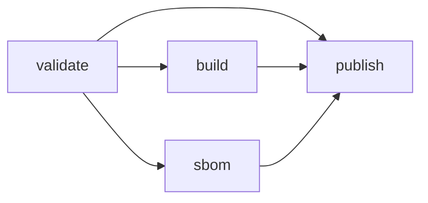
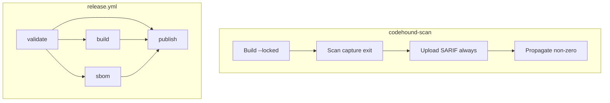

# ci: harden strict action, release validation, and supply chain

## Summary

- Restore delivery credibility: the `codehound-scan` composite action now uploads SARIF in an `always()` step, then returns the scanner's non-zero status (strict findings or operational failure).
- Tag releases cannot publish without a required `validate` job (fmt, Clippy, all-feature tests, audit, canaries); actions/tools are SHA/version-pinned with `--locked` product builds.
- MSRV (1.88) exercises `--all-features` plus the documented `go,cli` minimal build; `SECURITY.md` documents disclosure contact, support, embargo, and response targets.

## Motivation / context

- Plans: `plans/v0.0.7/ponytail/rust-go-senior-application-review.md` §§1.2, 1.3, 4.1, 4.2, 4.3
- Issues: see **Related issues**
- Parent epic: #187 (ponytail v0.0.7 remediation)

## Changes

### Composite action (`codehound-scan`)

- Capture `scan_exit` from the scanner without short-circuiting the job.
- Upload SARIF under `always()` + `continue-on-error`.
- Propagate the captured non-zero status after upload.
- Pin toolchain/cache/upload actions to reviewed SHAs; build with `--locked`.
- Proof script: `scripts/check_codehound_scan_action_contract.sh`.

### Release workflow

- Add `validate` job: `fmt`, Clippy `-D warnings` (all features), all-feature tests, pinned `cargo-audit`, release canaries.
- `build` / `sbom` `needs: validate`; `publish` `needs: [validate, build, sbom]` so publish cannot run when validation fails.
- Pin checkout/upload/download/gh-release/rust-toolchain to SHAs; pin Rust `1.88`, `cross` `0.2.5`, `cargo-cyclonedx` `0.5.9`, `cargo-audit` `0.22.2`; use `--locked` for product builds.

### CI MSRV

- `cargo test --all-targets --all-features --locked` on Rust 1.88.
- `cargo build --all-targets --no-default-features --features go,cli --locked`.
- Canary release binary build uses `--locked`.

### Disclosure policy

- Add `SECURITY.md` (GitHub advisories contact, supported versions, embargo, 5/14-day response targets).
- README taint section links to `SECURITY.md` and remains honest about experimental taint.

## Code snippets (if applicable)

### Before (strict always green)

```bash
./target/release/codehound ... > sarif || status=$?
echo "scan_exit=${status:-0}" >> "$GITHUB_OUTPUT"
exit 0   # unconditional — SARIF upload never sees a failed job, and CI stays green
```

### After (upload then gate)

```yaml
- name: Scan
  id: scan
  # write scan_exit to GITHUB_OUTPUT; do not fail yet
- name: Upload SARIF
  if: ${{ always() && inputs.upload-sarif == 'true' }}
  continue-on-error: true
- name: Propagate scanner status
  if: ${{ always() && steps.scan.outputs.scan_exit != '0' }}
  run: exit "${{ steps.scan.outputs.scan_exit }}"
```

### Release dependency graph



## Impact

| Area | Impact |
|------|--------|
| **Performance** | None (CI/docs only) |
| **Memory** | None |
| **Behavior / correctness** | Strict GH Action consumers now fail on High+ findings / scanner errors after SARIF upload |
| **API / CLI** | None (product Rust logic untouched) |
| **Dependencies** | Release tool versions pinned; no Cargo.toml change |
| **Binary size / build time** | Release builds use `--locked`; MSRV runs all-features (longer MSRV job) |

## Breaking changes / migration

| Item | Migration |
|------|-----------|
| Strict composite action now fails the job | Expected contract restoration. Set `strict: "false"` only when findings must not gate. |
| Tag release blocked without green `validate` | Push tags only on commits that pass fmt/clippy/tests/audit/canaries. |

## Architecture notes



## Files changed (high level)

| Path | Change |
|------|--------|
| `.github/actions/codehound-scan/action.yml` | Strict status after SARIF; pin SHAs |
| `.github/workflows/release.yml` | validate gate + pins + `--locked` |
| `.github/workflows/ci.yml` | MSRV all-features + `go,cli`; canary `--locked` |
| `scripts/check_codehound_scan_action_contract.sh` | Contract proof |
| `SECURITY.md` | Disclosure policy |
| `README.md` | Link to SECURITY.md |
| `plans/v0.0.7/pr/pr-ci-harden-delivery-gates.md` | This PR body |

## Test plan

- [x] `bash scripts/check_codehound_scan_action_contract.sh`
- [x] YAML parse of action + workflows
- [x] `make lint`
- [x] `make test`
- [x] Confirm `release.yml` `publish.needs` includes `validate`

### Commands

```sh
bash scripts/check_codehound_scan_action_contract.sh
make lint
make test
```

## Related issues

- Closes #189
- Relates to #187

## Integration

This branch is also intended for merge into the epic #187 integration branch for combined validation.
Prefer reviewing/merging the integration PR when present; this child PR is superseded by that integration merge for landing to `master`.

## PR metadata checklist (author)

- [x] Self-assigned (`--assignee @me`)
- [x] Labels applied (`enhancement`, `documentation`)
- [x] Related issues filled with real ticket IDs
- [x] Filled body committed under `plans/v0.0.7/pr/pr-ci-harden-delivery-gates.md`

## Follow-ups (out of scope)

- Detector/taint/ignore/cache/export product fixes (other #187 children)
- Tag protection / environment rules in GitHub settings (org-side)

## Reviewer checklist

- [ ] Behavior matches summary and test plan
- [ ] No unrelated Rust product logic in diff
- [ ] Action SHAs and tool versions look reviewable
- [ ] PR has assignee and labels
- [ ] Related issues use Closes/Relates keywords

## Release notes (if user-facing)

- CI: strict CodeHound GitHub Action fails the job after SARIF upload; tag releases require validation; vulnerability disclosure policy in `SECURITY.md`.
